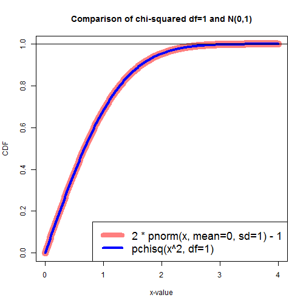

## Background and Synopsis
I took an online course form University of Amsterdam which presented McNemar's test in a form different than commonly presented.  Specifically: 
  
* Common - (Good - Bad)^2 / (Good + Bad) which is claimed to follow chi-squared df=1  
* UvA - (Good - Bad) / sqrt(Good + Bad) which is claimed to follow N(0,1)  

The purposes of this analysis are to 1) confirm that if x follows N(0,1) then x^2 follows chi-squared df=1, and 2) assess results from a sample of paired outcomes against each of these tests.  

As expected, the results of the various approaches are found to be substantially the same, provided that the mcnemar.test is run with correct=FALSE and the UvA p-values are converted to reflect their equivalents from running a two-sided test.  
  
## Analysis  
###_Generate CDF for x >= 0 using chisq(x^2,df=1) and N(0,1)_  
  
Note that for N(0,1) we want to generate the CDF of abs(x) which is to say we need 0 -> 0 and Inf -> 1.  The appropriate calculation for this is 2 * (pnorm(x) - 0.5).  


```r
myChi <- data.frame(x=rep(NA,401),y=rep(NA,401))
myNorm <- data.frame(x=rep(NA,401),y=rep(NA,401))

for (intCtr in seq(0,400,by=1)) {
    myNorm[intCtr+1,1] <- intCtr/100
    myNorm[intCtr+1,2] <- 2 * (pnorm(intCtr/100,mean=0,sd=1) - 0.5)
    
    myChi[intCtr+1,1] <- intCtr/100
    myChi[intCtr+1,2] <- pchisq((intCtr/100)^2,df=1)
}
```

We then plot the results:  

```r
plot(x=myNorm[,1],y=myNorm[,2],type="l",col=rgb(1,0,0,0.5),lwd=12,
     main="Comparison of chi-squared df=1 and N(0,1)",xlab="x-value",ylab="CDF"
     )

lines(x=myChi[,1],y=myChi[,2],col=rgb(0,0,1,1),lwd=4)

legend("bottomright",legend=c("2 * pnorm(x, mean=0, sd=1) - 1","pchisq(x^2, df=1)"),
       col=c(rgb(1,0,0,0.5),rgb(0,0,1,1)),lwd=c(8,4),cex=1.5
       )

abline(h=1)
```


  
As expected, the CDF for abs(x) on N(0,1) matches the CDF for x^2 on chi-squared, df=1.  

### _Compare McNemar Test results_  
Additionally, we force a pattern to some 2x2 data and assess using 1) McNemar's test in R, and 2) the UvA formula that follows N(0,1).  

First, generate data with patterns ranging from 5% on-diagonal change to 50% on-diagonal change, crossed with 50% bias towards Bad to 50% bias towards good.  The diagonal will loop by 5% while the bias loops by 10%.


```r
nTrials <- 10 * 11
storeTestResults <- data.frame(diag=rep(0,nTrials),
                               good=rep(0,nTrials),
                               bad=rep(0,nTrials),
                               mcnRp=rep(0.00,nTrials),
                               chisqp=rep(0.00,nTrials),
                               uvAp=rep(0.00,nTrials),
                               uvAmodp=rep(0.00,nTrials)
                               )

intCtr <- 0

for (diagCtr in seq(0.05,0.5,by=0.05)) {
    for (badCtr in seq(-0.5,0.5,by=0.1)) {
        
        nChange <- round(diagCtr*100,0)
        nGood <- round(nChange * (1+badCtr)/2 , 0)
        nBad <- nChange - nGood
        nPerNull <- round(50 - 0.5*nChange,0)
        
        intCtr <- intCtr + 1
        
        myTest <- matrix(data=c(nPerNull,nGood,nBad,nPerNull),nrow=2,byrow=TRUE)
        uATestStat <- (nGood - nBad) / sqrt(nGood + nBad)
        chiTestStat <- uATestStat^2
        
        storeTestResults$diag[intCtr] <- nPerNull
        storeTestResults$good[intCtr] <- nGood
        storeTestResults$bad[intCtr] <- nBad
        storeTestResults$mcnRp[intCtr] <- round(mcnemar.test(myTest,correct=FALSE)$p.value,4)
        storeTestResults$chisqp[intCtr] <- round(pchisq(chiTestStat,df=1,lower.tail=FALSE),4)
        storeTestResults$uvAp[intCtr] <- round(pnorm(uATestStat),4)
        storeTestResults$uvAmodp[intCtr] <- round(1-2*abs(pnorm(uATestStat)-0.5),4)
    }
}
```

Lastly, we examine some of the data and relevant summary statistics:  

```r
set.seed(0304160830)
myRands <- sample(nrow(storeTestResults),size=20,replace=FALSE)
storeTestResults[myRands[order(myRands)],]
```

```
##     diag good bad  mcnRp chisqp   uvAp uvAmodp
## 3     48    2   3 0.6547 0.6547 0.3274  0.6547
## 16    45    4   6 0.5271 0.5271 0.2635  0.5271
## 20    45    6   4 0.5271 0.5271 0.7365  0.5271
## 21    45    7   3 0.2059 0.2059 0.8970  0.2059
## 23    42    4  11 0.0707 0.0707 0.0354  0.0707
## 28    42    8   7 0.7963 0.7963 0.6019  0.7963
## 30    42    9   6 0.4386 0.4386 0.7807  0.4386
## 31    42   10   5 0.1967 0.1967 0.9016  0.1967
## 38    40    9  11 0.6547 0.6547 0.3274  0.6547
## 45    38    6  19 0.0093 0.0093 0.0047  0.0093
## 50    38   12  13 0.8415 0.8415 0.4207  0.8415
## 51    38   14  11 0.5485 0.5485 0.7257  0.5485
## 54    38   18   7 0.0278 0.0278 0.9861  0.0278
## 64    35   20  10 0.0679 0.0679 0.9661  0.0679
## 79    30   12  28 0.0114 0.0114 0.0057  0.0114
## 81    30   16  24 0.2059 0.2059 0.1030  0.2059
## 89    28   11  34 0.0006 0.0006 0.0003  0.0006
## 95    28   25  20 0.4561 0.4561 0.7720  0.4561
## 97    28   29  16 0.0526 0.0526 0.9737  0.0526
## 110   25   38  12 0.0002 0.0002 0.9999  0.0002
```

```r
summary(storeTestResults)
```

```
##       diag           good            bad            mcnRp       
##  Min.   :25.0   Min.   : 1.00   Min.   : 1.00   Min.   :0.0002  
##  1st Qu.:30.0   1st Qu.: 7.00   1st Qu.: 7.00   1st Qu.:0.0526  
##  Median :36.5   Median :12.00   Median :12.00   Median :0.1967  
##  Mean   :36.3   Mean   :13.75   Mean   :13.75   Mean   :0.3108  
##  3rd Qu.:42.0   3rd Qu.:19.75   3rd Qu.:19.75   3rd Qu.:0.5271  
##  Max.   :48.0   Max.   :38.00   Max.   :38.00   Max.   :1.0000  
##      chisqp            uvAp            uvAmodp      
##  Min.   :0.0002   Min.   :0.00010   Min.   :0.0002  
##  1st Qu.:0.0526   1st Qu.:0.09955   1st Qu.:0.0526  
##  Median :0.1967   Median :0.50000   Median :0.1967  
##  Mean   :0.3108   Mean   :0.50042   Mean   :0.3108  
##  3rd Qu.:0.5271   3rd Qu.:0.90160   3rd Qu.:0.5271  
##  Max.   :1.0000   Max.   :0.99990   Max.   :1.0000
```

```r
print(paste0("Do p-values from mcnemar.test with correct=FALSE match p-values from chisq df=1: ",
             identical(storeTestResults$mcnRp,storeTestResults$chisqp)
            )
      )
```

```
## [1] "Do p-values from mcnemar.test with correct=FALSE match p-values from chisq df=1: TRUE"
```

```r
print(paste0("Do p-values from mcnemar.test with correct=FALSE match adjusted p-values from N(0,1): ",
             identical(storeTestResults$mcnRp,storeTestResults$uvAmodp)
            )
      )
```

```
## [1] "Do p-values from mcnemar.test with correct=FALSE match adjusted p-values from N(0,1): TRUE"
```

Examination of this sample of results shows the following:  
* The R-function mcnemar.test(myTest,correct=FALSE) produces the same p-values as the chi-squared df=1 distribution applied against Difference^2 / Sum  
* The UVA-stat Difference/sqrt(Sum) generates p-values that could be used in a one-sided test.  When these p-values are modified to reflect a two-sided test, they match mcnemar.test(myTest,correct=FALSE).
