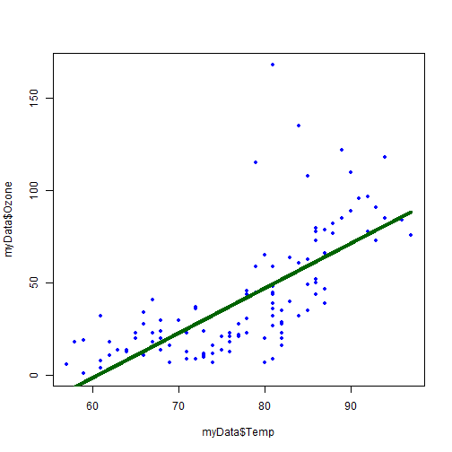
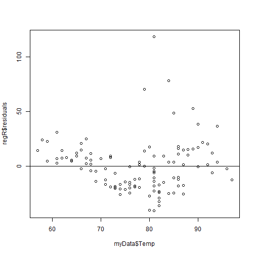
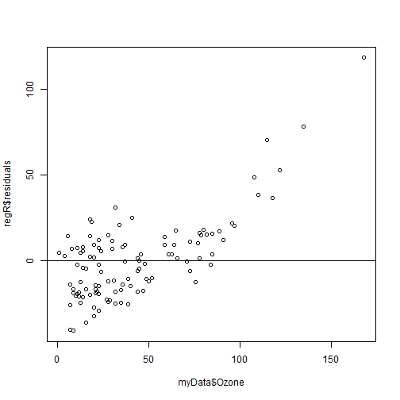
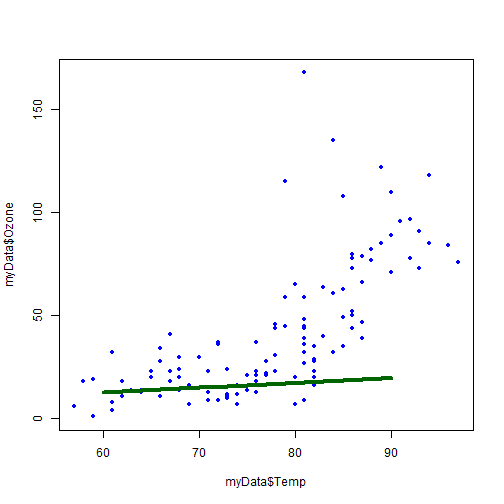
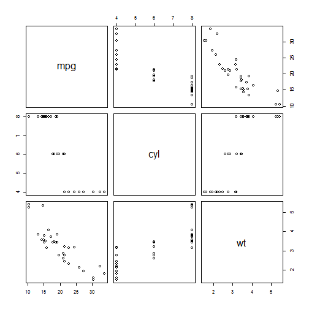
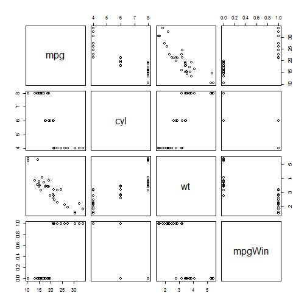

# Synopsis and Overview  
This document contains some of the key concepts, statistics, and R formulae from the UvA Inferential Statistics course.  It is intended as a helpful reference sheet for future use.  

## Module 1: Comparing Two Groups  
There are two schools of thought, frequentist (more common) and Bayesian (growing):  
  
* Frequentist - what are the odds of observing X given my hypothesized population?  
* Bayesian - what are the odds of a hypothesized population given that I observed X?  

There are a few good cautions raised about significance and confidence levels:  
  
* Statistical Significance - The x% confidence interval is constructed such that if we run the experiment infinite times, x% of our intervals would contain the true population mean  
* Practical Significance - does it actually matter that Ho: P=0 is rejected?  The confidence interval helps to assess effect magnitude  

Recall that there are two key error types:  
  
* Type I (reject a true null) - happens (1 - alpha), where alpha is pre-set  
* Type II (fail to reject a false null) -- happend beta, so (1 - beta) is the test power  
* Power is increased by better instruments, more homogenous samples, larger N, larger effect, one-sided tests, parametric tests (for sufficiently large N)  

####_Two indepedent proportions_  
The main metric is a z-test, and it generally requires at least 10 positive and 10 negative per group for one-sided tests, and at least 5 positive and 5 negative per group for two-sided tests:  

The test statistic is designed to follow a z-distribution, specifically:  
  
* Since null is equality, the test stastic starts as (p1-hat - p2-hat)  
* Standard error is then sqrt(p-hat * (1 - p-hat) * (1/n1 + 1/n2))  
* P-hat is the pooled proportion, or (n1 * p1-hat + n2 * p2-hat) / (n1 + n2)  
* CI (after the fact) can no longer use the pooled proportion since null is no longer assumed  
* (p1-hat - p2-hat) +/- z(alpha/2) * sqrt(p-hat1 * (1-p-hat1) / n1 + p-hat2 * (1-p-hat2) / n2)  

This can also be expressed as a relative risk, or p1/p2, with its own assumed confidence intervals.  

See below for an example from two random normal distributions:  


```r
set.seed(0313160758)
norm1 <- rnorm(100,mean=2,sd=1)
norm2 <- rnorm(120,mean=2.5,sd=1.5)
p1Norm <- norm1 > 2
p2Norm <- norm2 > 2
p1Hat <- mean(p1Norm)
p2Hat <- mean(p2Norm)
n1 <- length(p1Norm)
n2 <- length(p2Norm)

## Calculate means, difference, pooled proportion, standard error
print(paste0("Means of the data are P1: ",p1Hat," and P2: ",p2Hat))
```

```
## [1] "Means of the data are P1: 0.6 and P2: 0.55"
```

```r
poolProp <- (n1*p1Hat + n2*p2Hat) / (n1 + n2)
stdError <- sqrt(poolProp * (1-poolProp) * (1/n1 + 1/n2))
print(paste0("Pooled proportion is: ",round(poolProp,3)," with stderr: ",round(stdError,3)))
```

```
## [1] "Pooled proportion is: 0.573 with stderr: 0.067"
```

```r
## Calculate test statistic and p-value
zTestStat <- (p1Hat - p2Hat) / stdError
pTwoSided <- 1 - 2 * abs((pnorm(zTestStat) - 0.5))
print(paste0("The z-stat of: ",round(zTestStat,3)," which has z^2: ",round(zTestStat^2,3),
             " has two-sided significance: ",round(pTwoSided,3)
             )
      )
```

```
## [1] "The z-stat of: 0.746 which has z^2: 0.557 has two-sided significance: 0.455"
```

```r
## Calculate post-hoc CI
newStdErr <- sqrt(p1Hat * (1 - p1Hat) / n1 + p2Hat * (1 - p2Hat) / n2)
critZ <- qnorm(.05/2, lower.tail=FALSE)
print(paste0("Post-hoc 95% CI for difference in proportions is ",
             paste(round(p1Hat - p2Hat + c(-1,1) * critZ * newStdErr, 3), collapse=" , ")
             )
      )
```

```
## [1] "Post-hoc 95% CI for difference in proportions is -0.081 , 0.181"
```

```r
## Comparison to R -- note that R uses chi-squared which is directly related to N(0.1)
prop.test(x=c(sum(p1Norm),sum(p2Norm)) , n=c(n1, n2) , correct=FALSE)
```

```
## 
## 	2-sample test for equality of proportions without continuity
## 	correction
## 
## data:  c(sum(p1Norm), sum(p2Norm)) out of c(n1, n2)
## X-squared = 0.55724, df = 1, p-value = 0.4554
## alternative hypothesis: two.sided
## 95 percent confidence interval:
##  -0.08092941  0.18092941
## sample estimates:
## prop 1 prop 2 
##   0.60   0.55
```
  
And, we observe that the findings from R match the hand calculations, with the exception that R runs a chi-squared test and the hand calculations are a z-test.  If x~N(0,1) then x^2 ~ chi-squared df=1, so these are functionally the same approach and outcome.  
  
####_Two indepedent means_  
For two indepednent means, the t-test is applied.  This requires independence of samples, roughly normal population distributions (though t is robust against this), and a "large enough" (N ~30) sample:  
  
The test statistic is designed to follow a t-distribution, specifically:  
  
#####_Unequal variance_  
* Since null is equality, the test stastic starts as (x1-hat - x2-hat)  
* Pooled standard error is then unPSE = sqrt(s1^2/n1 + s2^2/n2)  
* df is a cluster - (s1^2/n1 + s2^2/n2)^2 / [ (s1^2/n1)^2 / (n1 - 1) + (s2^2/n2)^2 / (n2 - 1) ]  
* Test-statistic is (x1-hat - x2-hat) / unPSE, following t with df  
* Post-hoc CI is (x1-bar - x2-bar) +/- t(alpha/2) * unPSE 
  
#####_Assume equal variance_  

* Pooled standard error is then eqPSE = sqrt( [ (n1-1) * s1^2 + (n2-1) * s2^2 ] / [ (n1 - 1) + (n2 - 1) ]  
* df is easy - n1 + n2 - 2    
* Test-statistic is (x1-hat - x2-hat) / eqPSE, following t with df  
  
Note that the unequal variances approach is greatly preferred, as the equal variances approach can be sensitive to violations of normality.  

See below for an example from two random normal distributions (we will keep the norm1 and norm2 as originally drawn, but without any conversions for "greater than 2":  


```r
x1Hat <- mean(norm1)
x2Hat <- mean(norm2)
s1 <- sd(norm1)
s2 <- sd(norm2)
n1 <- length(p1Norm)
n2 <- length(p2Norm)

## Report on individual means, standard deviations, and sample sizes
print(paste0("Distribution 1 has mean: ",round(x1Hat,2)," with std ",round(s1,2)," on n=",n1))
```

```
## [1] "Distribution 1 has mean: 2.19 with std 1.09 on n=100"
```

```r
print(paste0("Distribution 2 has mean: ",round(x2Hat,2)," with std ",round(s2,2)," on n=",n2))
```

```
## [1] "Distribution 2 has mean: 2.44 with std 1.59 on n=120"
```

```r
## Run this as an unequal variance approach
unPSE <- sqrt(s1^2/n1 + s2^2/n2)
unDF <- (s1^2/n1 + s2^2/n2)^2 / ((s1^2/n1)^2 / (n1-1) + (s2^2/n2)^2 / (n2-1))
print(paste0("Assuming unequal variance, we have difference: ",round(x1Hat - x2Hat,2),
             " with pooled SE: ",round(unPSE,2)," and df = ",round(unDF,1)
             )
      )
```

```
## [1] "Assuming unequal variance, we have difference: -0.26 with pooled SE: 0.18 and df = 210.3"
```

```r
unTest <- (x1Hat - x2Hat) / unPSE
unPTwoSided <- 1 - 2 * abs(pt(unTest,df=unDF) - 0.5)
print(paste0("The t-statistic ",round(unTest,3)," has two-sided significance ",round(unPTwoSided,3)))
```

```
## [1] "The t-statistic -1.416 has two-sided significance 0.158"
```

```r
critT <- qt(.05/2,df=unDF,lower.tail=FALSE)
print(paste0("The 95% CI for difference in means is ",
             paste(round(x1Hat - x2Hat + c(-1,1) * critT * unPSE, 3), collapse=" , ")
             )
      )
```

```
## [1] "The 95% CI for difference in means is -0.615 , 0.101"
```

```r
## Comparison to the R results
t.test(norm1,norm2,paired=FALSE,var.equal=FALSE)
```

```
## 
## 	Welch Two Sample t-test
## 
## data:  norm1 and norm2
## t = -1.4156, df = 210.29, p-value = 0.1584
## alternative hypothesis: true difference in means is not equal to 0
## 95 percent confidence interval:
##  -0.6149437  0.1009042
## sample estimates:
## mean of x mean of y 
##  2.187555  2.444575
```

```r
## Run this as an equal variance approach
eqS <- sqrt( ( (n1-1) * s1^2 + (n2-1) * s2^2 ) / ( (n1 - 1) + (n2 - 1) ) )
eqPSE <- eqS * sqrt(1/n1 + 1/n2)
eqDF <- n1 + n2 - 2
print(paste0("Assuming equal variance, we have difference: ",round(x1Hat - x2Hat,2),
             " with S: ",round(eqS,2)," and pooled SE: ",round(eqPSE,2)," with df = ",round(eqDF,1)
             )
      )
```

```
## [1] "Assuming equal variance, we have difference: -0.26 with S: 1.39 and pooled SE: 0.19 with df = 218"
```

```r
eqTest <- (x1Hat - x2Hat) / eqPSE
eqPTwoSided <- 1 - 2 * abs(pt(eqTest,df=eqDF) - 0.5)
print(paste0("The t-statistic ",round(eqTest,3)," has two-sided significance ",round(eqPTwoSided,3)))
```

```
## [1] "The t-statistic -1.369 has two-sided significance 0.172"
```

```r
critT <- qt(.05/2,df=eqDF,lower.tail=FALSE)
print(paste0("The 95% CI for difference in means is ",
             paste(round(x1Hat - x2Hat + c(-1,1) * critT * eqPSE, 3), collapse=" , ")
             )
      )
```

```
## [1] "The 95% CI for difference in means is -0.627 , 0.113"
```

```r
## Comparison to the R results
t.test(norm1,norm2,paired=FALSE,var.equal=TRUE)
```

```
## 
## 	Two Sample t-test
## 
## data:  norm1 and norm2
## t = -1.3693, df = 218, p-value = 0.1723
## alternative hypothesis: true difference in means is not equal to 0
## 95 percent confidence interval:
##  -0.6269680  0.1129285
## sample estimates:
## mean of x mean of y 
##  2.187555  2.444575
```

And, we observe that the findings from R match the hand calculations.  
  
####_Two dependent proportions_  
With two dependent proportions, you have a McNemar test.  Note that R will run this as a chi-squared (worry about the direction for one-sided in interpretation) while UvA runs this as a z-test (worry about the direction in the statistic set-up).  
  
Essentially, there are four things that can happen:  Good -> Good, Good -> Bad, Bad -> Good, and Bad -> Bad.  We are only actually interested in Good -> Bad (GB) and Bad -> Good (BG).  

* z = (BG - GB) / sqrt(BG + GB)  
* chiSq = (BG - GB)^2 / (BG + GB)  

Suppose we have a grid of 311, 34 (BG), 17 (GB), 14.  We only care about the 34 and the 17:  


```r
zTest <- (34 - 17) / sqrt(34 + 17)
zPStat <- 1 - 2 * abs(pnorm(zTest) - 0.5)
print(paste0("Using z-test, we have z: ",round(zTest,3)," with two-sided p: ",round(zPStat,3)))
```

```
## [1] "Using z-test, we have z: 2.38 with two-sided p: 0.017"
```

```r
## Compare to R
mcnemar.test(x=matrix(data=c(311,34,17,14),nrow=2,byrow=TRUE),correct=FALSE)
```

```
## 
## 	McNemar's Chi-squared test
## 
## data:  matrix(data = c(311, 34, 17, 14), nrow = 2, byrow = TRUE)
## McNemar's chi-squared = 5.6667, df = 1, p-value = 0.01729
```

Except for the use of chi-squared vs. z-statistic, the outputs are substantially the same.  
  
####_Two dependent means_  
This test is much simpler to run since you have paired observations.  Essentially:  
  
* Test-statistic t = (x1-bar - x2-bar) / ( Sd / sqrt(n) )  
* Sd is the standard deviation of the differences  
* df = n-1  
* CI = (x1-bar - x2-bar) +/- t(alpha/2) * Sd / sqrt(n)  
  
Below is an example for a random normal added to a random normal:  


```r
myVar1 <- norm1
myVar2 <- norm1 + rnorm(100,mean=0.5,sd=5)
myDiff <- myVar1 - myVar2

muDiff <- mean(myDiff)
sDiff <- sd(myDiff)
nDiff <- length(myDiff)
seDiff <- sDiff / sqrt(nDiff)
dfDiff <- nDiff - 1

tStatDiff <- muDiff / seDiff
pStatDiff <- 1 - 2 * abs(pnorm(tStatDiff) - 0.5)

print(paste0("The difference in means is: ",round(muDiff,2)," with standard error: ",round(seDiff,2)))
```

```
## [1] "The difference in means is: -1.55 with standard error: 0.49"
```

```r
print(paste0("The t-statistic ",round(tStatDiff,2)," with df = ",dfDiff,
             " has two-sided significance ",round(pStatDiff,3)
             )
      )
```

```
## [1] "The t-statistic -3.16 with df = 99 has two-sided significance 0.002"
```

```r
tCritical <- qt(.05/2,lower.tail=FALSE,df=dfDiff)
print(paste0("The 95% CI for difference in means is: ",
             paste(round(muDiff + c(-1,1) * seDiff * tCritical,3),collapse=" , ")
             )
      )
```

```
## [1] "The 95% CI for difference in means is: -2.515 , -0.576"
```

```r
## Compare with R
t.test(myVar1,myVar2,paired=TRUE)
```

```
## 
## 	Paired t-test
## 
## data:  myVar1 and myVar2
## t = -3.1638, df = 99, p-value = 0.002069
## alternative hypothesis: true difference in means is not equal to 0
## 95 percent confidence interval:
##  -2.5150923 -0.5762888
## sample estimates:
## mean of the differences 
##               -1.545691
```

As expected, the results from R match the associated hand calculations.  
  
  
## Module 2: Categorical Association  
Tests for categorical association check relative frequencies for two or more categories.  The typical test statistic is chi-squared.  Comparisons are made against an "expected frequency" which can be a theoretical frequency or the frequency that would be obtained by multiplying out row/column frequencies.  

The general approach to a test matrix is to put the explanatory variables in the rows and the response variable in the columns.  There is, of course, no actual meaningful correlation statistic since the column orders are arbitrary.  So, the general framing would be:

* Ho: The variables are all independent, which is to say P(row, column) = P(row) * P(column)  
* Ha: There are one or more dependencies  
* Approach:  Create a new table (expected) that is P(row) * P(column)  

The example from the UvA course is used a few times in this module:  

```r
artHistory <- data.frame(fruit=c(11,8,3), flowers=c(5,6,10),mixed=c(1,8,12),
                         row.names=c("early","late","Baroque")
                         )
## Raw data frame
artHistory
```

```
##         fruit flowers mixed
## early      11       5     1
## late        8       6     8
## Baroque     3      10    12
```

```r
## Joint frequencies
jointFreqArt <- artHistory/sum(artHistory)
jointFreqArt
```

```
##            fruit  flowers    mixed
## early   0.171875 0.078125 0.015625
## late    0.125000 0.093750 0.125000
## Baroque 0.046875 0.156250 0.187500
```

```r
## Marginal (column) frequencies
margColArt <- colSums(artHistory)/sum(artHistory)
t(as.matrix(margColArt))
```

```
##        fruit  flowers    mixed
## [1,] 0.34375 0.328125 0.328125
```

```r
## Marginal (row) frequencies
margRowArt <- rowSums(artHistory)/sum(artHistory)
as.matrix(margRowArt)
```

```
##             [,1]
## early   0.265625
## late    0.343750
## Baroque 0.390625
```

```r
## Expected frequencies = product of marginal frequencies
expArtHistory <- ( as.matrix(margRowArt) %*% t(as.matrix(margColArt)) ) * sum(artHistory)
round(expArtHistory,1)
```

```
##         fruit flowers mixed
## early     5.8     5.6   5.6
## late      7.6     7.2   7.2
## Baroque   8.6     8.2   8.2
```

####_Chi-squared test for association_  
The chi-squared statistic is then the sum over all cells of residual^2 / expected, which could also be formulated as sum over all cells of (observed - expected)^2 / expected.  

The chi-squared statistics can then be assessed for its likelihood:  
  
* Test-statistic: sum over all cells of residual^2/expected  
* df = (nrow - 1) * (ncol - 1)  
* The mean of a chi-squared distribution with df=n will be n  
* The chi-squared is always greater than or equal to zero  
* pchisq(myStat, df=myDF, lower.tail=FALSE) brings back the odds of seeing >= myStat given myDF  
  
Note that we require n=5+ for each expected cell for this statistic to be reasonable.  


```r
## The residuals data frame
resArtHistory <- artHistory - expArtHistory
resArtHistory
```

```
##            fruit   flowers     mixed
## early    5.15625 -0.578125 -4.578125
## late     0.43750 -1.218750  0.781250
## Baroque -5.59375  1.796875  3.796875
```

```r
## Test Statistic method 1 -- residual^2 / expected
testMatrix1 <- resArtHistory^2 / expArtHistory
testMatrix1
```

```
##              fruit    flowers      mixed
## early   4.54963235 0.05991772 3.75739671
## late    0.02530992 0.20576299 0.08455087
## Baroque 3.64102273 0.39360119 1.75741071
```

```r
testStat1 <- sum(testMatrix1)
testStat1
```

```
## [1] 14.47461
```

```r
## Test statistics method 2 -- (observed/expected - 1)^2
testMatrix2 <- (artHistory - expArtHistory)^2 / expArtHistory
testMatrix2
```

```
##              fruit    flowers      mixed
## early   4.54963235 0.05991772 3.75739671
## late    0.02530992 0.20576299 0.08455087
## Baroque 3.64102273 0.39360119 1.75741071
```

```r
testStat2 <- sum(testMatrix2)
testStat2
```

```
## [1] 14.47461
```

```r
## Calculate df
dfArt <- (ncol(artHistory) - 1) * (nrow(artHistory) - 1)
dfArt
```

```
## [1] 4
```

```r
## Report on pStatistic
pStat <- pchisq(testStat1, df=dfArt, lower.tail=FALSE)
print(paste0("Chi-squared is ",round(testStat1,2)," on df=",dfArt," for p=",round(pStat,4)))
```

```
## [1] "Chi-squared is 14.47 on df=4 for p=0.0059"
```

```r
## No surprise that this matches R
chisq.test(artHistory,correct=FALSE)
```

```
## 
## 	Pearson's Chi-squared test
## 
## data:  artHistory
## X-squared = 14.475, df = 4, p-value = 0.005925
```

####_Interpretation of chi-squared_  
There are two ways to help with interpreting chi-squared.  Recall that as df increases, you expect chi-squared to increase, so there is no specific meaning to "this has chi-squared 6 while that has chi-squared 12".  

* Cramer's V is an attempt to standardize the chi-squared to within 0-1 where 0 means "no association" and 1 means "perfect association".  The challenge is that V tends to increase no matter what as the matrix becomes less square, so it is still not a perfect test.  
* Standarized residuals give a sense for how far each cell in the observed matrix is from expected.  It is reported on either a Pearson basis or a residuals basis.  

The calculation for Cramer's V is as follows:  
  
* V = sqrt(chi-squared / (n * m))  
* n = total cells in the matrix  
* m = lesser of # rows or # columns, then subtract 1  
  
There are two means of calculating the standardized residuals:  
  
* Pearson - residual / sqrt(expected)  
* Standraized - resiudal / sqrt(V)  
* V for a given cell =  expNCell * (1 - Prow) * (1 - Pcol)  
* The standardized residuals follow a z-distribution  
  
The code chunks below are copied from CheckChiSq_v001.Rmd:  
  

```r
testFrame <- data.frame(colI = c(5, 34, 33), colII = c(6, 47, 32), 
                        colIII = c(9, 48, 14), row.names=c("A","B","C")
                        )
testFrame
```

```
##   colI colII colIII
## A    5     6      9
## B   34    47     48
## C   33    32     14
```

```r
expMatrix <- as.matrix(rowSums(testFrame)) %*% t(as.matrix(colSums(testFrame)))
expMatrix <- expMatrix / sum(testFrame)
round(expMatrix,1)
```

```
##   colI colII colIII
## A  6.3   7.5    6.2
## B 40.7  48.1   40.2
## C 24.9  29.5   24.6
```

```r
resMatrix <- testFrame - expMatrix
round(resMatrix,1)
```

```
##   colI colII colIII
## A -1.3  -1.5    2.8
## B -6.7  -1.1    7.8
## C  8.1   2.5  -10.6
```

```r
testChiSq <- sum(resMatrix^2 / expMatrix)
nR <- nrow(resMatrix)
nC <- ncol(resMatrix)

dfChiSq <- (nR - 1) * (nC - 1)
cramerV <- sqrt(testChiSq / (nR * nC) / (min(nR, nC) - 1) )

## Pearson residuals - (obs - exp) / sqrt(exp)
prsMatrix <- resMatrix / sqrt(expMatrix)

## Standardized residuals - (obs - exp) / sqrt(V)
## Vij = sqrt(Expij * (1 - pRow) * (1 - pCol))
stdMatrix <- resMatrix / 
             sqrt(expMatrix * 
                   (as.matrix(1 - rowSums(expMatrix)/sum(expMatrix)) 
                    %*%             
                    t(as.matrix(1-colSums(expMatrix)/sum(expMatrix)))
                    )
                  )

print(paste0("Chi-squared is ",round(testChiSq,2)," with df=",dfChiSq,
             " (p=",
             round(pchisq(testChiSq, df=dfChiSq, lower.tail=FALSE),4),
             ")"
             )
      )
```

```
## [1] "Chi-squared is 11.84 with df=4 (p=0.0185)"
```

```r
print(paste0("Cramer's V is: ",round(cramerV,3)))
```

```
## [1] "Cramer's V is: 0.811"
```

```r
## Pearson residuals - (obs - exp) / sqrt(exp)
round(prsMatrix,2)
```

```
##    colI colII colIII
## A -0.52 -0.53   1.11
## B -1.06 -0.16   1.24
## C  1.61  0.47  -2.14
```

```r
## Standardized residuals - (obs - exp) / sqrt(V)
## Vij = sqrt(Expij * (1 - pRow) * (1 - pCol))
round(stdMatrix,2)
```

```
##    colI colII colIII
## A -0.66 -0.70   1.40
## B -1.94 -0.30   2.26
## C  2.41  0.73  -3.19
```

```r
testChi <- chisq.test(testFrame)
for (intCtr in 1:length(testChi)) {
    print(testChi[intCtr])
}
```

```
## $statistic
## X-squared 
##  11.84471 
## 
## $parameter
## df 
##  4 
## 
## $p.value
## [1] 0.01854417
## 
## $method
## [1] "Pearson's Chi-squared test"
## 
## $data.name
## [1] "testFrame"
## 
## $observed
##   colI colII colIII
## A    5     6      9
## B   34    47     48
## C   33    32     14
## 
## $expected
##        colI    colII   colIII
## A  6.315789  7.45614  6.22807
## B 40.736842 48.09211 40.17105
## C 24.947368 29.45175 24.60088
## 
## $residuals
##         colI      colII    colIII
## A -0.5235674 -0.5332688  1.110722
## B -1.0555108 -0.1574808  1.235227
## C  1.6122243  0.4695542 -2.137305
## 
## $stdres
##         colI      colII    colIII
## A -0.6626947 -0.7049874  1.401389
## B -1.9365006 -0.3017705  2.258989
## C  2.4110425  0.7334312 -3.186093
```

```r
## Borrowed from http://www.r-bloggers.com/example-8-39-calculating-cramers-v/
## With adaptations
cv.test <- function(x) {
    CV <- sqrt(chisq.test(x, correct=FALSE)$statistic /
               (sum(!is.na(x)) * (min(nrow(x), ncol(x)) - 1) )
               )
  
    print.noquote("Cramér V / Phi:")
  
    return(as.numeric(CV))
}

cv.test(testFrame)
```

```
## [1] Cramér V / Phi:
```

```
## [1] 0.8111964
```

The R functions (chisq.test and cv.test) match with the hand calculations as expected.  

####_Running chi-squared as "goodness of fit"_  
The chi-squared test can also be run to compare some actual observations against a theoretical distribution.  There are a few modest changes:  
  
* Ho: Observed does not differ from expected based on theory  
* Ha: Observed differs in at least some regard from expected based on theory  
* Test statistic chi-squared is sum-over-columns of (observed - expected)^2 / expected  
* df = N-1 where there are N columns explored  
* Requirement that expected be 5+ in each column  

Expected is generally a vector of probabilities summing to 1, with expected for each column become T*expected where T is the sum across all of the observed elements.  

An obvious but important caution is that this is absolutely NOT an appropriate way to compare two rows of observed data against each other!  This only works when you have a theoretical expectation prior to experimentation, and an observed dataset during your experiment plainly does not qualify!  

See below for a very simple example:  

```r
myVector <- c(5,20,10,35)
myTheory <- c(.2,.3,.1,.4)

chiSqAssoc <- (myVector - (sum(myVector) * myTheory) )^2 / ( sum(myVector) * myTheory) 
chiSqAssoc
```

```
## [1] 5.78571429 0.04761905 1.28571429 1.75000000
```

```r
dfAssoc <- length(chiSqAssoc) - 1
pStat <- pchisq(sum(chiSqAssoc), df=dfAssoc, lower.tail=FALSE)

print(paste0("Chi-squared is ", round(sum(chiSqAssoc),2),
             " with df=",dfAssoc," for p=",round(pStat,4)
             )
      )
```

```
## [1] "Chi-squared is 8.87 with df=3 for p=0.0311"
```

```r
chisq.test(myVector, correct=FALSE,p=myTheory)
```

```
## 
## 	Chi-squared test for given probabilities
## 
## data:  myVector
## X-squared = 8.869, df = 3, p-value = 0.03108
```

As expected, the results from R functions match the hand calculations.  

####_Side notes for chi-squared tests_  
Sometimes, not all of the conditions for chi-squared testing are met.  To wit:  
  
* Data from a non-random sample (frequent error; make sure your experiment is properly randomized)  
* Categories are not exclusive (make sure you have a column for Both-A-and-B and do not count +1 in both the A and B columns)  
* Categories are not exhaustive (make sure everything can be placed somewhere, even if just All Other)  
* Sample too small; requires expected values of 5+ per call (aggregate as needed if not)  
* Interpreting chi-squared as goodness of association (no way - Cramer's V at least gets you in the right direction)  
* Interpreting a high p-value as "support of theory" (as with all hypothesis testing, all we will ever do is fail to reject the null hypothesis; we do not accept/confirm the null!)  
  
####_Fisher's exact test_  
The Fisher's exact test is the solution when you have a contained, small-n problem which precludes using chi-squared tests of association.  
  
The test is generally designed for a 2x2 table as follows:  
  
  
a       | b       | (a+b)      
------- | ------- | -----------  
c       | d       | (c+d)      
(a+c)   | (b+d)   | (a+b+c+d)  
  
  
Define n=(a+b+c+d).  This configuration can occur (a+c)! * (b+d)! * (a+b)! * (c+d)! / [n! * a! * b! * c! * d!] of the time.  So, if a were the critical value, you could test how likely (one-sided or two-sided) you are to get the specific or more extreme value for a.

Recall that if you do not have a small-n problem, you use chi-squared!  This test is something of a mess.  See associated R code:  


```r
nTotal <- 23
nAplusB <- 10
nAplusC <- 8

fishStore <- data.frame(a=0:min(nAplusB,nAplusC),probA=rep(-1,min(nAplusB,nAplusC)+1))

for (intCtr in 1:(min(nAplusB,nAplusC)+1)) {
    a <- intCtr - 1
    b <- nAplusB - a
    c <- nAplusC - a
    d <- nTotal - a - b - c
    numer1 <- factorial(a+c) * factorial(b+d)
    numer2 <- factorial(a+b) * factorial(c+d)
    denom1 <- factorial(nTotal)
    denom2 <- factorial(a) * factorial(b) * factorial(c) * factorial(d)
    fishStore[intCtr,"probA"] <- (numer1/denom1) * (numer2/denom2)
}

fishStore
```

```
##   a        probA
## 1 0 2.624849e-03
## 2 1 3.499798e-02
## 3 2 1.574909e-01
## 4 3 3.149818e-01
## 5 4 3.062323e-01
## 6 5 1.469915e-01
## 7 6 3.340716e-02
## 8 7 3.181635e-03
## 9 8 9.177792e-05
```

```r
sum(fishStore[c(0,8),"probA"])
```

```
## [1] 0.003181635
```

```r
fisher.test(matrix(data=c(0,10,8,5),nrow=2,byrow=TRUE))$p.value
```

```
## [1] 0.002716626
```

```r
fisher.test(matrix(data=c(1,9,7,6),nrow=2,byrow=TRUE))$p.value
```

```
## [1] 0.07430341
```

```r
fisher.test(matrix(data=c(2,8,6,7),nrow=2,byrow=TRUE))$p.value
```

```
## [1] 0.3787858
```

```r
fisher.test(matrix(data=c(3,7,5,8),nrow=2,byrow=TRUE))$p.value
```

```
## [1] 1
```

```r
fisher.test(matrix(data=c(4,6,4,9),nrow=2,byrow=TRUE))$p.value
```

```
## [1] 0.6850182
```

```r
fisher.test(matrix(data=c(5,5,3,10),nrow=2,byrow=TRUE))$p.value
```

```
## [1] 0.2212949
```

```r
fisher.test(matrix(data=c(6,4,2,11),nrow=2,byrow=TRUE))$p.value
```

```
## [1] 0.03930542
```

```r
fisher.test(matrix(data=c(7,3,1,12),nrow=2,byrow=TRUE))$p.value
```

```
## [1] 0.005898261
```

```r
fisher.test(matrix(data=c(8,2,0,13),nrow=2,byrow=TRUE))$p.value
```

```
## [1] 9.177792e-05
```

These still do not match perfectly.  I get the sense this is a rarely used test, but time permitting it may be good to figure out the discrepancy.  
  
## Module 3: Simple Regression  
Simple Linear Regression ultimately reduces (perhaps after transformations) to y-hat(i) = a + b * x-hat(i).  The lingo is such that x is the "predictor" variable and y is the "response" variable.  
  
####_Regression equation_  
The goal is to use Ordinary Least Squares (OLS) to minimize the sum-squared distance of the residuals (errors).  Specifically, a few of the key calculations include:  
  
* min( [y(i) - y-hat(i)]^2 )  
* df/da ( [y(i) - (a + b * x(i))]^2 ) = 0
* df/db ( [y(i) - (a + b * x(i))]^2 ) = 0  

Ultimately, these equations reduce to the following:  

* b = r * Sy / Sx, where r is the Pearson correlation and Sy/Sx are the respective standard deviations  
* a = y-bar - b * x-bar  
* r is considered small at 0.3, medium at 0.5, and large at 0.8  

Once you have created OLS on your sample, you infer that it applies to a broader population, allowing you to make predictions.  At this point, we move back to Greek (population) letters, and assume that the population has normally distributed y, centered on predicted mu(y), for each x.  

There are two ways to express this:  
  
* mu(y) = alpha + Beta * x  -- with constant sigma  
* y(i) = alpha + beta * x(i) + epsilon(i) -- epsilon(i) having mean zero and sd sigma  

####_Predictive power (Sum of Squares)_  
The predictive power r^2 is derived by squaring the Pearson correlation.  This can be interpreted as the proportion of explained variance.  The typical approach is Sum of Squares, as follows:  
  
* Total Sum of Squares = sum-over-i-of ( y(i) - y-bar )^2, or the total variability in y from its mean  
* Residual Sum of Squares = sum-over-i-of ( y(i) - y-hat(i) )^2, or the total variability in y from its best-fit regression line estimate  
* Regression Sum of Squares = Total Sum of Squares - Residual Sum of Squares  
* r^2 = Resgression Sum of Squares / Total Sum of Squares  

So, when r^2=1, the regression explains everything, and when r^2=0, the regression explains nothing.  

See below for an example from the R dataset airquality:  

```r
data(airquality)
myData <- airquality[,c("Ozone","Temp","Month")]
myData <- myData[complete.cases(myData),]

pairs(myData) ## Many issues with the data -- using just as an example
```


```r
estBeta <- cor(myData$Ozone, myData$Temp) * sd(myData$Ozone) / sd(myData$Temp)
estAlpha <- mean(myData$Ozone) - estBeta * mean(myData$Temp)

estTSS <- sum( (myData$Ozone - mean(myData$Ozone))^2 )
estResSS <- sum( (myData$Ozone - (estAlpha + estBeta * myData$Temp))^2 )
estRegSS <- estTSS - estResSS
estR2 <- estRegSS / estTSS

dfReg <- 1 ## 1 predictor
dfRes <- length(myData$Ozone) - 2 ## 1 for mean, 1 for single predictor

meanResSS <- estResSS / dfRes
meanRegSS <- estRegSS / dfReg
stdResSS <- sqrt(meanResSS)

print(paste0("Estimated regression is Ozone = ",round(estAlpha,1)," + ",
             round(estBeta,2)," * Temp, constant sigma"
             )
      )
```

```
## [1] "Estimated regression is Ozone = -147 + 2.43 * Temp, constant sigma"
```

```r
print(paste0("TSS: ",round(estTSS,1)," ResSS: ",round(estResSS,1),
             " RegSS: ",round(estRegSS,1)," r^2: ",round(estR2,3),
             " Standard Residual ",round(stdResSS,2)," on df=",dfRes
             )
      )
```

```
## [1] "TSS: 125143.1 ResSS: 64109.9 RegSS: 61033.2 r^2: 0.488 Standard Residual 23.71 on df=114"
```

```r
print(paste0("Mean Residual SS: ",round(meanResSS,2),
             " and Mean Regression SS: ",round(meanRegSS,2),
             " for F=",round(meanRegSS/meanResSS,1)," on df ",
             dfReg," , ",dfRes
             )
      )
```

```
## [1] "Mean Residual SS: 562.37 and Mean Regression SS: 61033.17 for F=108.5 on df 1 , 114"
```

```r
print(paste0("Associated p-value is: ",
             round(pf(meanRegSS/meanResSS,df1=dfReg, df2=dfRes,lower.tail=FALSE),3)
             )
      )
```

```
## [1] "Associated p-value is: 0"
```

```r
## Comparison to running this in R
regR <- lm(Ozone ~ Temp, data=myData)
summary(regR)
```

```
## 
## Call:
## lm(formula = Ozone ~ Temp, data = myData)
## 
## Residuals:
##     Min      1Q  Median      3Q     Max 
## -40.729 -17.409  -0.587  11.306 118.271 
## 
## Coefficients:
##              Estimate Std. Error t value Pr(>|t|)    
## (Intercept) -146.9955    18.2872  -8.038 9.37e-13 ***
## Temp           2.4287     0.2331  10.418  < 2e-16 ***
## ---
## Signif. codes:  0 '***' 0.001 '**' 0.01 '*' 0.05 '.' 0.1 ' ' 1
## 
## Residual standard error: 23.71 on 114 degrees of freedom
## Multiple R-squared:  0.4877,	Adjusted R-squared:  0.4832 
## F-statistic: 108.5 on 1 and 114 DF,  p-value: < 2.2e-16
```

```r
sum(regR$residuals^2)
```

```
## [1] 64109.89
```

```r
## Graph this
plot(x=myData$Temp,y=myData$Ozone,pch=20,col="blue")
lines(x=myData$Temp,y=regR$fitted.values,col="dark green",lwd=4)
```



As expected, the call to lm() in R produces the same outputs as the hand calculations.  

####_Potential Pitfalls in Regression_  
There are many potential problems that can throw off the OLS approach, including but not limited to:  
  
* Nonlinearity - as in the Ozone example above, where Ozone is ~0 for all low-ish temperatures  
* Outliers - especially problematic for small-n regression or large deviation on x/y from regression line  
* Intepreting correlation as causality - this is just a model that y ~ x, not (necessarily) that x causes y  
* Inappropriate extrapolation - for example, above only has temperatures 60-90, cannot predict 30 or 120  
* Ecological fallacy - drawing conclusions about individuals after running a group model (for example, if aggregating students by state, drawing conclusions about a specific student in state X based on the model)  
* Restriction of range -- sample contains a very limited range of predictors (x variables)  

In addition, there are many assumptions that we should investigate/validate during the regression process:  
  
* Linearity of response and predictor relationships - eyeball test on scatterplot  
* Normality can be assessed by examining the residuals - eyeball test  
* Outliers can be investigates using standardized residuals, where "more extreme than +/- 3 is a concern"
* Homoscedasticity can be assessed by graphing residuals vs. predictors to see if they have equal dispersion for all values of predictor  
* Independence of errors means they are not related to each other; particularly an issue for time series  
  
The key theme is to look at a scatterplot.  The pairs() function showed that we have some issues in the regression run above which we would need to address if we wanted to take action based on this regression.  

####_Testing the model, including PI and CI_  
We can run hypothesis tests on whether our model beta is significant:  
  
* Ho: Beta = 0  
* Ha: Beta <> 0  
* Test statistic: t = Beta / seBeta , df = n-2 where n is total observations  
* CI = Beta +/- critical-t * seBeta  

Further, we can calculate some key statistics about the quality of our predictions:  
  
* Prediction Interval (PI) for predicted individual response  
* Confidence Interval (CI) for predicted population means  
  
* CI of the mean: CI for mu(y) = y-hat +/- t-critical * S(Res) / sqrt(n)  
* PI of an individual: PI for y(i) = y-hat +/- t-critical * S(Res)  
* S(Res) is the SE of the residual, defines as sqrt(Residual SS / (n-2))  
* n is the total number of observations  
  
We can take a look at some residuals and the above statistics for our previous Ozone ~ Temp call:  

  

```r
## Re-print for convenience
print(paste0("TSS: ",round(estTSS,1)," ResSS: ",round(estResSS,1),
             " RegSS: ",round(estRegSS,1)," r^2: ",round(estR2,3),
             " Standard Residual ",round(stdResSS,2)," on df=",dfRes
             )
      )
```

```
## [1] "TSS: 125143.1 ResSS: 64109.9 RegSS: 61033.2 r^2: 0.488 Standard Residual 23.71 on df=114"
```

```r
summary(regR)
```

```
## 
## Call:
## lm(formula = Ozone ~ Temp, data = myData)
## 
## Residuals:
##     Min      1Q  Median      3Q     Max 
## -40.729 -17.409  -0.587  11.306 118.271 
## 
## Coefficients:
##              Estimate Std. Error t value Pr(>|t|)    
## (Intercept) -146.9955    18.2872  -8.038 9.37e-13 ***
## Temp           2.4287     0.2331  10.418  < 2e-16 ***
## ---
## Signif. codes:  0 '***' 0.001 '**' 0.01 '*' 0.05 '.' 0.1 ' ' 1
## 
## Residual standard error: 23.71 on 114 degrees of freedom
## Multiple R-squared:  0.4877,	Adjusted R-squared:  0.4832 
## F-statistic: 108.5 on 1 and 114 DF,  p-value: < 2.2e-16
```

```r
plot(x=myData$Temp,y=regR$residuals)
abline(h=0)
```



```r
plot(x=myData$Ozone,y=regR$residuals)
abline(h=0)
```



As before, we match the outputs from R.  The residuals are plausibly OK when plotted against temperature, but clearly flawed when plotted against Ozone.  This is likely due to the non-linearity observed in the original dataset, and signals that we would need to clean the data or explore a different model before proceeding.  
  
####_Exponential Regression_  
While there are many types of nonlinear regression, the exponential form is especially nice since it reduces easily to the linear form.  The regression can be expressed as:  

* y = a * b^x  
* mu(y) = alpha * Beta^x  
* These are commonly time regressions, so mu(y) = alpha * Beta^t is common to see  

This formulation can easily be reduced to a linear form:  

* ln( y-hat ) = ln(alpha) + x * ln(beta)  
* ln( y-hat ) = A + B * x , where A = ln(alpha) and B=ln(beta)  

An example with the airquality dataset:  

```r
myLNData <- myData
myLNData$Ozone <- log(myData$Ozone)

regLNR <- lm(Ozone ~ Temp , data=myLNData)

alphaLN <- exp(regLNR$coefficients[[1]])
betaLN <- exp(regLNR$coefficients[[2]])

print(paste0("We predict alpha: ",round(alphaLN,3)," and beta: ",round(betaLN,3)))
```

```
## [1] "We predict alpha: 0.159 and beta: 1.07"
```

```r
plot(myData$Temp, myData$Ozone, pch=20, col="blue")
lines(x=60:90,y=alphaLN*(60:90)^betaLN,lwd=4,col="dark green")
```



```r
## R nonlinear least squares outputs
myNLS <- nls(Ozone ~ a * b^Temp, data=myData, start=list(a=1, b=1))
summary(myNLS)
```

```
## 
## Formula: Ozone ~ a * b^Temp
## 
## Parameters:
##   Estimate Std. Error t value Pr(>|t|)    
## a 0.298900   0.158536   1.885   0.0619 .  
## b 1.063533   0.006498 163.672   <2e-16 ***
## ---
## Signif. codes:  0 '***' 0.001 '**' 0.01 '*' 0.05 '.' 0.1 ' ' 1
## 
## Residual standard error: 22.66 on 114 degrees of freedom
## 
## Number of iterations to convergence: 14 
## Achieved convergence tolerance: 2.988e-07
```

The data from OLS on the linear transformation closely matches the approxiamtaion from R using NLS.  It is obviously not an appropriate fit given this data!  

## Module 4: Multiple Regression  
Multiple regression expands simple regression by moving to two or more predictors.  These may be needed to increase explanatory power or to relieve confounders.  The assumptions are similar, although there is now a best-fit plane to describe the mean, still with the assumption that residuals all have the same sigma and are normally distributed.  

The multiple regression equation can include:  
  
* Sample: y-hat(i) = a + b1 * x1(i) + b2 *x2(i) + . . . + bn * xn(i)  
* Population: mu(y) = alpha + beta1 * x1 + beta2 * x2 + . . .+ betan * xn  
  
####_Multiple R and R-Squared_  
Similar to simple regression, multiple regression can be described by both R and R^2.  These are:  
  
* R is the multiple correlation coefficient (always non-negative 0 <= R <= 1) that describes how strongly the response variable is related to the SET of predictor variables  
* R^2 is the explained variation as a proportion, and is still Regression Sum-Squares / Total Sum-Squares  
* Multiple-R is sqrt(R^2) and R^2 is (multiple-R)^2  
  
The multiple-R is based on several correlations.  For example, suppose you have response variable y with predictor variables x1, x2.  Define and use simple correlations as:  
  
* CorYX1 = cor(y, x1)  
* CorYX2 = cor(y, x2)  
* CorX1X2 = cor(x1, x2)  
* R = sqrt[ (CorYX1^2 + CorYX2^2 - 2 * CorYX1 * CorYX2 * CorX1X2) / (1 - CorX1X2^2) ]  

An example can be shown using the dataset mtcars, which will have something of a collinearity problem:  

```r
data(mtcars)
myMulti <- mtcars[,c("mpg","cyl","wt")]
pairs(myMulti)
```



```r
corYX1<- cor(mtcars$mpg,mtcars$cyl)
corYX2<- cor(mtcars$mpg,mtcars$wt)
corX1X2<- cor(mtcars$wt,mtcars$cyl)

multiR <- sqrt( (corYX1^2 + corYX2^2 - 2*corYX1*corYX2*corX1X2) / (1 - corX1X2^2) )

print(paste0("Correlations include MPG-CYL: ",round(corYX1,3),
             " MPG-WT: ",round(corYX2,3)," CYL-WT: ",round(corX1X2,3)
             )
      )
```

```
## [1] "Correlations include MPG-CYL: -0.852 MPG-WT: -0.868 CYL-WT: 0.782"
```

```r
print(paste0("Multiple R is ",round(multiR,4)," for R-squared ",round(multiR^2,4)))
```

```
## [1] "Multiple R is 0.9112 for R-squared 0.8302"
```

```r
summary(lm(mpg ~ cyl + wt, data=mtcars))
```

```
## 
## Call:
## lm(formula = mpg ~ cyl + wt, data = mtcars)
## 
## Residuals:
##     Min      1Q  Median      3Q     Max 
## -4.2893 -1.5512 -0.4684  1.5743  6.1004 
## 
## Coefficients:
##             Estimate Std. Error t value Pr(>|t|)    
## (Intercept)  39.6863     1.7150  23.141  < 2e-16 ***
## cyl          -1.5078     0.4147  -3.636 0.001064 ** 
## wt           -3.1910     0.7569  -4.216 0.000222 ***
## ---
## Signif. codes:  0 '***' 0.001 '**' 0.01 '*' 0.05 '.' 0.1 ' ' 1
## 
## Residual standard error: 2.568 on 29 degrees of freedom
## Multiple R-squared:  0.8302,	Adjusted R-squared:  0.8185 
## F-statistic: 70.91 on 2 and 29 DF,  p-value: 6.809e-12
```

The hand calculation for two-variable R matches what we get from the linear model in R.  

####_Overall Model Tests_  
The null hypothesis is that Beta1 = Beta2 = . . . = Betan = 0.  The alternate hypothesis is that at least one of the Beta is non-zero, which is to say that the predictors, alone or in combination, have explanatory power.  
There are several core assumptions required for running a multiple regression, including:  
  
* Linearity - as before, requires linear relationships of Y vs. Xi  
* Normal residuals  
* Homoscedastic residuals -- cannot grow/shrink as any of the Xi variables grow/shrink  
* Independent residuals -- especially important in time-series and the like  
* Observations > Predictors  
  
The overall hypothesis test is assessed using the F statistic.  This is calculated as:  
  
* MSReg (Regression Mean Sum Squares) = Regression Sum Squares / (k-1), where k is explanatory variables + 1  
* MSRes (Residual Mean Sum Squares) = Residual Sum Squares / (n-k), where n is the total observations  
* F = MSReg / MSRes with df1=(k-1) and df2=(n-k) where k is "explanatory variables + 1" and n is total observations  
  
So, continuing with the mtcars example, we have:  

```r
mtTSS <- sum( (mtcars$mpg - mean(mtcars$mpg) )^2 )
mtRegSS <- multiR^2 * mtTSS
mtResSS <- mtTSS - mtRegSS
dfReg <- (2 + 1 - 1)  ## k-1 where k is explanatory + 1
dfRes <- nrow(mtcars) - (2 + 1)  ## n-k where n is total and k is explanatory + 1

print(paste0("We have Mean Regression SS: ",round(mtRegSS/dfReg,2),
             " and Mean Resiudal SS: ",round(mtResSS/dfRes,2)
             )
      )
```

```
## [1] "We have Mean Regression SS: 467.44 and Mean Resiudal SS: 6.59"
```

```r
print(paste0("This gives F: ",round((mtRegSS/dfReg)/(mtResSS/dfRes),2),
             " on df1=",dfReg," and df2=",dfRes," for p=",
             round(pf((mtRegSS/dfReg)/(mtResSS/dfRes),df1=dfReg,df2=dfRes,lower.tail=FALSE),4)
             )
      )
```

```
## [1] "This gives F: 70.91 on df1=2 and df2=29 for p=0"
```

```r
summary(lm(mpg ~ cyl + wt, data=mtcars))
```

```
## 
## Call:
## lm(formula = mpg ~ cyl + wt, data = mtcars)
## 
## Residuals:
##     Min      1Q  Median      3Q     Max 
## -4.2893 -1.5512 -0.4684  1.5743  6.1004 
## 
## Coefficients:
##             Estimate Std. Error t value Pr(>|t|)    
## (Intercept)  39.6863     1.7150  23.141  < 2e-16 ***
## cyl          -1.5078     0.4147  -3.636 0.001064 ** 
## wt           -3.1910     0.7569  -4.216 0.000222 ***
## ---
## Signif. codes:  0 '***' 0.001 '**' 0.01 '*' 0.05 '.' 0.1 ' ' 1
## 
## Residual standard error: 2.568 on 29 degrees of freedom
## Multiple R-squared:  0.8302,	Adjusted R-squared:  0.8185 
## F-statistic: 70.91 on 2 and 29 DF,  p-value: 6.809e-12
```

```r
sum(resid(lm(mpg ~ cyl + wt, data=mtcars))^2) / (nrow(mtcars) - 3)
```

```
## [1] 6.592137
```

And as before, the hand calculations match with what we see from the lm() function.  

####_Individual Predictor Tests_  
Individual t-tests help to explain whether any particular variable(s) have explanatory power, after controlling for the other variables.  The same assumptions as the overall model continue to apply.  

The hypothesis testing is familiar:  
  
* Ho: Beta(i) = 0 after controlling for other factors  
* Ha: Beta(i) <> 0 after controlling for other factors  
* Test Stat t = Beta(i) / seBeta(i), df=n-k where n is total observations and k is "total predictors + 1"  
* CI for Beta(i) = Beta(i) +/- critical-T * seBeta(i), using df=n-k  
  
Note that the power of an individual predictor may go up or down as other variables are added/subtracted from the overall model.  We can grab the CI and test-statistic directly from R:  


```r
myA <- lm(mpg ~ cyl + wt, data=mtcars)

summary(myA)
```

```
## 
## Call:
## lm(formula = mpg ~ cyl + wt, data = mtcars)
## 
## Residuals:
##     Min      1Q  Median      3Q     Max 
## -4.2893 -1.5512 -0.4684  1.5743  6.1004 
## 
## Coefficients:
##             Estimate Std. Error t value Pr(>|t|)    
## (Intercept)  39.6863     1.7150  23.141  < 2e-16 ***
## cyl          -1.5078     0.4147  -3.636 0.001064 ** 
## wt           -3.1910     0.7569  -4.216 0.000222 ***
## ---
## Signif. codes:  0 '***' 0.001 '**' 0.01 '*' 0.05 '.' 0.1 ' ' 1
## 
## Residual standard error: 2.568 on 29 degrees of freedom
## Multiple R-squared:  0.8302,	Adjusted R-squared:  0.8185 
## F-statistic: 70.91 on 2 and 29 DF,  p-value: 6.809e-12
```

```r
myEst <- as.data.frame(summary(myA)$coefficients)$"Estimate"
mySE <- as.data.frame(summary(myA)$coefficients)$"Std. Error"
criticalT <- qt(.025, df=(nrow(mtcars)-(2+1)), lower.tail=FALSE)
myLow <- myEst - criticalT*mySE
myHigh <- myEst + criticalT*mySE

myLow
```

```
## [1] 36.178725 -2.355928 -4.739020
```

```r
myHigh
```

```
## [1] 43.1937976 -0.6596622 -1.6429245
```

```r
confint.lm(myA)
```

```
##                 2.5 %     97.5 %
## (Intercept) 36.178725 43.1937976
## cyl         -2.355928 -0.6596622
## wt          -4.739020 -1.6429245
```

And we see that the hand calculations off the summary of the lm match the confidence interval as (much more conveniently) created by way of confint.lm().  

####_Checking Assumptions_  
The key assumptions are very similar to simple regression and include but are not limited to:  
  
* Linearity - for any combination of other x, we need x(i) and y to be linearly related  
* Normal errors - eyeball test of residuals, fairly robust to violations for two-sided large-N  
* Homoscedastic errors - eyeball the residuals, see if errors get skinnier/fatter with x(i)  
* Independence of errors - generally controlled by good experiment design, particularly a problem for time series  
* Sufficient observations - rule of thumb for n >= 10*m where m is the number of predictors  
* Absaence of outliers - inspect any standardized residuals of greater than +/- 3  

####_Categorical predictors and response variables_  
The categorical predictor is a binary variable introduced to indicate yes/no.  It is typically used for things like male/female or smoker/nonsmoker.  If you have three things of interest, you use two categorical variables, where 1 0 is A, 0 1 is B, and 0 0 is C.  These need to be such that there is no case of 1 1.  The regression is run as per usual.  

The categorical response variable leads to logistic regression (logit), and would typically be used if we are trying to determine the yes/no status of something.  For example, perhaps we are trying to predict what gets an entry selected as top-100 in a global competition.  Then, we will have an indicator variable that is 1 for selected and 0 for not selected.  

A common functional form for the logit is exp(alpha + beta * x)/(1 + exp(alpha + beta * x)).  There are some features of note to this prediction:  
  
* When beta is positive, it slopes up  
* When beta is negative, it slopes down  
* When beta is high-magintude, it is a fast ramp  
* The inflection point y=0.5 occurs at x = -alpha/beta  
  
To use this variable in regression, we first convert to odds and then take the natural logarithm.  For example:  
  
* Odds = P(win)/P(lose) = exp(alpha + beta*x)  
* Log-odds = ln(odds) = alpha + beta*x  

The results of a logit regression are reported in log-odds, with the estimates being "change in log-odds per change in unit of predictor variable".  The coefficients may be referred to as the "odds ratio".  The easiest way to get back to probability is to recall that p = odds / (1 + odds).  

Software will also output a classification table showing predicted (cut point is typically p > 0.5) vs. actual.  There are a few key metrics:  

* Specificity = Correct Model Reject / Total Real World Reject  
* Sensitivity = Correct Model Accept / Total Real World Accept  
* Overall Percentage = Correct Model / Total Real World  
  
Suppose that we modify the mtcars example a bit and explore:  

```r
data(mtcars)
myMulti <- mtcars[,c("mpg","cyl","wt")]
myMulti$mpgWin <- myMulti$mpg > 20
pairs(myMulti)
```



```r
myModel <- glm(mpgWin ~ wt + cyl, family=binomial(link="logit"), data=myMulti)
summary(myModel)
```

```
## 
## Call:
## glm(formula = mpgWin ~ wt + cyl, family = binomial(link = "logit"), 
##     data = myMulti)
## 
## Deviance Residuals: 
##      Min        1Q    Median        3Q       Max  
## -1.62926  -0.00003   0.00000   0.00002   1.51381  
## 
## Coefficients:
##              Estimate Std. Error z value Pr(>|z|)
## (Intercept)    71.312  14650.124   0.005    0.996
## wt             -4.005      2.956  -1.355    0.175
## cyl            -9.866   2441.687  -0.004    0.997
## 
## (Dispersion parameter for binomial family taken to be 1)
## 
##     Null deviance: 43.860  on 31  degrees of freedom
## Residual deviance:  7.199  on 29  degrees of freedom
## AIC: 13.199
## 
## Number of Fisher Scoring iterations: 20
```

```r
anova(myModel, test="Chisq")
```

```
## Analysis of Deviance Table
## 
## Model: binomial, link: logit
## 
## Response: mpgWin
## 
## Terms added sequentially (first to last)
## 
## 
##      Df Deviance Resid. Df Resid. Dev  Pr(>Chi)    
## NULL                    31     43.860              
## wt    1  30.1298        30     13.730 4.041e-08 ***
## cyl   1   6.5313        29      7.199    0.0106 *  
## ---
## Signif. codes:  0 '***' 0.001 '**' 0.01 '*' 0.05 '.' 0.1 ' ' 1
```

```r
myFitted <- predict(myModel, newdata=myMulti, type="response")
myFitted <- ifelse(myFitted>0.5,1,0)

logitSens <- sum(myFitted*myMulti$mpgWin)/sum(myMulti$mpgWin)
logitSpec <- sum((1-myFitted)*(1-myMulti$mpgWin))/sum(1-myMulti$mpgWin)
logitAll <- sum(myFitted == myMulti$mpgWin)/length(myMulti$mpgWin)

print(paste0("This logit has specificity ",round(logitSpec,3)," and sensitivity ",
             round(logitSens,3)," for total percentage ",round(logitAll,3)
             )
      )
```

```
## [1] "This logit has specificity 0.944 and sensitivity 0.929 for total percentage 0.938"
```

Given the friendly inputs, the logit does quite well with the predictions.  

## Module 5: Analysis of Variance (ANOVA)  
ANOVA means ANalysis Of VAriance and is a means for assessing whether multiple groups all come from the same population.  The primary idea is to compare variance between groups and variance within groups.  An advantage of ANOVA vs. multiple t-tests is that ANOVA keeps Familywise Error Rate (FEWR) at alpha while multiple t-tests require alpha correction to avoid high rates of false detection.  
  
####_Hypotheses, test statistics, calculations, assumptions_  
  
* Ho is that all groups are from the same population (loosely, have the same means)  
* Ha is that one or more of the groups are from a different population (loosely have different means)  
* Test Statistic F = MSBetween / MSWithin, df1=(g-1), df2=(n-g)  
* Definition of n is number of total observations and definition of g is total number of groups  
* Broadly, Ho reduces to F=1 and Ha is that F>1  
  
The calculation of the key ANOVA statistics is very similar to (and highly related to) multiple regression.  For example, the key metrics come from:  
  
* Within each group k, calculate the group mean y-bar(k)  
* Across groups, calculate the grand mean y-bar-grand  
* For each group k, SSWithin(k) = sum-over-i-of ( y(i) - y-bar(k) )^2  
* SSWithin = sum-over-all-groups of SSWithin(k)  
* MSWithin = SSWithin / (n-g) where n is total observations and g is total groups  
* SSBetween = sum-over-all-groups-of ( n-group * (y-bar-group - y-bar-grand)^2 )  
* MSBetween = SSBetween / (g-1) where g is the number of groups  
  
The assumptions for ANOVA are broadly the same as for multiple regression.  In partiuclar, look at:  
  
* Independence of observations -- if dependenet by design, need to use "repeated measures ANOVA"  
* Normally distributed data (though robust to violations) -- prefer n >= 10, otherwise go non-parametric  
* Homogeneity of variances within groups (though robust and generally OK if maxSD <= 2*minSD)  
  
####_Post-hoc t-tests_  
If and only if ANOVA comes back significant, post-hoc t-tests can be run.  There is a need to decide on how strictly to treat alpha in this case, recalling that ANOVA already restricted the overall model to alpha.  So, we know something is significantly different and need to decide how strict we will be in allowing post-hoc Type 1 errors in identifying those something.  

One approach is to use Fisher Least Significant Differences.  This approach uses the pooled standard error available from the ANOVA as follows:  
  
* Suppose we will conmpare groups j and k which have means y-bar-j and y-bar-k with counts nj and nk  
* SE = sqrt( SSWithin / (n-g) ) * sqrt( 1/nj + 1/nk )  
* This reduces to SE = sqrt( MSWithin )  * sqrt( 1/nj + 1/nk )  
* If the groups are j and k, t = (y-bar-j minus y-bar-k) / SE, df=(n-g)  
* CI = (y-bar-j minus y-bar-k) +/- critical-t * SE, df=(n-g)  
  
Other approaches try to make some adjustments for FamilyWise Error Rate (FWER).  These include Bonferroni (divide alpha by the number of post-hoc comparisons) or Tukey's HSD (tries to keep FWER around alpha).  

The example below is borrowed liberally from seperate code I wrote to test ANOVA (see QuickLookANOVA_v001.Rmd for a more thorough explanation of the code).  


```r
dummyData <- data.frame(groupA=c(12,12,16,17,18), groupB=c(22,24,25,26,28), groupC=c(6,8,9,12,15))
boxplot(dummyData)
```


```r
sampleStats <- data.frame(means=rep(0,ncol(dummyData)),stdevs=rep(0,ncol(dummyData)))

for (intCtr in 1:ncol(dummyData)) {
    sampleStats$means[intCtr] <- mean(dummyData[,intCtr])
    sampleStats$stdevs[intCtr] <- sd(dummyData[,intCtr])
}

rownames(sampleStats) <- names(dummyData)

print("Means and Standard Deviations")
```

```
## [1] "Means and Standard Deviations"
```

```r
sampleStats
```

```
##        means   stdevs
## groupA    15 2.828427
## groupB    25 2.236068
## groupC    10 3.535534
```

```r
summary(dummyData)
```

```
##      groupA       groupB       groupC  
##  Min.   :12   Min.   :22   Min.   : 6  
##  1st Qu.:12   1st Qu.:24   1st Qu.: 8  
##  Median :16   Median :25   Median : 9  
##  Mean   :15   Mean   :25   Mean   :10  
##  3rd Qu.:17   3rd Qu.:26   3rd Qu.:12  
##  Max.   :18   Max.   :28   Max.   :15
```

```r
## Calculate MSWithin
ssWithinGroups <- rep(0,ncol(dummyData))

for (intCtr in 1:ncol(dummyData)) {
    for (intCtr2 in 1:nrow(dummyData)) {
        ssWithinGroups[intCtr] <- ssWithinGroups[intCtr] + 
                                  (dummyData[intCtr2,intCtr] - mean(dummyData[,intCtr]))^2
    }
}

ssWithinGroups
```

```
## [1] 32 20 50
```

```r
dfWithin <- ncol(dummyData) * nrow(dummyData) - ncol(dummyData)
msWithin <- sum(ssWithinGroups) / dfWithin
print(paste0("MS Within: ",msWithin," with df=",dfWithin))
```

```
## [1] "MS Within: 8.5 with df=12"
```

```r
## Calculate MSBetween
ssBetweenGroups <- rep(0,ncol(dummyData))
grandMean <- mean(as.matrix(dummyData))

for (intCtr in 1:ncol(dummyData)) {
    ssBetweenGroups[intCtr] <- length(dummyData[,intCtr]) * (mean(dummyData[,intCtr]) - grandMean)^2
}

ssBetweenGroups
```

```
## [1]  13.88889 347.22222 222.22222
```

```r
dfBetween <- ncol(dummyData) - 1
msBetween <- sum(ssBetweenGroups) / dfBetween
print(paste0("MS Between: ",round(msBetween,2)," with df=",dfBetween))
```

```
## [1] "MS Between: 291.67 with df=2"
```

```r
myFStat <- msBetween / msWithin
myPValue <- pf(myFStat,df1=msBetween,df2=msWithin,lower.tail=FALSE)

print(paste0("F-statistic: ",round(myFStat,2)," with df1=",dfBetween," and df2=",dfWithin))
```

```
## [1] "F-statistic: 34.31 with df1=2 and df2=12"
```

```r
print(paste0("Relevant p-value is: ",round(myPValue,4)))
```

```
## [1] "Relevant p-value is: 0"
```

```r
nCompare <- 0.5 * (ncol(dummyData) * (ncol(dummyData)-1))

myFisherLSD <- data.frame(compType=rep("",nCompare),diffLow=rep(0,nCompare),diffHigh=rep(0,nCompare),
                          stringsAsFactors = FALSE)

## Run for alpha=0.05 two-sided and df=dfWithin
tCritical <- qt(0.025,df=dfWithin,lower.tail=FALSE)

nCompare <- 1 ## Recycling the variable

for (intCtr in 1:(ncol(dummyData)-1)) {
    for (intCtr2 in (intCtr+1):ncol(dummyData)) {
        myFisherLSD$compType[nCompare] <- paste0(names(dummyData)[intCtr]," vs. ",names(dummyData)[intCtr2])
        
        diffMean <- mean(dummyData[,intCtr]) - mean(dummyData[,intCtr2])
        mySE <- sqrt(msWithin) * sqrt(1/length(dummyData[,intCtr]) + 1/length(dummyData[,intCtr2]))
        
        myFisherLSD$diffLow[nCompare] <- diffMean - tCritical*mySE
        myFisherLSD$diffHigh[nCompare] <- diffMean + tCritical*mySE
        
        nCompare <- nCompare + 1
    }
}

print("Below are the 95% hand-calculated CI for differences in mean using Fisher LSD")
```

```
## [1] "Below are the 95% hand-calculated CI for differences in mean using Fisher LSD"
```

```r
myFisherLSD
```

```
##            compType     diffLow  diffHigh
## 1 groupA vs. groupB -14.0175323 -5.982468
## 2 groupA vs. groupC   0.9824677  9.017532
## 3 groupB vs. groupC  10.9824677 19.017532
```

```r
myFactorFrame <- data.frame(keyGroup=rep("",nrow(dummyData)*ncol(dummyData)),
                            indValue=rep(0,nrow(dummyData)*ncol(dummyData)),
                            stringsAsFactors = FALSE
                            )

nCompare <- 1 ## Reccylcing the variable

for (intCtr in 1:ncol(dummyData)) {
    for (intCtr2 in 1:nrow(dummyData)) {
        myFactorFrame$keyGroup[nCompare] <- names(dummyData)[intCtr]
        myFactorFrame$indValue[nCompare] <- dummyData[intCtr2,intCtr]
        nCompare <- nCompare + 1
    }
}

myFactorFrame
```

```
##    keyGroup indValue
## 1    groupA       12
## 2    groupA       12
## 3    groupA       16
## 4    groupA       17
## 5    groupA       18
## 6    groupB       22
## 7    groupB       24
## 8    groupB       25
## 9    groupB       26
## 10   groupB       28
## 11   groupC        6
## 12   groupC        8
## 13   groupC        9
## 14   groupC       12
## 15   groupC       15
```

```r
myFactorFrame$aovFactor <- factor(myFactorFrame$keyGroup,levels=c("groupC","groupA","groupB"))
aovFromR <- aov(indValue ~ aovFactor , data=myFactorFrame)
summary(aovFromR)
```

```
##             Df Sum Sq Mean Sq F value   Pr(>F)    
## aovFactor    2  583.3   291.7   34.31 1.09e-05 ***
## Residuals   12  102.0     8.5                     
## ---
## Signif. codes:  0 '***' 0.001 '**' 0.01 '*' 0.05 '.' 0.1 ' ' 1
```

```r
confint(aovFromR)
```

```
##                      2.5 %    97.5 %
## (Intercept)      7.1591756 12.840824
## aovFactorgroupA  0.9824677  9.017532
## aovFactorgroupB 10.9824677 19.017532
```

```r
## Run the Tukey HSD
TukeyHSD(aovFromR)
```

```
##   Tukey multiple comparisons of means
##     95% family-wise confidence level
## 
## Fit: aov(formula = indValue ~ aovFactor, data = myFactorFrame)
## 
## $aovFactor
##               diff         lwr       upr     p adj
## groupA-groupC    5  0.08070249  9.919298 0.0462914
## groupB-groupC   15 10.08070249 19.919298 0.0000088
## groupB-groupA   10  5.08070249 14.919298 0.0004187
```

```r
## Run standard pairwise t-tests
pairwise.t.test(x=myFactorFrame$indValue , g=myFactorFrame$keyGroup , p.adjust.method = "none")
```

```
## 
## 	Pairwise comparisons using t tests with pooled SD 
## 
## data:  myFactorFrame$indValue and myFactorFrame$keyGroup 
## 
##        groupA  groupB 
## groupB 0.00015 -      
## groupC 0.01890 3.2e-06
## 
## P value adjustment method: none
```

```r
## Run Bonferroni pairwise t-tests
pairwise.t.test(x=myFactorFrame$indValue , g=myFactorFrame$keyGroup , p.adjust.method = "bonferroni")
```

```
## 
## 	Pairwise comparisons using t tests with pooled SD 
## 
## data:  myFactorFrame$indValue and myFactorFrame$keyGroup 
## 
##        groupA  groupB 
## groupB 0.00046 -      
## groupC 0.05669 9.5e-06
## 
## P value adjustment method: bonferroni
```

```r
## Run Holm pairwise t-tests
pairwise.t.test(x=myFactorFrame$indValue , g=myFactorFrame$keyGroup , p.adjust.method = "holm")
```

```
## 
## 	Pairwise comparisons using t tests with pooled SD 
## 
## data:  myFactorFrame$indValue and myFactorFrame$keyGroup 
## 
##        groupA  groupB 
## groupB 0.00031 -      
## groupC 0.01890 9.5e-06
## 
## P value adjustment method: holm
```
  
The hand calculations match the aov outputs observed from R.  The post-hoc confidence intervals vary depending on the metric that we choose to use.  

####_ANOVA and Multiple Regression_  
Further, ANOVA is a very close parallel to multiple regression.  
  
* MSResidual from regression will be MSWithin (within group variance) in ANOVA  
* MSRegression from regression will be MSBetween (between group variance) in ANOVA  
* F = MSRegression / MSResidual from regression will match F = MSBetween / MSWithin from ANOVA  
* p-value is pf(F, df1=(g-1), df2=(n-g), lower.tail=FALSE) in either case  
  


```r
myFactorFrame$dummyA <- ifelse(myFactorFrame$keyGroup=="groupA",1,0)
myFactorFrame$dummyB <- ifelse(myFactorFrame$keyGroup=="groupB",1,0)

myLMDummy <- lm(indValue ~ dummyA + dummyB, data=myFactorFrame)
summary(myLMDummy)
```

```
## 
## Call:
## lm(formula = indValue ~ dummyA + dummyB, data = myFactorFrame)
## 
## Residuals:
##    Min     1Q Median     3Q    Max 
##   -4.0   -2.5    0.0    2.0    5.0 
## 
## Coefficients:
##             Estimate Std. Error t value Pr(>|t|)    
## (Intercept)   10.000      1.304   7.670 5.77e-06 ***
## dummyA         5.000      1.844   2.712   0.0189 *  
## dummyB        15.000      1.844   8.135 3.17e-06 ***
## ---
## Signif. codes:  0 '***' 0.001 '**' 0.01 '*' 0.05 '.' 0.1 ' ' 1
## 
## Residual standard error: 2.915 on 12 degrees of freedom
## Multiple R-squared:  0.8512,	Adjusted R-squared:  0.8264 
## F-statistic: 34.31 on 2 and 12 DF,  p-value: 1.087e-05
```

```r
confint(myLMDummy)
```

```
##                  2.5 %    97.5 %
## (Intercept)  7.1591756 12.840824
## dummyA       0.9824677  9.017532
## dummyB      10.9824677 19.017532
```
  
As expected, the F-statistic is identical in the multivariate regression with dummy (factor) variables.  Further, the confidence intervals match those provided by aov().  

####_Factorial ANOVA_  
There is no particular reason that there needs to be just one factor variable.  Factorial ANOVA is run when you have two or more factors and one depedent variable.  An example would be when you have a 2x2x3 experiment frame and want to understand the potential differences.  

As a first approach, you can always collapse down to a single dimension and run ANOVA to look for the "main effect" of that specific variable.  

There can also be value to looking for the interaction effects.  TO BE CONTINUED.  


## Module 6: Nonparametric tests  
Non-parametric tests allow for drawing inferences even when the population paremeters are unknown or known to violate one or more conditions for the associated parametric test.  Broadly, the non-parametric tests are often comparable to a related parametric test.  

Common reasons for using a nonparametric test include:  
  
* Requires fewer assumptions than a parametric test  
* Allows for ordinal data, such as ranking on a scale of 1-5  
* Frequently robust to violations of assumptions (tend not to be terribly wrong)  
* Manages small sample sizes better  
  
The tradeoff is that while nonparametric tests tend to be more robust, parametric tests tend to have better power.  As and when sample sizes and assumptions allow, the parametric test is preferred.  
  
####_Sign test_  
The non-parametric sign test is the rough equivalent to the one-sided t-test.  It is typically used for sample sized smaller than 30-35, with the t-test (assumptions of normality) becoming good enough beyond that.  

Essentially, this is a voting system which is then evaluated based on the associated binomial distribution.  For example, suppose you wonder whether candy A or candy B tastes better.  You would gather in some votes, ignore the ties, and then see what the binomial distribution says.  

Ho: P(x > y) = p, frequently, though not necessarily, 50%  
Ha: P(x > y) <> p, frequently, though not necessarily, one-sided  
test statisttic: binomial distribution of w wins in n trials  

Suppose that we sample from a distribution that has 60% favor A, 10% favor neither, and 30% favor B.  We take 20 pulls from the population and run the sign test.  See for example:  

```r
set.seed(0316160710)

randPulls <- runif(20,0,1)
nWin <- sum(randPulls <= 0.6)
nLose <- sum(randPulls >= 0.7)
nTie <- sum(randPulls > 0.6 & randPulls < 0.7)

print(paste0("The sample has ",nWin," wins, ",nLose," losses, and ",nTie," ties"))
```

```
## [1] "The sample has 13 wins, 5 losses, and 2 ties"
```

```r
## Interested only in the wins and losses and the binomial test
binTest <- binom.test(x=nWin, n=(nWin+nLose), p=0.5, alternative="two.sided")
binTest ## fail to reject due to p=0.096
```

```
## 
## 	Exact binomial test
## 
## data:  nWin and (nWin + nLose)
## number of successes = 13, number of trials = 18, p-value = 0.09625
## alternative hypothesis: true probability of success is not equal to 0.5
## 95 percent confidence interval:
##  0.4651980 0.9030508
## sample estimates:
## probability of success 
##              0.7222222
```

```r
## Can be run as one-sided
binTest <- binom.test(x=nWin, n=(nWin+nLose), p=0.5, alternative="greater")
binTest ## reject based on p=0.048
```

```
## 
## 	Exact binomial test
## 
## data:  nWin and (nWin + nLose)
## number of successes = 13, number of trials = 18, p-value = 0.04813
## alternative hypothesis: true probability of success is greater than 0.5
## 95 percent confidence interval:
##  0.5021718 1.0000000
## sample estimates:
## probability of success 
##              0.7222222
```

```r
## The key cutoffs
qbinom(0.95,18,0.5) + 1  ## Cutoff for one-sided with 18 tries
```

```
## [1] 13
```

```r
qbinom(0.975,18,0.5) + 1  ## Cutoff for two-sided with 18 tries
```

```
## [1] 14
```

####_One-sample Wilcoxon signed ranks_  
This is roughly the equivalent to the one-sample t-test, and it expands on the sign test by treating different magnitudes of responses as having meaning.  The test looks at the median for its central tendency, and requires only that the sampling by independent and from a roughly symmetric population.  

This test frequently arises when you ask people to rate two items on a scale of 1-5 and want to test whether the first or second item is more popular.  The sign test would allow you to do this also, but the signed ranks test has the advantage of seeing 4-1 as different than 3-2 (where the sign test would see both as "win").

The table of paired responses is lined up, and any ties are deleted prior to running the test.  Next, new columns are created for 1) absolute value of score difference, and 2) sign of score difference.  The absolute value of score differences is ranked - IMPORTANT that everyone with a tied absolute score difference be given the average rank of their tied group - and the ranks are summed for both the positive (win) and negative (lose) categories.  A lookup table can then give you P(W > w), and care should be taken that you use the appropriate alpha depending on one-sided vs. two-sided.  

Ho: The medians of both groups are the same  
Ha: The medians of the groups are different (one-sided or two-sided as appropriate)  
Test statistic: W, the sum of ranks for the positive group  

Suppose for example that you ask 15 people to each rate two pastries.  See below for R code:

```r
v1 <- round(5*runif(15,0,1),0)
v2 <- round(5*runif(15,0,1)^2,0)

myFrame <- data.frame(v1=v1, v2=v2, absdiff=abs(v1-v2), type=sign(v1-v2), absRank=0)
myFrame
```

```
##    v1 v2 absdiff type absRank
## 1   4  0       4    1       0
## 2   1  2       1   -1       0
## 3   1  1       0    0       0
## 4   3  1       2    1       0
## 5   3  2       1    1       0
## 6   4  2       2    1       0
## 7   0  0       0    0       0
## 8   4  0       4    1       0
## 9   4  1       3    1       0
## 10  3  4       1   -1       0
## 11  4  2       2    1       0
## 12  1  1       0    0       0
## 13  1  2       1   -1       0
## 14  5  2       3    1       0
## 15  3  3       0    0       0
```

```r
## Filter out ties
myFrame <- myFrame[myFrame$absdiff!=0,]

## Rank the absolute values
myFrame$absRank <- rank(myFrame$absdiff,ties.method="average")
myFrame
```

```
##    v1 v2 absdiff type absRank
## 1   4  0       4    1    10.5
## 2   1  2       1   -1     2.5
## 4   3  1       2    1     6.0
## 5   3  2       1    1     2.5
## 6   4  2       2    1     6.0
## 8   4  0       4    1    10.5
## 9   4  1       3    1     8.5
## 10  3  4       1   -1     2.5
## 11  4  2       2    1     6.0
## 13  1  2       1   -1     2.5
## 14  5  2       3    1     8.5
```

```r
## Calculate test statistic
testW <- sum(subset(myFrame,type==1)$absRank)
nW <- length(subset(myFrame,type==1)$absRank)
testL <- sum(subset(myFrame,type==-1)$absRank)
nL <- length(subset(myFrame,type==-1)$absRank)

print(paste0("The positive ranks sum to ",testW," of ",testW+testL,
             " with ",nW," positive of ",nW+nL," total"
             )
      )
```

```
## [1] "The positive ranks sum to 58.5 of 66 with 8 positive of 11 total"
```

```r
## Wilcoxon signed rank test (one-sided)
psignrank(testW,(nW+nL),lower.tail=FALSE)
```

```
## [1] 0.006835937
```

```r
## Standard binomial test
binTest <- binom.test(x=nW, n=(nW+nL), p=0.5, alternative="greater")
binTest
```

```
## 
## 	Exact binomial test
## 
## data:  nW and (nW + nL)
## number of successes = 8, number of trials = 11, p-value = 0.1133
## alternative hypothesis: true probability of success is greater than 0.5
## 95 percent confidence interval:
##  0.4356258 1.0000000
## sample estimates:
## probability of success 
##              0.7272727
```

Note in this case how the signed-rank test easily spots the difference in median while the sign (binomial) test cannot draw the same inference.  This is because while v2 has chances to beat v1, they will tend to be small ones.  On the other hand, v1 is both more likely to beat v2 and also more likely to win big.

The Wilcoxon signed rank test can also be used by plugging the theoretical median in to column 2 if you have Ho: median=m.  

####_Two-samples Wilcoxon / Mann-Whitney_  
