# Synopsis and Overview  
This document contains some of the key concepts, statistics, and R formulae from the UvA Inferential Statistics course.  It is intended as a helpful reference sheet for future use.  

## Module 1: Comparing Two Groups  
There are two schools of thought, frequentist (more common) and Bayesian (growing):  
  
* Frequentist - what are the odds of observing X given my hypothesized population?  
* Bayesian - what are the odds of a hypothesized population given that I observed X?  

There are a few good cautions raised about significance and confidence levels:  
  
* Statistical Significance - The x% confidence interval is constructed such that if we run the experiment infinite times, x% of our intervals would contain the true population mean  
* Practical Significance - does it actually matter that Ho: P=0 is rejected?  The confidence interval helps to assess effect magnitude  

Recall that there are two key error types:  
  
* Type I (reject a true null) - happens (1 - alpha), where alpha is pre-set  
* Type II (fail to reject a false null) -- happend beta, so (1 - beta) is the test power  
* Power is increased by better instruments, more homogenous samples, larger N, larger effect, one-sided tests, parametric tests (for sufficiently large N)  

####_Two indepedent proportions_  
The main metric is a z-test, and it generally requires at least 10 positive and 10 negative per group for one-sided tests, and at least 5 positive and 5 negative per group for two-sided tests:  

The test statistic is designed to follow a z-distribution, specifically:  
  
* Since null is equality, the test stastic starts as (p1-hat - p2-hat)  
* Standard error is then sqrt(p-hat * (1 - p-hat) * (1/n1 + 1/n2))  
* P-hat is the pooled proportion, or (n1 * p1-hat + n2 * p2-hat) / (n1 + n2)  
* CI (after the fact) can no longer use the pooled proportion since null is no longer assumed  
* (p1-hat - p2-hat) +/- z(alpha/2) * sqrt(p-hat1 * (1-p-hat1) / n1 + p-hat2 * (1-p-hat2) / n2)  

This can also be expressed as a relative risk, or p1/p2, with its own assumed confidence intervals.  

See below for an example from two random normal distributions:  


```r
set.seed(0313160758)
norm1 <- rnorm(100,mean=2,sd=1)
norm2 <- rnorm(120,mean=2.5,sd=1.5)
p1Norm <- norm1 > 2
p2Norm <- norm2 > 2
p1Hat <- mean(p1Norm)
p2Hat <- mean(p2Norm)
n1 <- length(p1Norm)
n2 <- length(p2Norm)

## Calculate means, difference, pooled proportion, standard error
print(paste0("Means of the data are P1: ",p1Hat," and P2: ",p2Hat))
```

```
## [1] "Means of the data are P1: 0.6 and P2: 0.55"
```

```r
poolProp <- (n1*p1Hat + n2*p2Hat) / (n1 + n2)
stdError <- sqrt(poolProp * (1-poolProp) * (1/n1 + 1/n2))
print(paste0("Pooled proportion is: ",round(poolProp,3)," with stderr: ",round(stdError,3)))
```

```
## [1] "Pooled proportion is: 0.573 with stderr: 0.067"
```

```r
## Calculate test statistic and p-value
zTestStat <- (p1Hat - p2Hat) / stdError
pTwoSided <- 1 - 2 * abs((pnorm(zTestStat) - 0.5))
print(paste0("The z-stat of: ",round(zTestStat,3)," which has z^2: ",round(zTestStat^2,3),
             " has two-sided significance: ",round(pTwoSided,3)
             )
      )
```

```
## [1] "The z-stat of: 0.746 which has z^2: 0.557 has two-sided significance: 0.455"
```

```r
## Calculate post-hoc CI
newStdErr <- sqrt(p1Hat * (1 - p1Hat) / n1 + p2Hat * (1 - p2Hat) / n2)
critZ <- qnorm(.05/2, lower.tail=FALSE)
print(paste0("Post-hoc 95% CI for difference in proportions is ",
             paste(round(p1Hat - p2Hat + c(-1,1) * critZ * newStdErr, 3), collapse=" , ")
             )
      )
```

```
## [1] "Post-hoc 95% CI for difference in proportions is -0.081 , 0.181"
```

```r
## Comparison to R -- note that R uses chi-squared which is directly related to N(0.1)
prop.test(x=c(sum(p1Norm),sum(p2Norm)) , n=c(n1, n2) , correct=FALSE)
```

```
## 
## 	2-sample test for equality of proportions without continuity
## 	correction
## 
## data:  c(sum(p1Norm), sum(p2Norm)) out of c(n1, n2)
## X-squared = 0.55724, df = 1, p-value = 0.4554
## alternative hypothesis: two.sided
## 95 percent confidence interval:
##  -0.08092941  0.18092941
## sample estimates:
## prop 1 prop 2 
##   0.60   0.55
```
  
And, we observe that the findings from R match the hand calculations, with the exception that R runs a chi-squared test and the hand calculations are a z-test.  If x~N(0,1) then x^2 ~ chi-squared df=1, so these are functionally the same approach and outcome.  
  
####_Two indepedent means_  
For two indepednent means, the t-test is applied.  This requires independence of samples, roughly normal population distributions (though t is robust against this), and a "large enough" (N ~30) sample:  
  
The test statistic is designed to follow a t-distribution, specifically:  
  
#####_Unequal variance_  
* Since null is equality, the test stastic starts as (x1-hat - x2-hat)  
* Pooled standard error is then unPSE = sqrt(s1^2/n1 + s2^2/n2)  
* df is a cluster - (s1^2/n1 + s2^2/n2)^2 / [ (s1^2/n1)^2 / (n1 - 1) + (s2^2/n2)^2 / (n2 - 1) ]  
* Test-statistic is (x1-hat - x2-hat) / unPSE, following t with df  
* Post-hoc CI is (x1-bar - x2-bar) +/- t(alpha/2) * unPSE 
  
#####_Assume equal variance_  

* Pooled standard error is then eqPSE = sqrt( [ (n1-1) * s1^2 + (n2-1) * s2^2 ] / [ (n1 - 1) + (n2 - 1) ]  
* df is easy - n1 + n2 - 2    
* Test-statistic is (x1-hat - x2-hat) / eqPSE, following t with df  
  
Note that the unequal variances approach is greatly preferred, as the equal variances approach can be sensitive to violations of normality.  

See below for an example from two random normal distributions (we will keep the norm1 and norm2 as originally drawn, but without any conversions for "greater than 2":  


```r
x1Hat <- mean(norm1)
x2Hat <- mean(norm2)
s1 <- sd(norm1)
s2 <- sd(norm2)
n1 <- length(p1Norm)
n2 <- length(p2Norm)

## Report on individual means, standard deviations, and sample sizes
print(paste0("Distribution 1 has mean: ",round(x1Hat,2)," with std ",round(s1,2)," on n=",n1))
```

```
## [1] "Distribution 1 has mean: 2.19 with std 1.09 on n=100"
```

```r
print(paste0("Distribution 2 has mean: ",round(x2Hat,2)," with std ",round(s2,2)," on n=",n2))
```

```
## [1] "Distribution 2 has mean: 2.44 with std 1.59 on n=120"
```

```r
## Run this as an unequal variance approach
unPSE <- sqrt(s1^2/n1 + s2^2/n2)
unDF <- (s1^2/n1 + s2^2/n2)^2 / ((s1^2/n1)^2 / (n1-1) + (s2^2/n2)^2 / (n2-1))
print(paste0("Assuming unequal variance, we have difference: ",round(x1Hat - x2Hat,2),
             " with pooled SE: ",round(unPSE,2)," and df = ",round(unDF,1)
             )
      )
```

```
## [1] "Assuming unequal variance, we have difference: -0.26 with pooled SE: 0.18 and df = 210.3"
```

```r
unTest <- (x1Hat - x2Hat) / unPSE
unPTwoSided <- 1 - 2 * abs(pt(unTest,df=unDF) - 0.5)
print(paste0("The t-statistic ",round(unTest,3)," has two-sided significance ",round(unPTwoSided,3)))
```

```
## [1] "The t-statistic -1.416 has two-sided significance 0.158"
```

```r
critT <- qt(.05/2,df=unDF,lower.tail=FALSE)
print(paste0("The 95% CI for difference in means is ",
             paste(round(x1Hat - x2Hat + c(-1,1) * critT * unPSE, 3), collapse=" , ")
             )
      )
```

```
## [1] "The 95% CI for difference in means is -0.615 , 0.101"
```

```r
## Comparison to the R results
t.test(norm1,norm2,paired=FALSE,var.equal=FALSE)
```

```
## 
## 	Welch Two Sample t-test
## 
## data:  norm1 and norm2
## t = -1.4156, df = 210.29, p-value = 0.1584
## alternative hypothesis: true difference in means is not equal to 0
## 95 percent confidence interval:
##  -0.6149437  0.1009042
## sample estimates:
## mean of x mean of y 
##  2.187555  2.444575
```

```r
## Run this as an equal variance approach
eqS <- sqrt( ( (n1-1) * s1^2 + (n2-1) * s2^2 ) / ( (n1 - 1) + (n2 - 1) ) )
eqPSE <- eqS * sqrt(1/n1 + 1/n2)
eqDF <- n1 + n2 - 2
print(paste0("Assuming equal variance, we have difference: ",round(x1Hat - x2Hat,2),
             " with S: ",round(eqS,2)," and pooled SE: ",round(eqPSE,2)," with df = ",round(eqDF,1)
             )
      )
```

```
## [1] "Assuming equal variance, we have difference: -0.26 with S: 1.39 and pooled SE: 0.19 with df = 218"
```

```r
eqTest <- (x1Hat - x2Hat) / eqPSE
eqPTwoSided <- 1 - 2 * abs(pt(eqTest,df=eqDF) - 0.5)
print(paste0("The t-statistic ",round(eqTest,3)," has two-sided significance ",round(eqPTwoSided,3)))
```

```
## [1] "The t-statistic -1.369 has two-sided significance 0.172"
```

```r
critT <- qt(.05/2,df=eqDF,lower.tail=FALSE)
print(paste0("The 95% CI for difference in means is ",
             paste(round(x1Hat - x2Hat + c(-1,1) * critT * eqPSE, 3), collapse=" , ")
             )
      )
```

```
## [1] "The 95% CI for difference in means is -0.627 , 0.113"
```

```r
## Comparison to the R results
t.test(norm1,norm2,paired=FALSE,var.equal=TRUE)
```

```
## 
## 	Two Sample t-test
## 
## data:  norm1 and norm2
## t = -1.3693, df = 218, p-value = 0.1723
## alternative hypothesis: true difference in means is not equal to 0
## 95 percent confidence interval:
##  -0.6269680  0.1129285
## sample estimates:
## mean of x mean of y 
##  2.187555  2.444575
```

And, we observe that the findings from R match the hand calculations.  
  
####_Two dependent proportions_  
With two dependent proportions, you have a McNemar test.  Note that R will run this as a chi-squared (worry about the direction for one-sided in interpretation) while UvA runs this as a z-test (worry about the direction in the statistic set-up).  
  
Essentially, there are four things that can happen:  Good -> Good, Good -> Bad, Bad -> Good, and Bad -> Bad.  We are only actually interested in Good -> Bad (GB) and Bad -> Good (BG).  

* z = (BG - GB) / sqrt(BG + GB)  
* chiSq = (BG - GB)^2 / (BG + GB)  

Suppose we have a grid of 311, 34 (BG), 17 (GB), 14.  We only care about the 34 and the 17:  


```r
zTest <- (34 - 17) / sqrt(34 + 17)
zPStat <- 1 - 2 * abs(pnorm(zTest) - 0.5)
print(paste0("Using z-test, we have z: ",round(zTest,3)," with two-sided p: ",round(zPStat,3)))
```

```
## [1] "Using z-test, we have z: 2.38 with two-sided p: 0.017"
```

```r
## Compare to R
mcnemar.test(x=matrix(data=c(311,34,17,14),nrow=2,byrow=TRUE),correct=FALSE)
```

```
## 
## 	McNemar's Chi-squared test
## 
## data:  matrix(data = c(311, 34, 17, 14), nrow = 2, byrow = TRUE)
## McNemar's chi-squared = 5.6667, df = 1, p-value = 0.01729
```

Except for the use of chi-squared vs. z-statistic, the outputs are substantially the same.  
  
####_Two dependent means_  
This test is much simpler to run since you have paired observations.  Essentially:  
  
* Test-statistic t = (x1-bar - x2-bar) / ( Sd / sqrt(n) )  
* Sd is the standard deviation of the differences  
* df = n-1  
* CI = (x1-bar - x2-bar) +/- t(alpha/2) * Sd / sqrt(n)  
  
Below is an example for a random normal added to a random normal:  


```r
myVar1 <- norm1
myVar2 <- norm1 + rnorm(100,mean=0.5,sd=5)
myDiff <- myVar1 - myVar2

muDiff <- mean(myDiff)
sDiff <- sd(myDiff)
nDiff <- length(myDiff)
seDiff <- sDiff / sqrt(nDiff)
dfDiff <- nDiff - 1

tStatDiff <- muDiff / seDiff
pStatDiff <- 1 - 2 * abs(pnorm(tStatDiff) - 0.5)

print(paste0("The difference in means is: ",round(muDiff,2)," with standard error: ",round(seDiff,2)))
```

```
## [1] "The difference in means is: -1.55 with standard error: 0.49"
```

```r
print(paste0("The t-statistic ",round(tStatDiff,2)," with df = ",dfDiff,
             " has two-sided significance ",round(pStatDiff,3)
             )
      )
```

```
## [1] "The t-statistic -3.16 with df = 99 has two-sided significance 0.002"
```

```r
tCritical <- qt(.05/2,lower.tail=FALSE,df=dfDiff)
print(paste0("The 95% CI for difference in means is: ",
             paste(round(muDiff + c(-1,1) * seDiff * tCritical,3),collapse=" , ")
             )
      )
```

```
## [1] "The 95% CI for difference in means is: -2.515 , -0.576"
```

```r
## Compare with R
t.test(myVar1,myVar2,paired=TRUE)
```

```
## 
## 	Paired t-test
## 
## data:  myVar1 and myVar2
## t = -3.1638, df = 99, p-value = 0.002069
## alternative hypothesis: true difference in means is not equal to 0
## 95 percent confidence interval:
##  -2.5150923 -0.5762888
## sample estimates:
## mean of the differences 
##               -1.545691
```

As expected, the results from R match the associated hand calculations.  
  
  
## Module 2: Categorical Association  
Tests for categorical association check relative frequencies for two or more categories.  The typical test statistic is chi-squared.  Comparisons are made against an "expected frequency" which can be a theoretical frequency or the frequency that would be obtained by multiplying out row/column frequencies.  

The general approach to a test matrix is to put the explanatory variables in the rows and the response variable in the columns.  There is, of course, no actual meaningful correlation statistic since the column orders are arbitrary.  So, the general framing would be:

* Ho: The variables are all independent, which is to say P(row, column) = P(row) * P(column)  
* Ha: There are one or more dependencies  
* Approach:  Create a new table (expected) that is P(row) * P(column)  

The example from the UvA course is used a few times in this module:  

```r
artHistory <- data.frame(fruit=c(11,8,3), flowers=c(5,6,10),mixed=c(1,8,12),
                         row.names=c("early","late","Baroque")
                         )
## Raw data frame
artHistory
```

```
##         fruit flowers mixed
## early      11       5     1
## late        8       6     8
## Baroque     3      10    12
```

```r
## Joint frequencies
jointFreqArt <- artHistory/sum(artHistory)
jointFreqArt
```

```
##            fruit  flowers    mixed
## early   0.171875 0.078125 0.015625
## late    0.125000 0.093750 0.125000
## Baroque 0.046875 0.156250 0.187500
```

```r
## Marginal (column) frequencies
margColArt <- colSums(artHistory)/sum(artHistory)
t(as.matrix(margColArt))
```

```
##        fruit  flowers    mixed
## [1,] 0.34375 0.328125 0.328125
```

```r
## Marginal (row) frequencies
margRowArt <- rowSums(artHistory)/sum(artHistory)
as.matrix(margRowArt)
```

```
##             [,1]
## early   0.265625
## late    0.343750
## Baroque 0.390625
```

```r
## Expected frequencies = product of marginal frequencies
expArtHistory <- ( as.matrix(margRowArt) %*% t(as.matrix(margColArt)) ) * sum(artHistory)
round(expArtHistory,1)
```

```
##         fruit flowers mixed
## early     5.8     5.6   5.6
## late      7.6     7.2   7.2
## Baroque   8.6     8.2   8.2
```

####_Chi-squared test for association_  
The chi-squared statistic is then the sum over all cells of residual^2 / expected, which could also be formulated as sum over all cells of (observed - expected)^2 / expected.  

The chi-squared statistics can then be assessed for its likelihood:  
  
* Test-statistic: sum over all cells of residual^2/expected  
* df = (nrow - 1) * (ncol - 1)  
* The mean of a chi-squared distribution with df=n will be n  
* The chi-squared is always greater than or equal to zero  
* pchisq(myStat, df=myDF, lower.tail=FALSE) brings back the odds of seeing >= myStat given myDF  
  
Note that we require n=5+ for each expected cell for this statistic to be reasonable.  


```r
## The residuals data frame
resArtHistory <- artHistory - expArtHistory
resArtHistory
```

```
##            fruit   flowers     mixed
## early    5.15625 -0.578125 -4.578125
## late     0.43750 -1.218750  0.781250
## Baroque -5.59375  1.796875  3.796875
```

```r
## Test Statistic method 1 -- residual^2 / expected
testMatrix1 <- resArtHistory^2 / expArtHistory
testMatrix1
```

```
##              fruit    flowers      mixed
## early   4.54963235 0.05991772 3.75739671
## late    0.02530992 0.20576299 0.08455087
## Baroque 3.64102273 0.39360119 1.75741071
```

```r
testStat1 <- sum(testMatrix1)
testStat1
```

```
## [1] 14.47461
```

```r
## Test statistics method 2 -- (observed/expected - 1)^2
testMatrix2 <- (artHistory - expArtHistory)^2 / expArtHistory
testMatrix2
```

```
##              fruit    flowers      mixed
## early   4.54963235 0.05991772 3.75739671
## late    0.02530992 0.20576299 0.08455087
## Baroque 3.64102273 0.39360119 1.75741071
```

```r
testStat2 <- sum(testMatrix2)
testStat2
```

```
## [1] 14.47461
```

```r
## Calculate df
dfArt <- (ncol(artHistory) - 1) * (nrow(artHistory) - 1)
dfArt
```

```
## [1] 4
```

```r
## Report on pStatistic
pStat <- pchisq(testStat1, df=dfArt, lower.tail=FALSE)
print(paste0("Chi-squared is ",round(testStat1,2)," on df=",dfArt," for p=",round(pStat,4)))
```

```
## [1] "Chi-squared is 14.47 on df=4 for p=0.0059"
```

```r
## No surprise that this matches R
chisq.test(artHistory,correct=FALSE)
```

```
## 
## 	Pearson's Chi-squared test
## 
## data:  artHistory
## X-squared = 14.475, df = 4, p-value = 0.005925
```

####_Interpretation of chi-squared_  
There are two ways to help with interpreting chi-squared.  Recall that as df increases, you expect chi-squared to increase, so there is no specific meaning to "this has chi-squared 6 while that has chi-squared 12".  

* Cramer's V is an attempt to standardize the chi-squared to within 0-1 where 0 means "no association" and 1 means "perfect association".  The challenge is that V tends to increase no matter what as the matrix becomes less square, so it is still not a perfect test.  
* Standarized residuals give a sense for how far each cell in the observed matrix is from expected.  It is reported on either a Pearson basis or a residuals basis.  

The calculation for Cramer's V is as follows:  
  
* V = sqrt(chi-squared / (n * m))  
* n = total cells in the matrix  
* m = lesser of # rows or # columns, then subtract 1  
  
There are two means of calculating the standardized residuals:  
  
* Pearson - residual / sqrt(expected)  
* Standraized - resiudal / sqrt(V)  
* V for a given cell =  expNCell * (1 - Prow) * (1 - Pcol)  
* The standardized residuals follow a z-distribution  
  
The code chunks below are copied from CheckChiSq_v001.Rmd:  
  

```r
testFrame <- data.frame(colI = c(5, 34, 33), colII = c(6, 47, 32), 
                        colIII = c(9, 48, 14), row.names=c("A","B","C")
                        )
testFrame
```

```
##   colI colII colIII
## A    5     6      9
## B   34    47     48
## C   33    32     14
```

```r
expMatrix <- as.matrix(rowSums(testFrame)) %*% t(as.matrix(colSums(testFrame)))
expMatrix <- expMatrix / sum(testFrame)
round(expMatrix,1)
```

```
##   colI colII colIII
## A  6.3   7.5    6.2
## B 40.7  48.1   40.2
## C 24.9  29.5   24.6
```

```r
resMatrix <- testFrame - expMatrix
round(resMatrix,1)
```

```
##   colI colII colIII
## A -1.3  -1.5    2.8
## B -6.7  -1.1    7.8
## C  8.1   2.5  -10.6
```

```r
testChiSq <- sum(resMatrix^2 / expMatrix)
nR <- nrow(resMatrix)
nC <- ncol(resMatrix)

dfChiSq <- (nR - 1) * (nC - 1)
cramerV <- sqrt(testChiSq / (nR * nC) / (min(nR, nC) - 1) )

## Pearson residuals - (obs - exp) / sqrt(exp)
prsMatrix <- resMatrix / sqrt(expMatrix)

## Standardized residuals - (obs - exp) / sqrt(V)
## Vij = sqrt(Expij * (1 - pRow) * (1 - pCol))
stdMatrix <- resMatrix / 
             sqrt(expMatrix * 
                   (as.matrix(1 - rowSums(expMatrix)/sum(expMatrix)) 
                    %*%             
                    t(as.matrix(1-colSums(expMatrix)/sum(expMatrix)))
                    )
                  )

print(paste0("Chi-squared is ",round(testChiSq,2)," with df=",dfChiSq,
             " (p=",
             round(pchisq(testChiSq, df=dfChiSq, lower.tail=FALSE),4),
             ")"
             )
      )
```

```
## [1] "Chi-squared is 11.84 with df=4 (p=0.0185)"
```

```r
print(paste0("Cramer's V is: ",round(cramerV,3)))
```

```
## [1] "Cramer's V is: 0.811"
```

```r
## Pearson residuals - (obs - exp) / sqrt(exp)
round(prsMatrix,2)
```

```
##    colI colII colIII
## A -0.52 -0.53   1.11
## B -1.06 -0.16   1.24
## C  1.61  0.47  -2.14
```

```r
## Standardized residuals - (obs - exp) / sqrt(V)
## Vij = sqrt(Expij * (1 - pRow) * (1 - pCol))
round(stdMatrix,2)
```

```
##    colI colII colIII
## A -0.66 -0.70   1.40
## B -1.94 -0.30   2.26
## C  2.41  0.73  -3.19
```

```r
testChi <- chisq.test(testFrame)
for (intCtr in 1:length(testChi)) {
    print(testChi[intCtr])
}
```

```
## $statistic
## X-squared 
##  11.84471 
## 
## $parameter
## df 
##  4 
## 
## $p.value
## [1] 0.01854417
## 
## $method
## [1] "Pearson's Chi-squared test"
## 
## $data.name
## [1] "testFrame"
## 
## $observed
##   colI colII colIII
## A    5     6      9
## B   34    47     48
## C   33    32     14
## 
## $expected
##        colI    colII   colIII
## A  6.315789  7.45614  6.22807
## B 40.736842 48.09211 40.17105
## C 24.947368 29.45175 24.60088
## 
## $residuals
##         colI      colII    colIII
## A -0.5235674 -0.5332688  1.110722
## B -1.0555108 -0.1574808  1.235227
## C  1.6122243  0.4695542 -2.137305
## 
## $stdres
##         colI      colII    colIII
## A -0.6626947 -0.7049874  1.401389
## B -1.9365006 -0.3017705  2.258989
## C  2.4110425  0.7334312 -3.186093
```

```r
## Borrowed from http://www.r-bloggers.com/example-8-39-calculating-cramers-v/
## With adaptations
cv.test <- function(x) {
    CV <- sqrt(chisq.test(x, correct=FALSE)$statistic /
               (sum(!is.na(x)) * (min(nrow(x), ncol(x)) - 1) )
               )
  
    print.noquote("Cramér V / Phi:")
  
    return(as.numeric(CV))
}

cv.test(testFrame)
```

```
## [1] Cramér V / Phi:
```

```
## [1] 0.8111964
```

The R functions (chisq.test and cv.test) match with the hand calculations as expected.  

####_Running chi-squared as "goodness of fit"_  
The chi-squared test can also be run to compare some actual observations against a theoretical distribution.  There are a few modest changes:  
  
* Ho: Observed does not differ from expected based on theory  
* Ha: Observed differs in at least some regard from expected based on theory  
* Test statistic chi-squared is sum-over-columns of (observed - expected)^2 / expected  
* df = N-1 where there are N columns explored  
* Requirement that expected be 5+ in each column  

Expected is generally a vector of probabilities summing to 1, with expected for each column become T*expected where T is the sum across all of the observed elements.  

An obvious but important caution is that this is absolutely NOT an appropriate way to compare two rows of observed data against each other!  This only works when you have a theoretical expectation prior to experimentation, and an observed dataset during your experiment plainly does not qualify!  

See below for a very simple example:  

```r
myVector <- c(5,20,10,35)
myTheory <- c(.2,.3,.1,.4)

chiSqAssoc <- (myVector - (sum(myVector) * myTheory) )^2 / ( sum(myVector) * myTheory) 
chiSqAssoc
```

```
## [1] 5.78571429 0.04761905 1.28571429 1.75000000
```

```r
dfAssoc <- length(chiSqAssoc) - 1
pStat <- pchisq(sum(chiSqAssoc), df=dfAssoc, lower.tail=FALSE)

print(paste0("Chi-squared is ", round(sum(chiSqAssoc),2),
             " with df=",dfAssoc," for p=",round(pStat,4)
             )
      )
```

```
## [1] "Chi-squared is 8.87 with df=3 for p=0.0311"
```

```r
chisq.test(myVector, correct=FALSE,p=myTheory)
```

```
## 
## 	Chi-squared test for given probabilities
## 
## data:  myVector
## X-squared = 8.869, df = 3, p-value = 0.03108
```

As expected, the results from R functions match the hand calculations.  

####_Side notes for chi-squared tests_  
Sometimes, not all of the conditions for chi-squared testing are met.  To wit:  
  
* Data from a non-random sample (frequent error; make sure your experiment is properly randomized)  
* Categories are not exclusive (make sure you have a column for Both-A-and-B and do not count +1 in both the A and B columns)  
* Categories are not exhaustive (make sure everything can be placed somewhere, even if just All Other)  
* Sample too small; requires expected values of 5+ per call (aggregate as needed if not)  
* Interpreting chi-squared as goodness of association (no way - Cramer's V at least gets you in the right direction)  
* Interpreting a high p-value as "support of theory" (as with all hypothesis testing, all we will ever do is fail to reject the null hypothesis; we do not accept/confirm the null!)  
  
####_Fisher's exact test_  
The Fisher's exact test is the solution when you have a contained, small-n problem which precludes using chi-squared tests of association.  
  
The test is generally designed for a 2x2 table as follows:  
  
  
a       | b       | (a+b)      
------- | ------- | -----------  
c       | d       | (c+d)      
(a+c)   | (b+d)   | (a+b+c+d)  
  
  
Define n=(a+b+c+d).  This configuration can occur (a+c)! * (b+d)! * (a+b)! * (c+d)! / [n! * a! * b! * c! * d!] of the time.  So, if a were the critical value, you could test how likely (one-sided or two-sided) you are to get the specific or more extreme value for a.

Recall that if you do not have a small-n problem, you use chi-squared!  This test is something of a mess.  See associated R code:  


```r
nTotal <- 23
nAplusB <- 10
nAplusC <- 8

fishStore <- data.frame(a=0:min(nAplusB,nAplusC),probA=rep(-1,min(nAplusB,nAplusC)+1))

for (intCtr in 1:(min(nAplusB,nAplusC)+1)) {
    a <- intCtr - 1
    b <- nAplusB - a
    c <- nAplusC - a
    d <- nTotal - a - b - c
    numer1 <- factorial(a+c) * factorial(b+d)
    numer2 <- factorial(a+b) * factorial(c+d)
    denom1 <- factorial(nTotal)
    denom2 <- factorial(a) * factorial(b) * factorial(c) * factorial(d)
    fishStore[intCtr,"probA"] <- (numer1/denom1) * (numer2/denom2)
}

fishStore
```

```
##   a        probA
## 1 0 2.624849e-03
## 2 1 3.499798e-02
## 3 2 1.574909e-01
## 4 3 3.149818e-01
## 5 4 3.062323e-01
## 6 5 1.469915e-01
## 7 6 3.340716e-02
## 8 7 3.181635e-03
## 9 8 9.177792e-05
```

```r
sum(fishStore[c(0,8),"probA"])
```

```
## [1] 0.003181635
```

```r
fisher.test(matrix(data=c(0,10,8,5),nrow=2,byrow=TRUE))$p.value
```

```
## [1] 0.002716626
```

```r
fisher.test(matrix(data=c(1,9,7,6),nrow=2,byrow=TRUE))$p.value
```

```
## [1] 0.07430341
```

```r
fisher.test(matrix(data=c(2,8,6,7),nrow=2,byrow=TRUE))$p.value
```

```
## [1] 0.3787858
```

```r
fisher.test(matrix(data=c(3,7,5,8),nrow=2,byrow=TRUE))$p.value
```

```
## [1] 1
```

```r
fisher.test(matrix(data=c(4,6,4,9),nrow=2,byrow=TRUE))$p.value
```

```
## [1] 0.6850182
```

```r
fisher.test(matrix(data=c(5,5,3,10),nrow=2,byrow=TRUE))$p.value
```

```
## [1] 0.2212949
```

```r
fisher.test(matrix(data=c(6,4,2,11),nrow=2,byrow=TRUE))$p.value
```

```
## [1] 0.03930542
```

```r
fisher.test(matrix(data=c(7,3,1,12),nrow=2,byrow=TRUE))$p.value
```

```
## [1] 0.005898261
```

```r
fisher.test(matrix(data=c(8,2,0,13),nrow=2,byrow=TRUE))$p.value
```

```
## [1] 9.177792e-05
```

These still do not match perfectly.  I get the sense this is a rarely used test, but time permitting it may be good to figure out the discrepancy.  
  
## Module 3: Simple Regression  
Simple Linear Regression ultimately reduces (perhaps after transformations) to y-hat(i) = a + b * x-hat(i).  The lingo is such that x is the "predictor" variable and y is the "response" variable.  
  
####_Regression equation_  
The goal is to use Ordinary Least Squares (OLS) to minimize the sum-squared distance of the residuals (errors).  Specifically, a few of the key calculations include:  
  
* min( [y(i) - y-hat(i)]^2 )  
* df/da ( [y(i) - (a + b * x(i))]^2 ) = 0
* df/db ( [y(i) - (a + b * x(i))]^2 ) = 0  

Ultimately, these equations reduce to the following:  

* b = r * Sy / Sx, where r is the Pearson correlation and Sy/Sx are the respective standard deviations  
* a = y-bar - b * x-bar  
* r is considered small at 0.3, medium at 0.5, and large at 0.8  

Once you have created OLS on your sample, you infer that it applies to a broader population, allowing you to make predictions.  At this point, we move back to Greek (population) letters, and assume that the population has normally distributed y, centered on predicted mu(y), for each x.  

There are two ways to express this:  
  
* mu(y) = alpha + Beta * x  -- with constant sigma  
* y(i) = alpha + beta * x(i) + epsilon(i) -- epsilon(i) having mean zero and sd sigma  

####_Predictive power (Sum of Squares)_  
The predictive power r^2 is derived by squaring the Pearson correlation.  This can be interpreted as the proportion of explained variance.  The typical approach is Sum of Squares, as follows:  
  
* Total Sum of Squares = sum-over-i-of ( y(i) - y-bar )^2, or the total variability in y from its mean  
* Residual Sum of Squares = sum-over-i-of ( y(i) - y-hat(i) )^2, or the total variability in y from its best-fit regression line estimate  
* Regression Sum of Squares = Total Sum of Squares - Residual Sum of Squares  
* r^2 = Resgression Sum of Squares / Total Sum of Squares  

So, when r^2=1, the regression explains everything, and when r^2=0, the regression explains nothing.  

See below for an example from the R dataset airquality:  

```r
data(airquality)
myData <- airquality[,c("Ozone","Temp","Month")]
myData <- myData[complete.cases(myData),]

pairs(myData) ## Many issues with the data -- using just as an example
```


```r
estBeta <- cor(myData$Ozone, myData$Temp) * sd(myData$Ozone) / sd(myData$Temp)
estAlpha <- mean(myData$Ozone) - estBeta * mean(myData$Temp)

estTSS <- sum( (myData$Ozone - mean(myData$Ozone))^2 )
estResSS <- sum( (myData$Ozone - (estAlpha + estBeta * myData$Temp))^2 )
estRegSS <- estTSS - estResSS
estR2 <- estRegSS / estTSS

dfReg <- 1 ## 1 predictor
dfRes <- length(myData$Ozone) - 2 ## 1 for mean, 1 for single predictor

meanResSS <- estResSS / dfRes
meanRegSS <- estRegSS / dfReg
stdResSS <- sqrt(meanResSS)

print(paste0("Estimated regression is Ozone = ",round(estAlpha,1)," + ",
             round(estBeta,2)," * Temp, constant sigma"
             )
      )
```

```
## [1] "Estimated regression is Ozone = -147 + 2.43 * Temp, constant sigma"
```

```r
print(paste0("TSS: ",round(estTSS,1)," ResSS: ",round(estResSS,1),
             " RegSS: ",round(estRegSS,1)," r^2: ",round(estR2,3),
             " Standard Residual ",round(stdResSS,2)," on df=",dfRes
             )
      )
```

```
## [1] "TSS: 125143.1 ResSS: 64109.9 RegSS: 61033.2 r^2: 0.488 Standard Residual 23.71 on df=114"
```

```r
print(paste0("Mean Residual SS: ",round(meanResSS,2),
             " and Mean Regression SS: ",round(meanRegSS,2),
             " for F=",round(meanRegSS/meanResSS,1)," on df ",
             dfReg," , ",dfRes
             )
      )
```

```
## [1] "Mean Residual SS: 562.37 and Mean Regression SS: 61033.17 for F=108.5 on df 1 , 114"
```

```r
print(paste0("Associated p-value is: ",
             round(pf(meanRegSS/meanResSS,df1=dfReg, df2=dfRes,lower.tail=FALSE),3)
             )
      )
```

```
## [1] "Associated p-value is: 0"
```

```r
## Comparison to running this in R
regR <- lm(Ozone ~ Temp, data=myData)
summary(regR)
```

```
## 
## Call:
## lm(formula = Ozone ~ Temp, data = myData)
## 
## Residuals:
##     Min      1Q  Median      3Q     Max 
## -40.729 -17.409  -0.587  11.306 118.271 
## 
## Coefficients:
##              Estimate Std. Error t value Pr(>|t|)    
## (Intercept) -146.9955    18.2872  -8.038 9.37e-13 ***
## Temp           2.4287     0.2331  10.418  < 2e-16 ***
## ---
## Signif. codes:  0 '***' 0.001 '**' 0.01 '*' 0.05 '.' 0.1 ' ' 1
## 
## Residual standard error: 23.71 on 114 degrees of freedom
## Multiple R-squared:  0.4877,	Adjusted R-squared:  0.4832 
## F-statistic: 108.5 on 1 and 114 DF,  p-value: < 2.2e-16
```

```r
sum(regR$residuals^2)
```

```
## [1] 64109.89
```

```r
## Graph this
plot(x=myData$Temp,y=myData$Ozone,pch=20,col="blue")
lines(x=myData$Temp,y=regR$fitted.values,col="dark green",lwd=4)
```

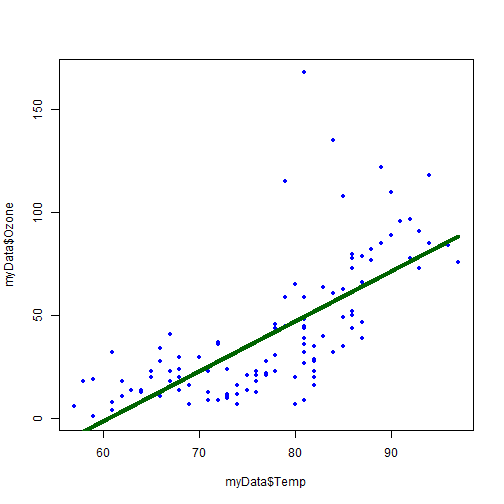

As expected, the call to lm() in R produces the same outputs as the hand calculations.  

####_Potential Pitfalls in Regression_  
There are many potential problems that can throw off the OLS approach, including but not limited to:  
  
* Nonlinearity - as in the Ozone example above, where Ozone is ~0 for all low-ish temperatures  
* Outliers - especially problematic for small-n regression or large deviation on x/y from regression line  
* Intepreting correlation as causality - this is just a model that y ~ x, not (necessarily) that x causes y  
* Inappropriate extrapolation - for example, above only has temperatures 60-90, cannot predict 30 or 120  
* Ecological fallacy - drawing conclusions about individuals after running a group model (for example, if aggregating students by state, drawing conclusions about a specific student in state X based on the model)  
* Restriction of range -- sample contains a very limited range of predictors (x variables)  

In addition, there are many assumptions that we should investigate/validate during the regression process:  
  
* Linearity of response and predictor relationships - eyeball test on scatterplot  
* Normality can be assessed by examining the residuals - eyeball test  
* Outliers can be investigates using standardized residuals, where "more extreme than +/- 3 is a concern"
* Homoscedasticity can be assessed by graphing residuals vs. predictors to see if they have equal dispersion for all values of predictor  
* Independence of errors means they are not related to each other; particularly an issue for time series  
  
The key theme is to look at a scatterplot.  The pairs() function showed that we have some issues in the regression run above which we would need to address if we wanted to take action based on this regression.  

####_Testing the model, including PI and CI_  
We can run hypothesis tests on whether our model beta is significant:  
  
* Ho: Beta = 0  
* Ha: Beta <> 0  
* Test statistic: t = Beta / seBeta , df = n-2 where n is total observations  
* CI = Beta +/- critical-t * seBeta  

Further, we can calculate some key statistics about the quality of our predictions:  
  
* Prediction Interval (PI) for predicted individual response  
* Confidence Interval (CI) for predicted population means  
  
* CI of the mean: CI for mu(y) = y-hat +/- t-critical * S(Res) / sqrt(n)  
* PI of an individual: PI for y(i) = y-hat +/- t-critical * S(Res)  
* S(Res) is the SE of the residual, defines as sqrt(Residual SS / (n-2))  
* n is the total number of observations  
  
We can take a look at some residuals and the above statistics for our previous Ozone ~ Temp call:  

  

```r
## Re-print for convenience
print(paste0("TSS: ",round(estTSS,1)," ResSS: ",round(estResSS,1),
             " RegSS: ",round(estRegSS,1)," r^2: ",round(estR2,3),
             " Standard Residual ",round(stdResSS,2)," on df=",dfRes
             )
      )
```

```
## [1] "TSS: 125143.1 ResSS: 64109.9 RegSS: 61033.2 r^2: 0.488 Standard Residual 23.71 on df=114"
```

```r
summary(regR)
```

```
## 
## Call:
## lm(formula = Ozone ~ Temp, data = myData)
## 
## Residuals:
##     Min      1Q  Median      3Q     Max 
## -40.729 -17.409  -0.587  11.306 118.271 
## 
## Coefficients:
##              Estimate Std. Error t value Pr(>|t|)    
## (Intercept) -146.9955    18.2872  -8.038 9.37e-13 ***
## Temp           2.4287     0.2331  10.418  < 2e-16 ***
## ---
## Signif. codes:  0 '***' 0.001 '**' 0.01 '*' 0.05 '.' 0.1 ' ' 1
## 
## Residual standard error: 23.71 on 114 degrees of freedom
## Multiple R-squared:  0.4877,	Adjusted R-squared:  0.4832 
## F-statistic: 108.5 on 1 and 114 DF,  p-value: < 2.2e-16
```

```r
plot(x=myData$Temp,y=regR$residuals)
abline(h=0)
```

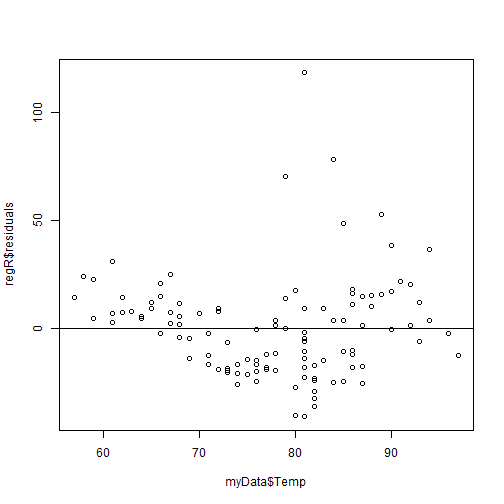

```r
plot(x=myData$Ozone,y=regR$residuals)
abline(h=0)
```

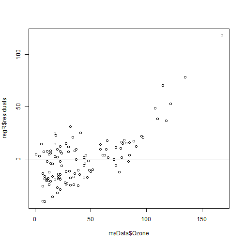

As before, we match the outputs from R.  The residuals are plausibly OK when plotted against temperature, but clearly flawed when plotted against Ozone.  This is likely due to the non-linearity observed in the original dataset, and signals that we would need to clean the data or explore a different model before proceeding.  
  
####_Exponential Regression_  
While there are many types of nonlinear regression, the exponential form is especially nice since it reduces easily to the linear form.  The regression can be expressed as:  

* y = a * b^x  
* mu(y) = alpha * Beta^x  
* These are commonly time regressions, so mu(y) = alpha * Beta^t is common to see  

This formulation can easily be reduced to a linear form:  

* ln( y-hat ) = ln(alpha) + x * ln(beta)  
* ln( y-hat ) = A + B * x , where A = ln(alpha) and B=ln(beta)  

An example with the airquality dataset:  

```r
myLNData <- myData
myLNData$Ozone <- log(myData$Ozone)

regLNR <- lm(Ozone ~ Temp , data=myLNData)

alphaLN <- exp(regLNR$coefficients[[1]])
betaLN <- exp(regLNR$coefficients[[2]])

print(paste0("We predict alpha: ",round(alphaLN,3)," and beta: ",round(betaLN,3)))
```

```
## [1] "We predict alpha: 0.159 and beta: 1.07"
```

```r
plot(myData$Temp, myData$Ozone, pch=20, col="blue")
lines(x=60:90,y=alphaLN*(60:90)^betaLN,lwd=4,col="dark green")
```

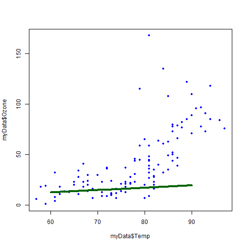

```r
## R nonlinear least squares outputs
myNLS <- nls(Ozone ~ a * b^Temp, data=myData, start=list(a=1, b=1))
summary(myNLS)
```

```
## 
## Formula: Ozone ~ a * b^Temp
## 
## Parameters:
##   Estimate Std. Error t value Pr(>|t|)    
## a 0.298900   0.158536   1.885   0.0619 .  
## b 1.063533   0.006498 163.672   <2e-16 ***
## ---
## Signif. codes:  0 '***' 0.001 '**' 0.01 '*' 0.05 '.' 0.1 ' ' 1
## 
## Residual standard error: 22.66 on 114 degrees of freedom
## 
## Number of iterations to convergence: 14 
## Achieved convergence tolerance: 2.988e-07
```

The data from OLS on the linear transformation closely matches the approxiamtaion from R using NLS.  It is obviously not an appropriate fit given this data!  

## Module 4: Multiple Regression  
Multiple regression expands simple regression by moving to two or more predictors.  These may be needed to increase explanatory power or to relieve confounders.  The assumptions are similar, although there is now a best-fit plane to describe the mean, still with the assumption that residuals all have the same sigma and are normally distributed.  

The multiple regression equation can include:  
  
* Sample: y-hat(i) = a + b1 * x1(i) + b2 *x2(i) + . . . + bn * xn(i)  
* Population: mu(y) = alpha + beta1 * x1 + beta2 * x2 + . . .+ betan * xn  
  
####_Multiple R and R-Squared_  
Similar to simple regression, multiple regression can be described by both R and R^2.  These are:  
  
* R is the multiple correlation coefficient (always non-negative 0 <= R <= 1) that describes how strongly the response variable is related to the SET of predictor variables  
* R^2 is the explained variation as a proportion, and is still Regression Sum-Squares / Total Sum-Squares  
* Multiple-R is sqrt(R^2) and R^2 is (multiple-R)^2  
  
The multiple-R is based on several correlations.  For example, suppose you have response variable y with predictor variables x1, x2.  Define and use simple correlations as:  
  
* CorYX1 = cor(y, x1)  
* CorYX2 = cor(y, x2)  
* CorX1X2 = cor(x1, x2)  
* R = sqrt[ (CorYX1^2 + CorYX2^2 - 2 * CorYX1 * CorYX2 * CorX1X2) / (1 - CorX1X2^2) ]  

An example can be shown using the dataset mtcars, which will have something of a collinearity problem:  

```r
data(mtcars)
myMulti <- mtcars[,c("mpg","cyl","wt")]
pairs(myMulti)
```

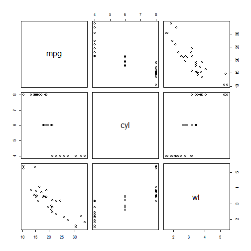

```r
corYX1<- cor(mtcars$mpg,mtcars$cyl)
corYX2<- cor(mtcars$mpg,mtcars$wt)
corX1X2<- cor(mtcars$wt,mtcars$cyl)

multiR <- sqrt( (corYX1^2 + corYX2^2 - 2*corYX1*corYX2*corX1X2) / (1 - corX1X2^2) )

print(paste0("Correlations include MPG-CYL: ",round(corYX1,3),
             " MPG-WT: ",round(corYX2,3)," CYL-WT: ",round(corX1X2,3)
             )
      )
```

```
## [1] "Correlations include MPG-CYL: -0.852 MPG-WT: -0.868 CYL-WT: 0.782"
```

```r
print(paste0("Multiple R is ",round(multiR,4)," for R-squared ",round(multiR^2,4)))
```

```
## [1] "Multiple R is 0.9112 for R-squared 0.8302"
```

```r
summary(lm(mpg ~ cyl + wt, data=mtcars))
```

```
## 
## Call:
## lm(formula = mpg ~ cyl + wt, data = mtcars)
## 
## Residuals:
##     Min      1Q  Median      3Q     Max 
## -4.2893 -1.5512 -0.4684  1.5743  6.1004 
## 
## Coefficients:
##             Estimate Std. Error t value Pr(>|t|)    
## (Intercept)  39.6863     1.7150  23.141  < 2e-16 ***
## cyl          -1.5078     0.4147  -3.636 0.001064 ** 
## wt           -3.1910     0.7569  -4.216 0.000222 ***
## ---
## Signif. codes:  0 '***' 0.001 '**' 0.01 '*' 0.05 '.' 0.1 ' ' 1
## 
## Residual standard error: 2.568 on 29 degrees of freedom
## Multiple R-squared:  0.8302,	Adjusted R-squared:  0.8185 
## F-statistic: 70.91 on 2 and 29 DF,  p-value: 6.809e-12
```

The hand calculation for two-variable R matches what we get from the linear model in R.  

####_Overall Model Tests_  
The null hypothesis is that Beta1 = Beta2 = . . . = Betan = 0.  The alternate hypothesis is that at least one of the Beta is non-zero, which is to say that the predictors, alone or in combination, have explanatory power.  
There are several core assumptions required for running a multiple regression, including:  
  
* Linearity - as before, requires linear relationships of Y vs. Xi  
* Normal residuals  
* Homoscedastic residuals -- cannot grow/shrink as any of the Xi variables grow/shrink  
* Independent residuals -- especially important in time-series and the like  
* Observations > Predictors  
  
The overall hypothesis test is assessed using the F statistic.  This is calculated as:  
  
* MSReg (Regression Mean Sum Squares) = Regression Sum Squares / (k-1), where k is explanatory variables + 1  
* MSRes (Residual Mean Sum Squares) = Residual Sum Squares / (n-k), where n is the total observations  
* F = MSReg / MSRes with df1=(k-1) and df2=(n-k) where k is "explanatory variables + 1" and n is total observations  
  
So, continuing with the mtcars example, we have:  

```r
mtTSS <- sum( (mtcars$mpg - mean(mtcars$mpg) )^2 )
mtRegSS <- multiR^2 * mtTSS
mtResSS <- mtTSS - mtRegSS
dfReg <- (2 + 1 - 1)  ## k-1 where k is explanatory + 1
dfRes <- nrow(mtcars) - (2 + 1)  ## n-k where n is total and k is explanatory + 1

print(paste0("We have Mean Regression SS: ",round(mtRegSS/dfReg,2),
             " and Mean Resiudal SS: ",round(mtResSS/dfRes,2)
             )
      )
```

```
## [1] "We have Mean Regression SS: 467.44 and Mean Resiudal SS: 6.59"
```

```r
print(paste0("This gives F: ",round((mtRegSS/dfReg)/(mtResSS/dfRes),2),
             " on df1=",dfReg," and df2=",dfRes," for p=",
             round(pf((mtRegSS/dfReg)/(mtResSS/dfRes),df1=dfReg,df2=dfRes,lower.tail=FALSE),4)
             )
      )
```

```
## [1] "This gives F: 70.91 on df1=2 and df2=29 for p=0"
```

```r
summary(lm(mpg ~ cyl + wt, data=mtcars))
```

```
## 
## Call:
## lm(formula = mpg ~ cyl + wt, data = mtcars)
## 
## Residuals:
##     Min      1Q  Median      3Q     Max 
## -4.2893 -1.5512 -0.4684  1.5743  6.1004 
## 
## Coefficients:
##             Estimate Std. Error t value Pr(>|t|)    
## (Intercept)  39.6863     1.7150  23.141  < 2e-16 ***
## cyl          -1.5078     0.4147  -3.636 0.001064 ** 
## wt           -3.1910     0.7569  -4.216 0.000222 ***
## ---
## Signif. codes:  0 '***' 0.001 '**' 0.01 '*' 0.05 '.' 0.1 ' ' 1
## 
## Residual standard error: 2.568 on 29 degrees of freedom
## Multiple R-squared:  0.8302,	Adjusted R-squared:  0.8185 
## F-statistic: 70.91 on 2 and 29 DF,  p-value: 6.809e-12
```

```r
sum(resid(lm(mpg ~ cyl + wt, data=mtcars))^2) / (nrow(mtcars) - 3)
```

```
## [1] 6.592137
```

And as before, the hand calculations match with what we see from the lm() function.  

####_Individual Predictor Tests_  
Individual t-tests help to explain whether any particular variable(s) have explanatory power, after controlling for the other variables.  The same assumptions as the overall model continue to apply.  

The hypothesis testing is familiar:  
  
* Ho: Beta(i) = 0 after controlling for other factors  
* Ha: Beta(i) <> 0 after controlling for other factors  
* Test Stat t = Beta(i) / seBeta(i), df=n-k where n is total observations and k is "total predictors + 1"  
* CI for Beta(i) = Beta(i) +/- critical-T * seBeta(i), using df=n-k  
  
Note that the power of an individual predictor may go up or down as other variables are added/subtracted from the overall model.  We can grab the CI and test-statistic directly from R:  


```r
myA <- lm(mpg ~ cyl + wt, data=mtcars)

summary(myA)
```

```
## 
## Call:
## lm(formula = mpg ~ cyl + wt, data = mtcars)
## 
## Residuals:
##     Min      1Q  Median      3Q     Max 
## -4.2893 -1.5512 -0.4684  1.5743  6.1004 
## 
## Coefficients:
##             Estimate Std. Error t value Pr(>|t|)    
## (Intercept)  39.6863     1.7150  23.141  < 2e-16 ***
## cyl          -1.5078     0.4147  -3.636 0.001064 ** 
## wt           -3.1910     0.7569  -4.216 0.000222 ***
## ---
## Signif. codes:  0 '***' 0.001 '**' 0.01 '*' 0.05 '.' 0.1 ' ' 1
## 
## Residual standard error: 2.568 on 29 degrees of freedom
## Multiple R-squared:  0.8302,	Adjusted R-squared:  0.8185 
## F-statistic: 70.91 on 2 and 29 DF,  p-value: 6.809e-12
```

```r
myEst <- as.data.frame(summary(myA)$coefficients)$"Estimate"
mySE <- as.data.frame(summary(myA)$coefficients)$"Std. Error"
criticalT <- qt(.025, df=(nrow(mtcars)-(2+1)), lower.tail=FALSE)
myLow <- myEst - criticalT*mySE
myHigh <- myEst + criticalT*mySE

myLow
```

```
## [1] 36.178725 -2.355928 -4.739020
```

```r
myHigh
```

```
## [1] 43.1937976 -0.6596622 -1.6429245
```

```r
confint.lm(myA)
```

```
##                 2.5 %     97.5 %
## (Intercept) 36.178725 43.1937976
## cyl         -2.355928 -0.6596622
## wt          -4.739020 -1.6429245
```

And we see that the hand calculations off the summary of the lm match the confidence interval as (much more conveniently) created by way of confint.lm().  

####_Checking Assumptions_  
The key assumptions are very similar to simple regression and include but are not limited to:  
  
* Linearity - for any combination of other x, we need x(i) and y to be linearly related  
* Normal errors - eyeball test of residuals, fairly robust to violations for two-sided large-N  
* Homoscedastic errors - eyeball the residuals, see if errors get skinnier/fatter with x(i)  
* Independence of errors - generally controlled by good experiment design, particularly a problem for time series  
* Sufficient observations - rule of thumb for n >= 10*m where m is the number of predictors  
* Absaence of outliers - inspect any standardized residuals of greater than +/- 3  

####_Categorical predictors and response variables_  
The categorical predictor is a binary variable introduced to indicate yes/no.  It is typically used for things like male/female or smoker/nonsmoker.  If you have three things of interest, you use two categorical variables, where 1 0 is A, 0 1 is B, and 0 0 is C.  These need to be such that there is no case of 1 1.  The regression is run as per usual.  

The categorical response variable leads to logistic regression (logit), and would typically be used if we are trying to determine the yes/no status of something.  For example, perhaps we are trying to predict what gets an entry selected as top-100 in a global competition.  Then, we will have an indicator variable that is 1 for selected and 0 for not selected.  

A common functional form for the logit is exp(alpha + beta * x)/(1 + exp(alpha + beta * x)).  There are some features of note to this prediction:  
  
* When beta is positive, it slopes up  
* When beta is negative, it slopes down  
* When beta is high-magintude, it is a fast ramp  
* The inflection point y=0.5 occurs at x = -alpha/beta  
  
To use this variable in regression, we first convert to odds and then take the natural logarithm.  For example:  
  
* Odds = P(win)/P(lose) = exp(alpha + beta * x)  
* Log-odds = ln(odds) = alpha + beta * x  

The results of a logit regression are reported in log-odds, with the estimates being "change in log-odds per change in unit of predictor variable".  The coefficients may be referred to as the "odds ratio".  The easiest way to get back to probability is to recall that p = odds / (1 + odds).  

Software will also output a classification table showing predicted (cut point is typically p > 0.5) vs. actual.  There are a few key metrics:  

* Specificity = Correct Model Reject / Total Real World Reject  
* Sensitivity = Correct Model Accept / Total Real World Accept  
* Overall Percentage = Correct Model / Total Real World  
  
Suppose that we modify the mtcars example a bit and explore:  

```r
data(mtcars)
myMulti <- mtcars[,c("mpg","cyl","wt")]
myMulti$mpgWin <- myMulti$mpg > 20
pairs(myMulti)
```

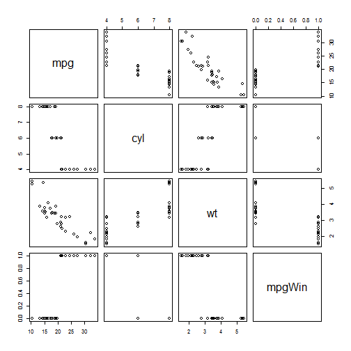

```r
myModel <- glm(mpgWin ~ wt + cyl, family=binomial(link="logit"), data=myMulti)
summary(myModel)
```

```
## 
## Call:
## glm(formula = mpgWin ~ wt + cyl, family = binomial(link = "logit"), 
##     data = myMulti)
## 
## Deviance Residuals: 
##      Min        1Q    Median        3Q       Max  
## -1.62926  -0.00003   0.00000   0.00002   1.51381  
## 
## Coefficients:
##              Estimate Std. Error z value Pr(>|z|)
## (Intercept)    71.312  14650.124   0.005    0.996
## wt             -4.005      2.956  -1.355    0.175
## cyl            -9.866   2441.687  -0.004    0.997
## 
## (Dispersion parameter for binomial family taken to be 1)
## 
##     Null deviance: 43.860  on 31  degrees of freedom
## Residual deviance:  7.199  on 29  degrees of freedom
## AIC: 13.199
## 
## Number of Fisher Scoring iterations: 20
```

```r
anova(myModel, test="Chisq")
```

```
## Analysis of Deviance Table
## 
## Model: binomial, link: logit
## 
## Response: mpgWin
## 
## Terms added sequentially (first to last)
## 
## 
##      Df Deviance Resid. Df Resid. Dev  Pr(>Chi)    
## NULL                    31     43.860              
## wt    1  30.1298        30     13.730 4.041e-08 ***
## cyl   1   6.5313        29      7.199    0.0106 *  
## ---
## Signif. codes:  0 '***' 0.001 '**' 0.01 '*' 0.05 '.' 0.1 ' ' 1
```

```r
myFitted <- predict(myModel, newdata=myMulti, type="response")
myFitted <- ifelse(myFitted>0.5,1,0)

logitSens <- sum(myFitted*myMulti$mpgWin)/sum(myMulti$mpgWin)
logitSpec <- sum((1-myFitted)*(1-myMulti$mpgWin))/sum(1-myMulti$mpgWin)
logitAll <- sum(myFitted == myMulti$mpgWin)/length(myMulti$mpgWin)

print(paste0("This logit has specificity ",round(logitSpec,3)," and sensitivity ",
             round(logitSens,3)," for total percentage ",round(logitAll,3)
             )
      )
```

```
## [1] "This logit has specificity 0.944 and sensitivity 0.929 for total percentage 0.938"
```

Given the friendly inputs, the logit does quite well with the predictions.  

## Module 5: Analysis of Variance (ANOVA)  
ANOVA means ANalysis Of VAriance and is a means for assessing whether multiple groups all come from the same population.  The primary idea is to compare variance between groups and variance within groups.  An advantage of ANOVA vs. multiple t-tests is that ANOVA keeps Familywise Error Rate (FEWR) at alpha while multiple t-tests require alpha correction to avoid high rates of false detection.  
  
####_Hypotheses, test statistics, calculations, assumptions_  
  
* Ho is that all groups are from the same population (loosely, have the same means)  
* Ha is that one or more of the groups are from a different population (loosely have different means)  
* Test Statistic F = MSBetween / MSWithin, df1=(g-1), df2=(n-g)  
* Definition of n is number of total observations and definition of g is total number of groups  
* Broadly, Ho reduces to F=1 and Ha is that F>1  
  
The calculation of the key ANOVA statistics is very similar to (and highly related to) multiple regression.  For example, the key metrics come from:  
  
* Within each group k, calculate the group mean y-bar(k)  
* Across groups, calculate the grand mean y-bar-grand  
* For each group k, SSWithin(k) = sum-over-i-of ( y(i) - y-bar(k) )^2  
* SSWithin = sum-over-all-groups of SSWithin(k)  
* MSWithin = SSWithin / (n-g) where n is total observations and g is total groups  
* SSBetween = sum-over-all-groups-of ( n-group * (y-bar-group - y-bar-grand)^2 )  
* MSBetween = SSBetween / (g-1) where g is the number of groups  
  
The assumptions for ANOVA are broadly the same as for multiple regression.  In partiuclar, look at:  
  
* Independence of observations -- if dependenet by design, need to use "repeated measures ANOVA"  
* Normally distributed data (though robust to violations) -- prefer n >= 10, otherwise go non-parametric  
* Homogeneity of variances within groups (though robust and generally OK if maxSD <= 2*minSD)  
  
####_Post-hoc t-tests_  
If and only if ANOVA comes back significant, post-hoc t-tests can be run.  There is a need to decide on how strictly to treat alpha in this case, recalling that ANOVA already restricted the overall model to alpha.  So, we know something is significantly different and need to decide how strict we will be in allowing post-hoc Type 1 errors in identifying those something.  

One approach is to use Fisher Least Significant Differences.  This approach uses the pooled standard error available from the ANOVA as follows:  
  
* Suppose we will conmpare groups j and k which have means y-bar-j and y-bar-k with counts nj and nk  
* SE = sqrt( SSWithin / (n-g) ) * sqrt( 1/nj + 1/nk )  
* This reduces to SE = sqrt( MSWithin )  * sqrt( 1/nj + 1/nk )  
* If the groups are j and k, t = (y-bar-j minus y-bar-k) / SE, df=(n-g)  
* CI = (y-bar-j minus y-bar-k) +/- critical-t * SE, df=(n-g)  
  
Other approaches try to make some adjustments for FamilyWise Error Rate (FWER).  These include Bonferroni (divide alpha by the number of post-hoc comparisons) or Tukey's HSD (tries to keep FWER around alpha).  

The example below is borrowed liberally from seperate code I wrote to test ANOVA (see QuickLookANOVA_v001.Rmd for a more thorough explanation of the code).  


```r
dummyData <- data.frame(groupA=c(12,12,16,17,18), groupB=c(22,24,25,26,28), groupC=c(6,8,9,12,15))
boxplot(dummyData)
```

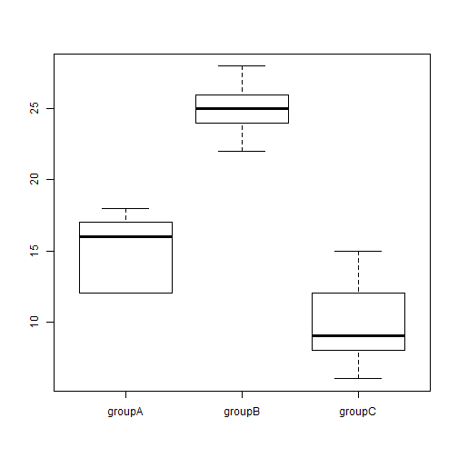

```r
sampleStats <- data.frame(means=rep(0,ncol(dummyData)),stdevs=rep(0,ncol(dummyData)))

for (intCtr in 1:ncol(dummyData)) {
    sampleStats$means[intCtr] <- mean(dummyData[,intCtr])
    sampleStats$stdevs[intCtr] <- sd(dummyData[,intCtr])
}

rownames(sampleStats) <- names(dummyData)

print("Means and Standard Deviations")
```

```
## [1] "Means and Standard Deviations"
```

```r
sampleStats
```

```
##        means   stdevs
## groupA    15 2.828427
## groupB    25 2.236068
## groupC    10 3.535534
```

```r
summary(dummyData)
```

```
##      groupA       groupB       groupC  
##  Min.   :12   Min.   :22   Min.   : 6  
##  1st Qu.:12   1st Qu.:24   1st Qu.: 8  
##  Median :16   Median :25   Median : 9  
##  Mean   :15   Mean   :25   Mean   :10  
##  3rd Qu.:17   3rd Qu.:26   3rd Qu.:12  
##  Max.   :18   Max.   :28   Max.   :15
```

```r
## Calculate MSWithin
ssWithinGroups <- rep(0,ncol(dummyData))

for (intCtr in 1:ncol(dummyData)) {
    for (intCtr2 in 1:nrow(dummyData)) {
        ssWithinGroups[intCtr] <- ssWithinGroups[intCtr] + 
                                  (dummyData[intCtr2,intCtr] - mean(dummyData[,intCtr]))^2
    }
}

ssWithinGroups
```

```
## [1] 32 20 50
```

```r
dfWithin <- ncol(dummyData) * nrow(dummyData) - ncol(dummyData)
msWithin <- sum(ssWithinGroups) / dfWithin
print(paste0("MS Within: ",msWithin," with df=",dfWithin))
```

```
## [1] "MS Within: 8.5 with df=12"
```

```r
## Calculate MSBetween
ssBetweenGroups <- rep(0,ncol(dummyData))
grandMean <- mean(as.matrix(dummyData))

for (intCtr in 1:ncol(dummyData)) {
    ssBetweenGroups[intCtr] <- length(dummyData[,intCtr]) * (mean(dummyData[,intCtr]) - grandMean)^2
}

ssBetweenGroups
```

```
## [1]  13.88889 347.22222 222.22222
```

```r
dfBetween <- ncol(dummyData) - 1
msBetween <- sum(ssBetweenGroups) / dfBetween
print(paste0("MS Between: ",round(msBetween,2)," with df=",dfBetween))
```

```
## [1] "MS Between: 291.67 with df=2"
```

```r
myFStat <- msBetween / msWithin
myPValue <- pf(myFStat,df1=msBetween,df2=msWithin,lower.tail=FALSE)

print(paste0("F-statistic: ",round(myFStat,2)," with df1=",dfBetween," and df2=",dfWithin))
```

```
## [1] "F-statistic: 34.31 with df1=2 and df2=12"
```

```r
print(paste0("Relevant p-value is: ",round(myPValue,4)))
```

```
## [1] "Relevant p-value is: 0"
```

```r
nCompare <- 0.5 * (ncol(dummyData) * (ncol(dummyData)-1))

myFisherLSD <- data.frame(compType=rep("",nCompare),diffLow=rep(0,nCompare),diffHigh=rep(0,nCompare),
                          stringsAsFactors = FALSE)

## Run for alpha=0.05 two-sided and df=dfWithin
tCritical <- qt(0.025,df=dfWithin,lower.tail=FALSE)

nCompare <- 1 ## Recycling the variable

for (intCtr in 1:(ncol(dummyData)-1)) {
    for (intCtr2 in (intCtr+1):ncol(dummyData)) {
        myFisherLSD$compType[nCompare] <- paste0(names(dummyData)[intCtr]," vs. ",names(dummyData)[intCtr2])
        
        diffMean <- mean(dummyData[,intCtr]) - mean(dummyData[,intCtr2])
        mySE <- sqrt(msWithin) * sqrt(1/length(dummyData[,intCtr]) + 1/length(dummyData[,intCtr2]))
        
        myFisherLSD$diffLow[nCompare] <- diffMean - tCritical*mySE
        myFisherLSD$diffHigh[nCompare] <- diffMean + tCritical*mySE
        
        nCompare <- nCompare + 1
    }
}

print("Below are the 95% hand-calculated CI for differences in mean using Fisher LSD")
```

```
## [1] "Below are the 95% hand-calculated CI for differences in mean using Fisher LSD"
```

```r
myFisherLSD
```

```
##            compType     diffLow  diffHigh
## 1 groupA vs. groupB -14.0175323 -5.982468
## 2 groupA vs. groupC   0.9824677  9.017532
## 3 groupB vs. groupC  10.9824677 19.017532
```

```r
myFactorFrame <- data.frame(keyGroup=rep("",nrow(dummyData)*ncol(dummyData)),
                            indValue=rep(0,nrow(dummyData)*ncol(dummyData)),
                            stringsAsFactors = FALSE
                            )

nCompare <- 1 ## Reccylcing the variable

for (intCtr in 1:ncol(dummyData)) {
    for (intCtr2 in 1:nrow(dummyData)) {
        myFactorFrame$keyGroup[nCompare] <- names(dummyData)[intCtr]
        myFactorFrame$indValue[nCompare] <- dummyData[intCtr2,intCtr]
        nCompare <- nCompare + 1
    }
}

myFactorFrame
```

```
##    keyGroup indValue
## 1    groupA       12
## 2    groupA       12
## 3    groupA       16
## 4    groupA       17
## 5    groupA       18
## 6    groupB       22
## 7    groupB       24
## 8    groupB       25
## 9    groupB       26
## 10   groupB       28
## 11   groupC        6
## 12   groupC        8
## 13   groupC        9
## 14   groupC       12
## 15   groupC       15
```

```r
myFactorFrame$aovFactor <- factor(myFactorFrame$keyGroup,levels=c("groupC","groupA","groupB"))
aovFromR <- aov(indValue ~ aovFactor , data=myFactorFrame)
summary(aovFromR)
```

```
##             Df Sum Sq Mean Sq F value   Pr(>F)    
## aovFactor    2  583.3   291.7   34.31 1.09e-05 ***
## Residuals   12  102.0     8.5                     
## ---
## Signif. codes:  0 '***' 0.001 '**' 0.01 '*' 0.05 '.' 0.1 ' ' 1
```

```r
confint(aovFromR)
```

```
##                      2.5 %    97.5 %
## (Intercept)      7.1591756 12.840824
## aovFactorgroupA  0.9824677  9.017532
## aovFactorgroupB 10.9824677 19.017532
```

```r
## Run the Tukey HSD
TukeyHSD(aovFromR)
```

```
##   Tukey multiple comparisons of means
##     95% family-wise confidence level
## 
## Fit: aov(formula = indValue ~ aovFactor, data = myFactorFrame)
## 
## $aovFactor
##               diff         lwr       upr     p adj
## groupA-groupC    5  0.08070249  9.919298 0.0462914
## groupB-groupC   15 10.08070249 19.919298 0.0000088
## groupB-groupA   10  5.08070249 14.919298 0.0004187
```

```r
## Run standard pairwise t-tests
pairwise.t.test(x=myFactorFrame$indValue , g=myFactorFrame$keyGroup , p.adjust.method = "none")
```

```
## 
## 	Pairwise comparisons using t tests with pooled SD 
## 
## data:  myFactorFrame$indValue and myFactorFrame$keyGroup 
## 
##        groupA  groupB 
## groupB 0.00015 -      
## groupC 0.01890 3.2e-06
## 
## P value adjustment method: none
```

```r
## Run Bonferroni pairwise t-tests
pairwise.t.test(x=myFactorFrame$indValue , g=myFactorFrame$keyGroup , p.adjust.method = "bonferroni")
```

```
## 
## 	Pairwise comparisons using t tests with pooled SD 
## 
## data:  myFactorFrame$indValue and myFactorFrame$keyGroup 
## 
##        groupA  groupB 
## groupB 0.00046 -      
## groupC 0.05669 9.5e-06
## 
## P value adjustment method: bonferroni
```

```r
## Run Holm pairwise t-tests
pairwise.t.test(x=myFactorFrame$indValue , g=myFactorFrame$keyGroup , p.adjust.method = "holm")
```

```
## 
## 	Pairwise comparisons using t tests with pooled SD 
## 
## data:  myFactorFrame$indValue and myFactorFrame$keyGroup 
## 
##        groupA  groupB 
## groupB 0.00031 -      
## groupC 0.01890 9.5e-06
## 
## P value adjustment method: holm
```
  
The hand calculations match the aov outputs observed from R.  The post-hoc confidence intervals vary depending on the metric that we choose to use.  

####_ANOVA and Multiple Regression_  
Further, ANOVA is a very close parallel to multiple regression.  
  
* MSResidual from regression will be MSWithin (within group variance) in ANOVA  
* MSRegression from regression will be MSBetween (between group variance) in ANOVA  
* F = MSRegression / MSResidual from regression will match F = MSBetween / MSWithin from ANOVA  
* p-value is pf(F, df1=(g-1), df2=(n-g), lower.tail=FALSE) in either case  
  


```r
myFactorFrame$dummyA <- ifelse(myFactorFrame$keyGroup=="groupA",1,0)
myFactorFrame$dummyB <- ifelse(myFactorFrame$keyGroup=="groupB",1,0)

myLMDummy <- lm(indValue ~ dummyA + dummyB, data=myFactorFrame)
summary(myLMDummy)
```

```
## 
## Call:
## lm(formula = indValue ~ dummyA + dummyB, data = myFactorFrame)
## 
## Residuals:
##    Min     1Q Median     3Q    Max 
##   -4.0   -2.5    0.0    2.0    5.0 
## 
## Coefficients:
##             Estimate Std. Error t value Pr(>|t|)    
## (Intercept)   10.000      1.304   7.670 5.77e-06 ***
## dummyA         5.000      1.844   2.712   0.0189 *  
## dummyB        15.000      1.844   8.135 3.17e-06 ***
## ---
## Signif. codes:  0 '***' 0.001 '**' 0.01 '*' 0.05 '.' 0.1 ' ' 1
## 
## Residual standard error: 2.915 on 12 degrees of freedom
## Multiple R-squared:  0.8512,	Adjusted R-squared:  0.8264 
## F-statistic: 34.31 on 2 and 12 DF,  p-value: 1.087e-05
```

```r
confint(myLMDummy)
```

```
##                  2.5 %    97.5 %
## (Intercept)  7.1591756 12.840824
## dummyA       0.9824677  9.017532
## dummyB      10.9824677 19.017532
```
  
As expected, the F-statistic is identical in the multivariate regression with dummy (factor) variables.  Further, the confidence intervals match those provided by aov().  

####_Factorial ANOVA_  
There is no particular reason that there needs to be just one factor variable.  Factorial ANOVA is run when you have two or more factors and one depedent variable.  An example would be when you have a 2x2x3 experiment frame and want to understand the potential differences.  

As a first approach, you can always collapse down to a single dimension and run ANOVA to look for the "main effect" of that specific variable.  

There can also be value to looking for the interaction effects.  Broadly speaking:
  
* 1 dependent, 1 independent - one-way ANOVA  
* 1 dependent, 2+ independent - factorial ANOVA  
* 2+ dependent, 1 independent - Multiple ANOVAs  
* 2+ dependent, 2+ independent - MANOVA  

Suppose for this example that you have three levels on variable A and two levels on variables B and have the mean, standard deviation, and N for each of the AxB buckets.  You also have the marginals for A and B.  

The key terms are then (Within=Overall, DueA/DueB on marginals, DueAB on joints):  
  
* SSWithin = sum-over-k-of ( (nk-1) * sdk^2 ), dfWithin = N - g [N total observations in g groups]  
* SSDueA = sum-over-j-of ( nj * (mean-in-j - grand-mean)^2 ), df = g(a) - 1 [g(a)=groups of a]  
* SSDueB = sum-over-m-of ( nm * (mean-in-m - grand-mean)^2 ), df = g(b) - 1 [g(b)=groups of b]  
* SSDueAB = sum-over-z-of ( nz * (mean-in-z - row-mean - col-mean + grand-mean)^2 ), df=(g(a) - 1) * (g(b) - 1), where g(a) is the number of groups of type A and g(b) is the number of groups of type B.  

That is confusing!  An example may be helpful.  


```r
## Create an example grid with n, mu, and sd
factFrame <- data.frame(typeA=c(rep("1",3),rep("2",3),rep("3",3),rep("Total",3)),
                        typeB=rep(c("1","2","Total"),4),
                        groupN=c(20,22,42,15,32,47,18,21,39,53,75,128),
                        groupMean=c(5.35,5.73,5.55,5,5.34,5.23,5.72,5.10,5.38,5.38,5.39,5.38),
                        groupSD=c(1.21,1.17,1.19,1.14,1.10,1.12,1.06,1.15,1.11,1.13,1.14,1.14)
                        )

withinFrame <- subset(factFrame, typeA != "Total" & typeB != "Total")
gA <- sum(table(withinFrame$typeA)>0)
gB <- sum(table(withinFrame$typeB)>0)
overallN <- sum(withinFrame$groupN)
grandMean <- sum(withinFrame$groupMean * withinFrame$groupN) / overallN

ssWithin <- sum( (withinFrame$groupN - 1) * withinFrame$groupSD^2 )
dfWithin <- overallN - gA * gB

dueAFrame <- subset(factFrame, typeA != "Total" & typeB == "Total")
ssDueA <- sum( dueAFrame$groupN * ( dueAFrame$groupMean - grandMean )^2 )
dfDueA <- gA - 1

dueBFrame <- subset(factFrame, typeA == "Total" & typeB != "Total")
ssDueB <- sum( dueBFrame$groupN * ( dueBFrame$groupMean - grandMean )^2 )
dfDueB <- gB - 1

dueABFrame <- withinFrame
dueABFrame$meanA <- dueAFrame[match(withinFrame$typeA,dueAFrame$typeA),"groupMean"]
dueABFrame$meanB <- dueBFrame[match(withinFrame$typeB,dueBFrame$typeB),"groupMean"]
ssDueAB <- sum( dueABFrame$groupN * ( dueABFrame$groupMean - dueABFrame$meanA - dueABFrame$meanB + grandMean)^2 )
dfDueAB <- (gA - 1) * (gB - 1)

fDueA <- (ssDueA / dfDueA) / (ssWithin / dfWithin)
pDueA <- pf(fDueA, dfDueA, dfWithin, lower.tail=FALSE)
dueAFrame
```

```
##   typeA typeB groupN groupMean groupSD
## 3     1 Total     42      5.55    1.19
## 6     2 Total     47      5.23    1.12
## 9     3 Total     39      5.38    1.11
```

```r
print(paste0("Due A Marginal: F=",round(fDueA,2)," with p=",round(pDueA,4)))
```

```
## [1] "Due A Marginal: F=0.88 with p=0.4182"
```

```r
fDueB <- (ssDueB / dfDueB) / (ssWithin / dfWithin)
pDueB <- pf(fDueB, dfDueB, dfWithin, lower.tail=FALSE)
dueBFrame
```

```
##    typeA typeB groupN groupMean groupSD
## 10 Total     1     53      5.38    1.13
## 11 Total     2     75      5.39    1.14
```

```r
print(paste0("Due B Marginal: F=",round(fDueB,2)," with p=",round(pDueB,4)))
```

```
## [1] "Due B Marginal: F=0 with p=0.9542"
```

```r
fDueAB <- (ssDueAB / dfDueAB) / (ssWithin / dfWithin)
pDueAB <- pf(fDueAB, dfDueAB, dfWithin, lower.tail=FALSE)
dueABFrame
```

```
##   typeA typeB groupN groupMean groupSD meanA meanB
## 1     1     1     20      5.35    1.21  5.55  5.38
## 2     1     2     22      5.73    1.17  5.55  5.39
## 4     2     1     15      5.00    1.14  5.23  5.38
## 5     2     2     32      5.34    1.10  5.23  5.39
## 7     3     1     18      5.72    1.06  5.38  5.38
## 8     3     2     21      5.10    1.15  5.38  5.39
```

```r
print(paste0("Due AB Marginal: F=",round(fDueAB,2)," with p=",round(pDueAB,4)))
```

```
## [1] "Due AB Marginal: F=2.47 with p=0.0887"
```

```r
## An example from the Tooth Growth Data -- much easier to use R!
data(ToothGrowth)
summary(aov(len ~ dose * supp, data=ToothGrowth))
```

```
##             Df Sum Sq Mean Sq F value   Pr(>F)    
## dose         1 2224.3  2224.3 133.415  < 2e-16 ***
## supp         1  205.3   205.3  12.317 0.000894 ***
## dose:supp    1   88.9    88.9   5.333 0.024631 *  
## Residuals   56  933.6    16.7                     
## ---
## Signif. codes:  0 '***' 0.001 '**' 0.01 '*' 0.05 '.' 0.1 ' ' 1
```

So, while this can be calculated by hand, if you have the raw data, then it is a lot easier to use the interaction term for aov() in R.  


## Module 6: Nonparametric tests  
Non-parametric tests allow for drawing inferences even when the population paremeters are unknown or known to violate one or more conditions for the associated parametric test.  Broadly, the non-parametric tests are often comparable to a related parametric test.  

Common reasons for using a nonparametric test include:  
  
* Requires fewer assumptions than a parametric test  
* Allows for ordinal data, such as ranking on a scale of 1-5  
* Frequently robust to violations of assumptions (tend not to be terribly wrong)  
* Manages small sample sizes better  
  
The tradeoff is that while nonparametric tests tend to be more robust, parametric tests tend to have better power.  As and when sample sizes and assumptions allow, the parametric test is preferred.  
  
####_Sign test_  
The non-parametric sign test is the rough equivalent to the one-sided t-test.  It is typically used for sample sized smaller than 30-35, with the t-test (assumptions of normality) becoming good enough beyond that.  

Essentially, this is a voting system which is then evaluated based on the associated binomial distribution.  For example, suppose you wonder whether candy A or candy B tastes better.  You would gather in some votes, ignore the ties, and then see what the binomial distribution says.  

Ho: P(x > y) = p, frequently, though not necessarily, 50%  
Ha: P(x > y) <> p, frequently, though not necessarily, one-sided  
test statisttic: binomial distribution of w wins in n trials  

Suppose that we sample from a distribution that has 60% favor A, 10% favor neither, and 30% favor B.  We take 20 pulls from the population and run the sign test.  See for example:  

```r
set.seed(0316160710)

randPulls <- runif(20,0,1)
nWin <- sum(randPulls <= 0.6)
nLose <- sum(randPulls >= 0.7)
nTie <- sum(randPulls > 0.6 & randPulls < 0.7)

print(paste0("The sample has ",nWin," wins, ",nLose," losses, and ",nTie," ties"))
```

```
## [1] "The sample has 13 wins, 5 losses, and 2 ties"
```

```r
## Interested only in the wins and losses and the binomial test
binTest <- binom.test(x=nWin, n=(nWin+nLose), p=0.5, alternative="two.sided")
binTest ## fail to reject due to p=0.096
```

```
## 
## 	Exact binomial test
## 
## data:  nWin and (nWin + nLose)
## number of successes = 13, number of trials = 18, p-value = 0.09625
## alternative hypothesis: true probability of success is not equal to 0.5
## 95 percent confidence interval:
##  0.4651980 0.9030508
## sample estimates:
## probability of success 
##              0.7222222
```

```r
## Can be run as one-sided
binTest <- binom.test(x=nWin, n=(nWin+nLose), p=0.5, alternative="greater")
binTest ## reject based on p=0.048
```

```
## 
## 	Exact binomial test
## 
## data:  nWin and (nWin + nLose)
## number of successes = 13, number of trials = 18, p-value = 0.04813
## alternative hypothesis: true probability of success is greater than 0.5
## 95 percent confidence interval:
##  0.5021718 1.0000000
## sample estimates:
## probability of success 
##              0.7222222
```

```r
## The key cutoffs
qbinom(0.95,18,0.5) + 1  ## Cutoff for one-sided with 18 tries
```

```
## [1] 13
```

```r
qbinom(0.975,18,0.5) + 1  ## Cutoff for two-sided with 18 tries
```

```
## [1] 14
```

####_One-sample Wilcoxon signed ranks_  
This is roughly the equivalent to the one-sample t-test, and it expands on the sign test by treating different magnitudes of responses as having meaning.  The test looks at the median for its central tendency, and requires only that the sampling by independent and from a roughly symmetric population.  

This test frequently arises when you ask people to rate two items on a scale of 1-5 and want to test whether the first or second item is more popular.  The sign test would allow you to do this also, but the signed ranks test has the advantage of seeing 4-1 as different than 3-2 (where the sign test would see both as "win").

The table of paired responses is lined up, and any ties are deleted prior to running the test.  Next, new columns are created for 1) absolute value of score difference, and 2) sign of score difference.  The absolute value of score differences is ranked - IMPORTANT that everyone with a tied absolute score difference be given the average rank of their tied group - and the ranks are summed for both the positive (win) and negative (lose) categories.  A lookup table can then give you P(W > w), and care should be taken that you use the appropriate alpha depending on one-sided vs. two-sided.  

Ho: The medians of both groups are the same  
Ha: The medians of the groups are different (one-sided or two-sided as appropriate)  
Test statistic: W, the sum of ranks for the positive group  

Suppose for example that you ask 15 people to each rate two pastries.  See below for R code:

```r
v1 <- round(5*runif(15,0,1),0)
v2 <- round(5*runif(15,0,1)^2,0)

myFrame <- data.frame(v1=v1, v2=v2, absdiff=abs(v1-v2), type=sign(v1-v2), absRank=0)
myFrame
```

```
##    v1 v2 absdiff type absRank
## 1   4  0       4    1       0
## 2   1  2       1   -1       0
## 3   1  1       0    0       0
## 4   3  1       2    1       0
## 5   3  2       1    1       0
## 6   4  2       2    1       0
## 7   0  0       0    0       0
## 8   4  0       4    1       0
## 9   4  1       3    1       0
## 10  3  4       1   -1       0
## 11  4  2       2    1       0
## 12  1  1       0    0       0
## 13  1  2       1   -1       0
## 14  5  2       3    1       0
## 15  3  3       0    0       0
```

```r
## Filter out ties
myFrame <- myFrame[myFrame$absdiff!=0,]

## Rank the absolute values
myFrame$absRank <- rank(myFrame$absdiff,ties.method="average")
myFrame
```

```
##    v1 v2 absdiff type absRank
## 1   4  0       4    1    10.5
## 2   1  2       1   -1     2.5
## 4   3  1       2    1     6.0
## 5   3  2       1    1     2.5
## 6   4  2       2    1     6.0
## 8   4  0       4    1    10.5
## 9   4  1       3    1     8.5
## 10  3  4       1   -1     2.5
## 11  4  2       2    1     6.0
## 13  1  2       1   -1     2.5
## 14  5  2       3    1     8.5
```

```r
## Calculate test statistic
testW <- sum(subset(myFrame,type==1)$absRank)
nW <- length(subset(myFrame,type==1)$absRank)
testL <- sum(subset(myFrame,type==-1)$absRank)
nL <- length(subset(myFrame,type==-1)$absRank)

print(paste0("The positive ranks sum to ",testW," of ",testW+testL,
             " with ",nW," positive of ",nW+nL," total"
             )
      )
```

```
## [1] "The positive ranks sum to 58.5 of 66 with 8 positive of 11 total"
```

```r
## Wilcoxon signed rank test (one-sided)
psignrank(floor(testW),(nW+nL),lower.tail=FALSE) ## 0.5s not in psignrank
```

```
## [1] 0.009277344
```

```r
## Standard binomial test
binTest <- binom.test(x=nW, n=(nW+nL), p=0.5, alternative="greater")
binTest
```

```
## 
## 	Exact binomial test
## 
## data:  nW and (nW + nL)
## number of successes = 8, number of trials = 11, p-value = 0.1133
## alternative hypothesis: true probability of success is greater than 0.5
## 95 percent confidence interval:
##  0.4356258 1.0000000
## sample estimates:
## probability of success 
##              0.7272727
```

Note in this case how the signed-rank test easily spots the difference in median while the sign (binomial) test cannot draw the same inference.  This is because while v2 has chances to beat v1, they will tend to be small ones.  On the other hand, v1 is both more likely to beat v2 and also more likely to win big.

The Wilcoxon signed rank test can also be used by plugging the theoretical median in to column 2 if you have Ho: median=m.  

####_Two-samples Wilcoxon / Mann-Whitney_  
The Wilcoxon (or Mann-Whitney) test is the nonparametric version of comparing differences in means for two samples.  The nonparamentric version looks at mean ranks, similar to the signed-rank test.  

The Wilcoxon test would be created by taking the data for type A and type B, combining it as appropriate and running the below:  
  
* Ho: mean rank sales in A and B are equal  
* Ha: mean rank sales in A and B are unequal (usually two-sided, but could be one-sided)  
* Test statistic Wx is the sum of ranks of one of the groups  
* Assign ranks to the elements of the combined data, giving tied elements the average rank  
* Then, sum the ranks for both A and B  
* Look up the critical values in a table, and assess significance  
  
Typically, if group sizes are greater than 10, you have enough data for the z-test.  Suppose you have:  
  
* Ranks x1, x2, . . . , xm  
* Ranks y1, y2, . . . , yn  
* Expected rank sum for X will be 0.5 * m * (m + n + 1), or substitute in N = m + n  
* Expected standard deviation of rank sum is sqrt( m * n * (m + n + 1) / 12 )  
* (Wx - mu(Wx)) / sigma(Wx) will roughly follow a z-distribution  
  
The Wilcoxon test is often the most suitable test for measuring central tendency.  You can use oridnal or numeric data, it is almost as powerful as the parametric test, and requires only indpendence of data.  

See below for an example:  

```r
set.seed(0316161754)
rand1 <- rnorm(20,mean=1)
rand2 <- rnorm(15,mean=1.5)

randAll <- rbind(data.frame(rand=rand1,type="A"),
                 data.frame(rand=rand2,type="B")
                 )
randAll$rank <- rank(randAll$rand, ties.method="average")

m <- length(rand1)
n <- length(rand2)

expMuW <- 0.5 * m * (m + n + 1)
expSigmaW <- sqrt( m * n * (m + n + 1) / 12 )

testW <- sum(randAll[randAll$type=="A",]$rank)

zStat <- (testW - expMuW) / expSigmaW
pStat <- 1 - 2 * abs(pnorm(zStat) - 0.5)

print(paste0("Rank sum for A is ",testW," where mean is ",expMuW,
             " and sigma is ",expSigmaW," for z=",round(zStat,2),
             " with two-tailed p=",round(pStat,4)
             )
      )
```

```
## [1] "Rank sum for A is 280 where mean is 360 and sigma is 30 for z=-2.67 with two-tailed p=0.0077"
```

```r
wilcox.test(rand1, rand2,correct=FALSE)
```

```
## 
## 	Wilcoxon rank sum test
## 
## data:  rand1 and rand2
## W = 70, p-value = 0.006848
## alternative hypothesis: true location shift is not equal to 0
```

While these tests give similar results, there are some differences since n=15 and n=20 are still a distance from CLT holding perfectly.  

####_Kruskal-Willis_  
Mean rank testing can be expanded to 3+ groups, similar to the concept with ANOVA.  The Kruskal-Willis test is the broad non-parametric equivalent of the one-way ANOVA.  
  
Ho: The groups all have the same mean rank  
Ha: At least one of the groups have different mean rank  
Test statistic: H with follow chi-squared df=(g-1) where g is the number of groups  

The general approach to the Kruskal-Willis test should be familiar:  
  
1.  Take all of the data and rank the observations (give average tied rank to everyone in the tied group)  
2.  Calculate the overall mean R-bar, as well as the mean of each group, R-bar-k  
3.  H = [ 12 / ( N * (N + 1) ) ] * sum-over-k-of nk * (R-bar-k - R-bar)^2, N being total observations  
4.  Assess H as chi-squared df=(g-1), with g being the number of groups  
  
Similar to ANOVA, a significant H does not tell you how the groups differ from each other, merely that there is at least one meaningful difference.  Compared to ANOVA:  
  
* ANOVA requires normally distribiuted, non-skewed, populations with homogenous variance, using quantitative variables  
* KW can use quantitative or oridnal variables, and in small-n environments, and where ANOVA assumptions fail to hold  
  
See below for an example:  

```r
fr <- c(65,68,72,83,84,91,94,97)
ch <- c(25,37,49,54,59,81,82)
sp <- c(13,41,49,52,55,82)

myFrame <- rbind(data.frame(dat=fr,type="fr"), data.frame(dat=ch,type="ch"),
                 data.frame(dat=sp,type="sp")
                 )

myFrame$rank = rank(myFrame$dat,ties.method="average")
myFrame
```

```
##    dat type rank
## 1   65   fr 11.0
## 2   68   fr 12.0
## 3   72   fr 13.0
## 4   83   fr 17.0
## 5   84   fr 18.0
## 6   91   fr 19.0
## 7   94   fr 20.0
## 8   97   fr 21.0
## 9   25   ch  2.0
## 10  37   ch  3.0
## 11  49   ch  5.5
## 12  54   ch  8.0
## 13  59   ch 10.0
## 14  81   ch 14.0
## 15  82   ch 15.5
## 16  13   sp  1.0
## 17  41   sp  4.0
## 18  49   sp  5.5
## 19  52   sp  7.0
## 20  55   sp  9.0
## 21  82   sp 15.5
```

```r
rBar <- mean(myFrame$rank)
overallN <- length(myFrame$rank)

rBarGroup <- tapply(myFrame$rank,myFrame$type,FUN=mean)
rBarN <- tapply(myFrame$rank,myFrame$type,FUN=length)

statH <- ( sum(rBarN * (rBarGroup - rBar)^2 ) ) * 
         (12 / (overallN * (overallN + 1) ) )

print(paste0("The K-W stat is ",round(statH,2)," on df=",length(rBarN)-1,
             " for p=",round(pchisq(statH, df=(length(rBarN)-1),lower.tail=FALSE),4)
             )
      )
```

```
## [1] "The K-W stat is 9.84 on df=2 for p=0.0073"
```

```r
kruskal.test(dat ~ type, data=myFrame)
```

```
## 
## 	Kruskal-Wallis rank sum test
## 
## data:  dat by type
## Kruskal-Wallis chi-squared = 9.8491, df = 2, p-value = 0.007266
```

The results of the hand calculation and the R function are very close, but not quite the same.  I am not sure what drives the very small difference in chi-squared statistic.  

####_Spearman correlation (monotonicity)_  
The Pearson correlation is the most commonly used test for linear association between two quantitative variables.  It does require that the variables be bivariate normally distributed, and is sensitive to both outliers and skew of the underlying data.  

The Spearman correlation meansure the monotonic association between two variables, and is especially valuable when working with ordinal variables, non-linear relationships, outliers, non-normal distributions, and small-n.  

The Spearman correlation (rank correlation) measure the strength of monotonic association between the data, and varies between -1 and 1 just like a regular correlation.  

The Spearman correlation works by assigning a rank within each of the columns of interest, then running Pearson's correlation on the ranks.  Recall that all tied values should get the group tied average rank.  

See below for an example:  

```r
colA <- c(3 , 4 , 4 , 5 , 7 , 7 , 10 , 12 , 13)
colB <- c(2 , 3 , 4.5 , 4 , 5.4 , 5.5 , 6.5 , 6 , 6.25)

rksA <- rank(colA,ties.method="average")
rksB <- rank(colB,ties.method="average")

print(paste0("The Pearson correlation is ",round(cor(colA,colB),3),
             " with Spearman correlation of ",round(cor(rksA,rksB),3)
             )
      )
```

```
## [1] "The Pearson correlation is 0.859 with Spearman correlation of 0.916"
```

```r
cor(colA,colB,method="pearson")
```

```
## [1] 0.8586753
```

```r
cor(colA,colB,method="spearman")
```

```
## [1] 0.9159987
```

As expected, the correlation from method="spearman" matches using default (Pearson) correlation on the ranked dataset.  

####_Runs test_  
The runs test examines the number of runs in a dataset.  This requires a means of classifying each element as one of two types.  For example, it could be Heads/Tails or Above/Below Average or Rising/Falling.  Within the data, a run is considered to occur every time there is a change from type 1 to type 2 or vice versa.  Importantly, the first element of the group is always the first run, and the first appearance of the other element is always the second run.  

If there are very few runs, then it suggests there is bunching of some type.  If there are very many runs, then it suggests systemic fluctuations are present.  In either case, the data are decidedly non-random.  

Suppose that you have some data and count the runs:  
  
* m = total elements of type 1  
* n = total elements of type 2  
* N = (m+n) = total elements  
* runs = total number of runs  

If you are working in the small-n (m,n less than 10) world, these are lookups against a table.  As the world gets larger, you can start to use z-tests assuming:  
  
* mu(runs) = (2 * m * n / N) + 1 where N = m+n is the total number of elements  
* sigma(runs) = sqrt( (2 * m * n * (2 * m * n - N) ) / ( N^2 * (N - 1) ) )  

See below for an example calculation:  

```r
myRun <- c(0,1,1,1,0,1,0,0,1,0,1,0,1,0,1,0,1,0,1,1,0,0,1)

m <- sum(myRun==0)
n <- sum(myRun==1)
bigN <- sum(m,n)

nRuns <- 1
for (intCtr in 2:bigN) {
    nRuns <- nRuns + (myRun[intCtr] != myRun[intCtr-1])
}

print(paste0("There are ",nRuns," runs on ",bigN," elements split m=",m," and n=",n))
```

```
## [1] "There are 18 runs on 23 elements split m=11 and n=12"
```

```r
muRuns <- (2 * m * n / bigN) + 1
sigmaRuns <- sqrt( (2 * m * n * (2 * m * n - bigN) ) / 
                   ( bigN^2 * (bigN - 1) ) 
                  )
zStat <- (nRuns - muRuns) / sigmaRuns
pStat <- 1 - 2 * abs(pnorm(zStat) - 0.5)

print(paste0("With expected mu ",round(muRuns,2)," and sigma ",round(sigmaRuns,2),
             " , z-stat is ",round(zStat,3)," for two-tailed p=",round(pStat,4)
             )
      )
```

```
## [1] "With expected mu 12.48 and sigma 2.34 , z-stat is 2.362 for two-tailed p=0.0182"
```

This can be handy for assessing whether or not trends observed in data are consistent with randomness.


## Module 7: Practical examples  
Below are a few practical examples that may come in handy:  
  
01. Random data to hit a target mean and SD  
02. Dredging through multiple simulations to get significant-p for rnorm vs. rnorm  
03. Chebyshev's inequality recap  
04. Impact of paired testing (t-test)  
05. Impact of paired testing (prop-test)  
06. Factorial transforms for Fisher Exact  
07. Vector factorial and correlations  
08. Impact of Pairs on Correlation  
09. Post-hoc (ANOVA) group mean comparisons  
  
####_7.01 Random data for target mean/SD_  
First, the ability to leverage the meaning of standard deviation and mean to simulate random data that hits a target mean and standard deviation for a pre-supplied N.  
  

```r
## Generating random data to exactly hit a target mean and SD
genRandMuSigma <- function(tgtMean, tgtSD, tgtN, nTries=100, forceInt=TRUE, forceNonNeg=TRUE) {

    if (tgtN < 3) {
        stop(paste0("Cannot simulate for two or fewer values"))
    }

    ## Calculate the needed SumX and SumXSq using the definition of mean and SD
    ## Mean = SUM(X) / N
    tgtSumX <- tgtMean * tgtN
    
    ## SD = SQRT ( SUMSQ(X - Mean) / (N - 1) ) -- sample SD formula
    tgtSumXSq <- (tgtN - 1) * tgtSD^2 + tgtN * tgtMean^2
    
    ## The routine will force the last two values to hit these targets, which can be impossible
    ## As such, it runs a loop for nTries times and then crashes out if it cannot succeed
    ## The last two values may be non-integers regardless of forceInt, but will not be imaginary
    gotSolution <- FALSE
    
    for (intCtr in 1:nTries) {
        randVector <- rep(-999, tgtN)
        randVector[1:(tgtN - 2)] <- rnorm(tgtN - 2, mean=tgtMean, sd=tgtSD)
        
        if ( forceInt ) { 
            randVector[1:(tgtN - 2)] <- round(randVector[1:(tgtN - 2)],0) 
        }
        
        if ( forceNonNeg ) {
            randVector[1:(tgtN - 2)] <- pmax(randVector[1:(tgtN - 2)],0)             
        }
        
        remSum <- tgtSumX - sum(randVector[1:(tgtN - 2)])
        remSumSq <- tgtSumXSq - sum(randVector[1:(tgtN - 2)]^2)
        
        ## Consider the final two values of randVector to be a and b
        ## Then require a + b = remSum and a^2 + b^2 = remSumSq
        ## Squaring, a^2 + 2 * a * b + b^2 = remSum^2, so remSumSq + 2 * a * b = remSum^2
        ## And since b = remSum - a, then remSum^2 - remSumSq = 2 * a * (remSum - a)
        ## So, -2 * a^2 + 2 * remSum * a = (remSum^2 - remSumSq)
        ## And, a^2 - remSum * a + 0.5 * (remSum^2 - remSumSq) = 0
        ## Quadratically, a = [ remSum +/- sqrt( remSum^2 - 2*(remSum^2 - remSumSq) ) ] / 2
        ## So, a = 0.5 * ( remSum +/- sqrt ( 2 * remSumSq - remSum^2 ) )
        ## With b=remSum-a (note that the +/- for a just return v1,v2 and v2,v1 in different order)
        
        ## Proceed only if the outputs will be valid
        check1 <- 2 * remSumSq - remSum^2 ## sqrt is a real number if this is non-negative
        check2 <- remSum^2 - check1 ## the smaller of v1, v2 is negative if this is negative
        
        if ( check1 >= 0 & ( (check2 >= 0 & remSum >= 0) | !forceNonNeg) ){
            randVector[tgtN - 1] <- 0.5 * ( remSum + sqrt(check1) )
            randVector[tgtN] <- 0.5 * ( remSum - sqrt(check1) )
            
            print(paste0("Good news, found a valid vector at try ",intCtr))
            print(paste0("Mean: ",mean(randVector)," with SD: ",sd(randVector),
                         " and min: ",min(randVector)
                         )
                  )
            
            gotSolution <- TRUE
            return(randVector)
            break ## This will break out of the FOR loop
        }
        

        
    }
    
    if ( !gotSolution ) {
        print("Sorry, unable to generate the requested data, perhaps try again")
    }
    
}

randGroup1 <- genRandMuSigma(tgtMean=10, tgtSD=2, tgtN=12)
```

```
## [1] "Good news, found a valid vector at try 1"
## [1] "Mean: 10 with SD: 2 and min: 7"
```

```r
round(randGroup1, 3)
```

```
##  [1] 10.000 10.000 10.000  8.000  9.000  9.000 11.000 12.000  7.000 10.000
## [11] 14.828  9.172
```

```r
randGroup2 <- genRandMuSigma(tgtMean=1, tgtSD=2, tgtN=12)
```

```
## [1] "Good news, found a valid vector at try 38"
## [1] "Mean: 1 with SD: 2 and min: 0"
```

```r
round(randGroup2, 3)
```

```
##  [1] 0.000 0.000 0.000 0.000 1.000 0.000 1.000 0.000 0.000 3.000 6.702
## [12] 0.298
```

```r
randGroup3 <- genRandMuSigma(tgtMean=1, tgtSD=2, tgtN=12, forceNonNeg = FALSE)
```

```
## [1] "Good news, found a valid vector at try 4"
## [1] "Mean: 1 with SD: 2 and min: -2"
```

```r
round(randGroup3, 3)
```

```
##  [1]  2  1 -2  0  0 -1  0  2 -1  3  4  4
```

```r
randGroup4 <- genRandMuSigma(tgtMean=1, tgtSD=2, tgtN=12, forceInt = FALSE)
```

```
## [1] "Good news, found a valid vector at try 42"
## [1] "Mean: 1 with SD: 2 and min: 0"
```

```r
round(randGroup4, 3)
```

```
##  [1] 1.879 0.000 0.000 0.000 0.160 0.000 0.163 1.484 0.000 0.000 6.954
## [12] 1.360
```

```r
randGroup5 <- genRandMuSigma(tgtMean=10, tgtSD=8, tgtN=12)
```

```
## [1] "Good news, found a valid vector at try 2"
## [1] "Mean: 10 with SD: 8 and min: 0"
```

```r
round(randGroup5, 3)
```

```
##  [1] 11.000 14.000  3.000 14.000  0.000  4.000  9.000  6.000  2.000 12.000
## [11] 29.152 15.848
```
  
####_7.02 Random data for Bonferroni/FDR_  
Next, a function is created to show that high correlations (low p-values) will occur by chance with sufficient numbers of random trials.  This shows the risks of failing to run an appropriate correction such as Bonferroni or FDR in assessing "is this specific finding significant".  
  

```r
fakeCorrel <- function(nPer=40, nTries=10000) {
    
    vecP <- rep(-9.9999, nTries)
    
    for (intCtr in 1:nTries) {
        fakeX <- rnorm(nPer)
        fakeY <- rnorm(nPer)
        vecP[intCtr] <- cor.test(fakeX, fakeY)$p.value
        
        if (intCtr==1) {
            storeX <- fakeX
            storeY <- fakeY
            storeP <- cor.test(fakeX, fakeY)$p.value
            storeN <- intCtr
        } else {
            if (cor.test(fakeX, fakeY)$p.value < storeP) {
                storeX <- fakeX
                storeY <- fakeY
                storeP <- cor.test(fakeX, fakeY)$p.value
                storeN <- intCtr
            }
        }
    }
    
    return(list(xVal=storeX, yVal=storeY, minP=storeP, atN=storeN, vecP=vecP))
    
}

fakeList <- fakeCorrel()
fakeList[1:4]
```

```
## $xVal
##  [1] -1.77698192 -1.65947427  1.42792339  0.21820668  1.26930804
##  [6] -0.60310009 -1.13742923  1.57300624 -0.36329628  1.59995686
## [11] -0.41904749  1.46158678  1.21618988 -0.75772172  0.36365666
## [16] -1.26057220  1.67409451  1.33385455 -0.26732996  1.36747061
## [21]  0.12313666 -0.98927509 -2.16049727  0.31066532  1.39511338
## [26] -0.11951718 -0.74391504 -1.08597715  0.23443222 -0.02276521
## [31]  1.32743615  0.10931297 -1.35512442 -1.67515460  1.04211544
## [36] -1.76028263  1.05793038 -1.51499693 -0.56711115  0.52206420
## 
## $yVal
##  [1]  0.54450995 -1.18677522  1.72682638  0.16335482  2.22695727
##  [6] -0.34356403  1.06491373  0.93898733 -1.43545293  1.25344596
## [11]  0.91936212 -1.25752829  0.13501065 -0.78393059  0.61068363
## [16] -0.05245019  1.50064076  1.06389177  0.07836032  0.58587629
## [21] -0.75509164 -0.53127394  0.71066924  0.75418093  0.96860596
## [26]  0.30130494 -1.93149556  0.19783818  0.73953251 -0.35114015
## [31]  0.83531354 -0.24259721 -0.86837900 -0.32524884  1.84189445
## [36] -1.79588556  1.12050420 -1.35316783  0.18326399  0.20049826
## 
## $minP
## [1] 0.0001569684
## 
## $atN
## [1] 1208
```

```r
cor.test(fakeList[[1]],fakeList[[2]])
```

```
## 
## 	Pearson's product-moment correlation
## 
## data:  fakeList[[1]] and fakeList[[2]]
## t = 4.1965, df = 38, p-value = 0.000157
## alternative hypothesis: true correlation is not equal to 0
## 95 percent confidence interval:
##  0.3046307 0.7438521
## sample estimates:
##       cor 
## 0.5627388
```

```r
plot(fakeList[[2]],fakeList[[1]],xlab="Random 1",ylab="Random 2",
     main=paste0("Random data generated at trial ",fakeList[[4]])
     )
fakeLM <- lm(fakeList[[2]] ~ fakeList[[1]])
summary(fakeLM)
```

```
## 
## Call:
## lm(formula = fakeList[[2]] ~ fakeList[[1]])
## 
## Residuals:
##      Min       1Q   Median       3Q      Max 
## -2.16491 -0.50076  0.05439  0.41548  1.57172 
## 
## Coefficients:
##               Estimate Std. Error t value Pr(>|t|)    
## (Intercept)     0.1938     0.1341   1.445 0.156707    
## fakeList[[1]]   0.4882     0.1163   4.196 0.000157 ***
## ---
## Signif. codes:  0 '***' 0.001 '**' 0.01 '*' 0.05 '.' 0.1 ' ' 1
## 
## Residual standard error: 0.8482 on 38 degrees of freedom
## Multiple R-squared:  0.3167,	Adjusted R-squared:  0.2987 
## F-statistic: 17.61 on 1 and 38 DF,  p-value: 0.000157
```

```r
abline(a=coef(fakeLM)[[1]], b=coef(fakeLM)[[2]],col="blue",lwd=1.5)
title(sub=paste0("R-squared: ", round(summary(fakeLM)$r.squared, 3)," with Slope: ",
                 round(coef(fakeLM)[[2]],2)," and Intercept: ",round(coef(fakeLM)[[1]],2)
                 )
      )
```

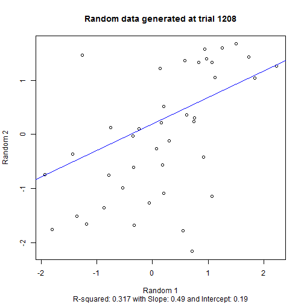

```r
plot(x=fakeList$vecP[order(fakeList$vecP)], ylab="P-value", xlab="N-th Lowest P-value",
     main=paste0("P-values for ",length(fakeList$vecP)," random correlations")
     )
```

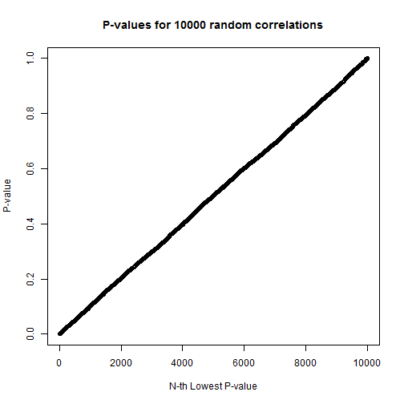

```r
plot(x=log10(fakeList$vecP[order(fakeList$vecP)]), ylab="Log10(P-value)", 
     xlab="N-th Lowest P-value", type="l", col="blue", lwd=2,
     ylim=c(floor(log10(0.05/length(fakeList$vecP))), 0),
     main=paste0("P-values for ",length(fakeList$vecP)," random correlations")
     )

abline(h=log10(0.05/length(fakeList$vecP)), lty=2, col="red")
lines(x=log10(0.05*(1:length(fakeList$vecP))/length(fakeList$vecP)), 
      lty=2, col="dark green"
      )
ctBon <- sum(fakeList$vecP <= 0.05/length(fakeList$vecP))
ctFDR <- sum(fakeList$vecP[order(fakeList$vecP)] <= 
             0.05 * (1:length(fakeList$vecP) / length(fakeList$vecP))
             )
legend("right", legend=c("Log10 of P", paste0("FDR (",ctFDR,")"), paste0("Bonferroni (",ctBon,")")), 
       lty=c(1,2,2), lwd=c(2,1,1), col=c("blue","dark green","red")
       )
```

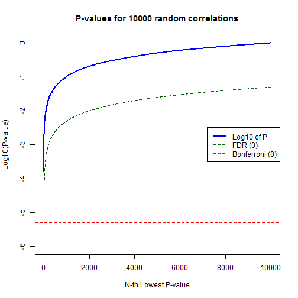
  
####_7.03 Chebyshev Inequality_  
The Chebyshev inequality states that there can never be more than 1/k^2 of the distribution that lies further than k-sigma from the mean.  The inequality is powerful in that it need not make any assumptions about distribution, but weak in that you can make a much more precise interval claim if you know the distribution.  The below code provides an example of how this works:  


```r
## Create a dummy distribution with problems
## 80% from rnorm(mean=1,sd=0.1), 15% from 0.1*rpois(lambda=10), 5% from 1000*rbinom(prob=0.05)

dat1 <- rnorm(8000, mean=1, sd=0.1) ## mean 1
dat2 <- rpois(1500, lambda=10) ## mean 10
dat3 <- 1000 * rep(0:1, c(450,50)) ## mean 100
datAll <- c(dat1, dat2, dat3)

nAll <- length(datAll)
meanAll <- mean(datAll)
sdAll <- sd(datAll)
print(paste0("Mean: ", round(meanAll,2), " with SD: ", round(sdAll, 2)) )
```

```
## [1] "Mean: 7.3 with SD: 70.46"
```

```r
## Graph by abs(0.1 + SD away from mean)
orderSD <- log10(0.1 + abs((datAll - meanAll)/sdAll))

plot(x=orderSD[order(orderSD)], type="l", col="blue", 
     ylab="Log10 of (0.1 + abs(#SD from Mean))", main="Sorted Data"
     )
```

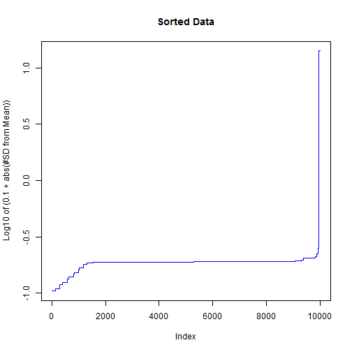

```r
## Number 1/2/3/5/10/14/15/16 SD from mean
resFrame <- NULL

for (sdAway in c(1, 2, 3, 5, 10, 14, 15, 16)) {
    actData <- sum(abs((datAll-meanAll)/sdAll) >= sdAway)
    gaussData <- 2 * (1 - pnorm(sdAway)) * nAll
    chebyData <- (1/sdAway^2) * nAll
    resFrame <- rbind(resFrame, data.frame(sdAway=sdAway, actData=actData, 
                                           gaussData=round(gaussData,0), 
                                           chebyData=round(chebyData,0)
                                           )
                     )
}

## Print actual vs. theoretical
resFrame
```

```
##   sdAway actData gaussData chebyData
## 1      1      50      3173     10000
## 2      2      50       455      2500
## 3      3      50        27      1111
## 4      5      50         0       400
## 5     10      50         0       100
## 6     14      50         0        51
## 7     15       0         0        44
## 8     16       0         0        39
```

```r
minSD <- (min(datAll)-meanAll)/sdAll
maxSD <- (max(datAll)-meanAll)/sdAll

print(paste0("Min/Max SD from mean are: ", round(minSD,3), " to ", round(maxSD, 3)) )
```

```
## [1] "Min/Max SD from mean are: -0.104 to 14.089"
```
  
With the highly skewed distribution, the Gaussian rule for standard deviations fails terribly.  Still, the Chebyshev inequality is spot on, with the actual data no longer being n SD from the mean once the relevant 1/n^2 is no longer sufficiently large to allow it.  

Further, note that this data is all positive skew.  The most negative data are only -0.1 SD from the mean, showing again what a debacle could be created by assuming the normal +/- 1/2/3 standard deviation rules.  
  
  
####_7.04 Paired data (t-test)_  
Paired data can often significantly reduce the variance, allowing for detection of events that would be non-significant if looking at two independent groups.  Below is an example of very high variance data that participates in two trials.  The variance of Trial A vs. Trial B is set to be very small.  
  

```r
## Create Trial A vector with mean 200 and SD 40
trialA <- rnorm(100,mean=200,sd=40)

## Create Trial B vector as Trial A vector plus N(1, 1)
trialB <- trialA + rnorm(100,mean=1,sd=1)

## Plot data and differences
plot(trialA, trialB, main="Trial A vs. Trial B")
```

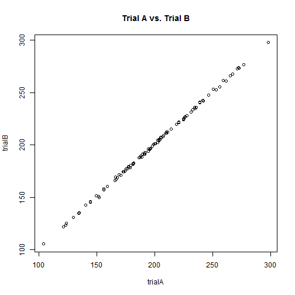

```r
plot(trialB - trialA, main="Trial B minus Trial A")
```

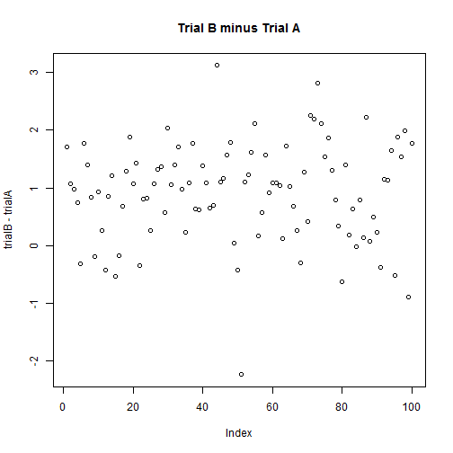

```r
## Run various t-tests and see the outcomes
t.test(trialA, trialB)
```

```
## 
## 	Welch Two Sample t-test
## 
## data:  trialA and trialB
## t = -0.1646, df = 198, p-value = 0.8694
## alternative hypothesis: true difference in means is not equal to 0
## 95 percent confidence interval:
##  -11.87500  10.04536
## sample estimates:
## mean of x mean of y 
##  199.4752  200.3900
```

```r
t.test(trialA, trialB, paired=TRUE)
```

```
## 
## 	Paired t-test
## 
## data:  trialA and trialB
## t = -10.683, df = 99, p-value < 2.2e-16
## alternative hypothesis: true difference in means is not equal to 0
## 95 percent confidence interval:
##  -1.0847310 -0.7449028
## sample estimates:
## mean of the differences 
##              -0.9148169
```

```r
t.test(trialA-trialB) ## Same as paired
```

```
## 
## 	One Sample t-test
## 
## data:  trialA - trialB
## t = -10.683, df = 99, p-value < 2.2e-16
## alternative hypothesis: true mean is not equal to 0
## 95 percent confidence interval:
##  -1.0847310 -0.7449028
## sample estimates:
##  mean of x 
## -0.9148169
```
  
If the t-test is required to assume non-paired data, then the differences are not statistically significant.  This is because the standard error for trial A mean (standalone) will be roughly 40 / sqrt(100) or 4, which swamps the true difference in means of only 1.  

The paired t-test easily picks up the difference since the standard error for trialA - trialB will be roughly 1 / sqrt(100) or 0.1, with a mean of roughly -1.  Note that running the A vs. B paired t-test is identical to running a t-test on (A-B).  It is easier to interpret when using the "paired" statement.  
  
  
####_7.05 Paired data (prop-test)_  
Paired data can also be important for tests of proportions, when the variable of interest is either paired and/or dependent.  An example is included below:  
  

```r
## Example (paired) - a group of students of varying capability took two tests
## Each of their odds of passing improved by ~10% after a quick online study
studentPreProb <- c(runif(n=400, min=0.1, max=0.2), runif(n=400, min=0.8, max=0.9))
studentPostProb <- studentPreProb + runif(n=800, min=0, max=0.1)
studentPrePass <- rbinom(length(studentPreProb), size=1, prob=studentPreProb)
studentPostPass <- rbinom(length(studentPostProb), size=1, prob=studentPostProb)

## Assume two independent proportions
prop.test(x=c(sum(studentPrePass), sum(studentPostPass)),  
          n=c(length(studentPrePass), length(studentPostPass)), 
          correct=FALSE
          )
```

```
## 
## 	2-sample test for equality of proportions without continuity
## 	correction
## 
## data:  c(sum(studentPrePass), sum(studentPostPass)) out of c(length(studentPrePass), length(studentPostPass))
## X-squared = 6.5099, df = 1, p-value = 0.01073
## alternative hypothesis: two.sided
## 95 percent confidence interval:
##  -0.11262146 -0.01487854
## sample estimates:
##  prop 1  prop 2 
## 0.48500 0.54875
```

```r
## Assume two paired proportions
## Create matrix of Pass/Fail
passBoth <- sum(studentPrePass * studentPostPass)
failBoth <- sum((studentPrePass==0) * (studentPostPass==0))
passPre <- sum((studentPrePass==1) * (studentPostPass==0))
passPost <- sum((studentPrePass==0) * (studentPostPass==1))

pfMatrix <- matrix(data=c(passBoth, passPre, passPost, failBoth), nrow=2, byrow=TRUE, 
                   dimnames=list(c("Pass Pre", "Fail Pre"),c("Pass Post", "Fail Post"))
                   )
pfMatrix
```

```
##          Pass Post Fail Post
## Pass Pre       319        69
## Fail Pre       120       292
```

```r
mcnemar.test(pfMatrix, correct=FALSE)
```

```
## 
## 	McNemar's Chi-squared test
## 
## data:  pfMatrix
## McNemar's chi-squared = 13.762, df = 1, p-value = 0.0002075
```

By looking only at cases of Pass -> Fail vs. Fail -> Pass, the mcnemar.test is able to more precisely tease out the differences in the groups.  The challenge with the proportions test assuming independence is that most students either passed both exams or failed both exams based on their natural talents, which tends to wash out the impact that we hope to study.  
  
  
####_7.06 Fisher Exact Factorials_  
The Fisher Exact Test is an odds ratio based on the permutations of non-negative integers in a 2x2 table with fixed marginals.  Essentially, the fixed marginals and non-negative marginals mean there are a finite number of combinations, each with an associated p.  The odds ratio sums all of the p that are equal or more extreme than a specific combination, reporting that back as the overall p-value.  
  

```r
fishExact <- function(mtxIn) {
    curA <- mtxIn[1,1]
    maxA <- min(colSums(mtxIn)[1],rowSums(mtxIn)[1])
    minA <- max(0, sum(diag(mtxIn) * c(1,-1)) )
    
    storeData <- matrix(data=NA,nrow=(maxA-minA+1), ncol=2)
    
    for (intDelta in (minA-curA):(maxA-curA)) {
        mtxWork <- mtxIn + matrix(data=intDelta*c(1,-1,-1,1), nrow=2)
        
        numer <- prod(factorial(c(colSums(mtxWork), rowSums(mtxWork)) ) )
        denom <- prod(factorial(mtxWork), factorial(sum(mtxWork)) )
        
        print(paste0("Using value A=",curA+intDelta," gives ratio=",round(numer/denom,4)))
        
        storeData[intDelta - minA + curA + 1, 1] <- curA + intDelta
        storeData[intDelta - minA + curA + 1, 2] <- numer/denom
    }
    
    storeData
}

fishMatrix <- matrix(data=c(8,4,2,5), nrow=2, byrow=TRUE)
fishData <- fishExact(fishMatrix)
```

```
## [1] "Using value A=3 gives ratio=0.0024"
## [1] "Using value A=4 gives ratio=0.0375"
## [1] "Using value A=5 gives ratio=0.18"
## [1] "Using value A=6 gives ratio=0.3501"
## [1] "Using value A=7 gives ratio=0.3001"
## [1] "Using value A=8 gives ratio=0.1125"
## [1] "Using value A=9 gives ratio=0.0167"
## [1] "Using value A=10 gives ratio=7e-04"
```

```r
pCurA <- fishData[fishData[,1]==8, 2] ## Current upper right
pTwoSide <- sum(fishData[,2] * (fishData[,2] <= pCurA)) ## Two-sided p
print(paste0("Sum of probability <= ",round(pCurA,4)," is ",round(pTwoSide,4)))
```

```
## [1] "Sum of probability <= 0.1125 is 0.1698"
```

```r
fisher.test(fishMatrix)
```

```
## 
## 	Fisher's Exact Test for Count Data
## 
## data:  fishMatrix
## p-value = 0.1698
## alternative hypothesis: true odds ratio is not equal to 1
## 95 percent confidence interval:
##   0.4748063 69.1739992
## sample estimates:
## odds ratio 
##   4.556516
```

```r
barplot(height=fishData[,2], names.arg=fishData[,1], col="light blue", 
        main="Probabilities by Upper-Left Value", xlab="x[1,1]", ylab="Probability"
        )
```

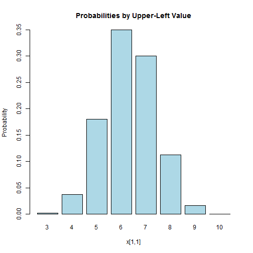
  
The results of the hand calculation match the fisher.test outcome, and the bar plot shows how much the relative probabilities of a configuration can change as the upper-left value changes.  
  
####_7.07 Vector Factorial and Correlation_  
The correlation will change significantly if the vectors are reordered.  Below is an example of the degree to which various correlations are observed between two identical vectors, one randomized post-hoc.  
  

```r
par(mfrow=c(1,2))

## Run for vectors of length 10
vecA <- 1:10
pStore <- matrix(data=rep(-9, 8000),nrow=4000)

for (intCtr in 1:nrow(pStore)) {
    vecB <- sample(vecA, length(vecA), replace=FALSE)
    pStore[intCtr, 1] <- cor.test(vecA, vecB)$estimate
    pStore[intCtr, 2] <- cor.test(vecA, vecB)$p.value
}

summary(pStore[,1])
```

```
##      Min.   1st Qu.    Median      Mean   3rd Qu.      Max. 
## -0.903000 -0.236400 -0.006061 -0.003800  0.236400  0.915200
```

```r
hist(pStore[,1], col="light blue", breaks=seq(-1,1,by=0.05), xlab="Correlation",
     main="Correlations for Randomized Integer 1:10", cex.main=0.9
     )
hist(pStore[,2], col="dark green", breaks=seq(0,1,by=0.05), xlab="P-value",
     main="P-Values for Correlations on 1:10", cex.main=0.9
     )
```

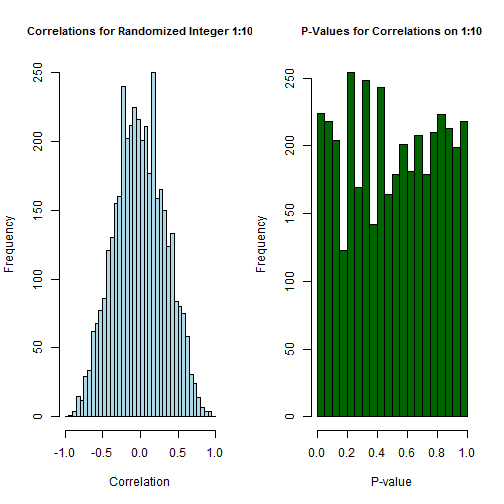

```r
## Run for vectors of length 100
vecA <- 1:100
pStore <- matrix(data=rep(-9, 8000),nrow=4000)

for (intCtr in 1:nrow(pStore)) {
    vecB <- sample(vecA, length(vecA), replace=FALSE)
    pStore[intCtr, 1] <- cor.test(vecA, vecB)$estimate
    pStore[intCtr, 2] <- cor.test(vecA, vecB)$p.value
}

summary(pStore[,1])
```

```
##      Min.   1st Qu.    Median      Mean   3rd Qu.      Max. 
## -0.303800 -0.066400  0.002574  0.002302  0.070700  0.368900
```

```r
hist(pStore[,1], col="light blue", breaks=seq(-1,1,by=0.05), xlab="Correlation",
     main="Correlations for Randomized Integer 1:100", cex.main=0.9
     )
hist(pStore[,2], col="dark green", breaks=seq(0,1,by=0.05), xlab="P-value",
     main="P-Values for Correlations on 1:100", cex.main=0.9
     )
```

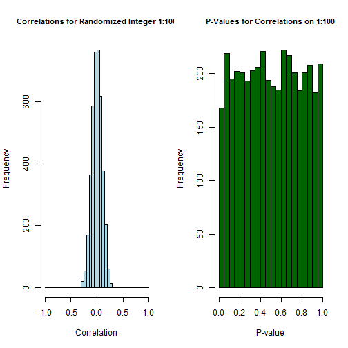

```r
## Run for vectors of length 1000
vecA <- 1:1000
pStore <- matrix(data=rep(-9, 8000),nrow=4000)

for (intCtr in 1:nrow(pStore)) {
    vecB <- sample(vecA, length(vecA), replace=FALSE)
    pStore[intCtr, 1] <- cor.test(vecA, vecB)$estimate
    pStore[intCtr, 2] <- cor.test(vecA, vecB)$p.value
}

summary(pStore[,1])
```

```
##      Min.   1st Qu.    Median      Mean   3rd Qu.      Max. 
## -0.133100 -0.019900  0.001465  0.001408  0.023220  0.115500
```

```r
hist(pStore[,1], col="light blue", breaks=seq(-1,1,by=0.05), xlab="Correlation",
     main="Correlations for Randomized Integer 1:1000", cex.main=0.9
     )
hist(pStore[,2], col="dark green", breaks=seq(0,1,by=0.05), xlab="P-value",
     main="P-Values for Correlations on 1:1000", cex.main=0.9
     )
```

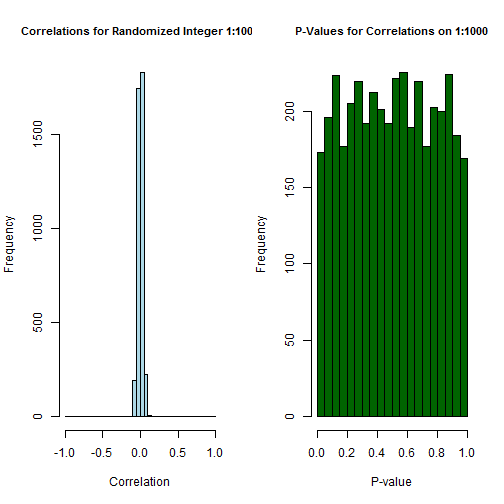

```r
par(mfrow=c(1,1))
```
  
Consistent with CLT, the distribution of the randomized correlations becomes much more compact as n-per-trial increases.  For each value of n-per-trial, the p-values are distributed as runif(min=0, max=1), consistent with the p-values that should be observed for multiple trials drawn from a true null hypothesis distribution.  
####_7.08 Impact of Each Pair in Vector Correlation_  
Suppose that you have a air of vectors with correlation r.  In many cases, different paired points will have a different impact on the reported correlation.  Below is an experiment to see the contribution of each of the pairs.  
  

```r
vecA <- 1:40
vecB <- sample(1:40, 40, replace=FALSE)

## Automated correlation
pCor <- cor(vecA, vecB)
pCor
```

```
## [1] -0.07842402
```

```r
## Hand-calculated correlation
stdA <- (vecA - mean(vecA)) / sd(vecA)
stdB <- (vecB - mean(vecB)) / sd(vecB)
scoreN <- (stdA * stdB) / (length(stdA) - 1)
sum(scoreN)
```

```
## [1] -0.07842402
```

```r
## Plot the individual contributions
sortScore <- scoreN[order(-scoreN)]
plot(x=1:length(sortScore), y=sortScore, ylab="Contribution", pch=20, col="light blue",
     main=paste0("Pair Contribution to Overall Correlation"),
     cex.axis=0.8, cex=4, ylim=c(-.1,.1)
     )

## Now change the top 4 points to each be the respective vector means
modA <- vecA
modB <- vecB

chgKeys <- which(scoreN >= sortScore[4])
modA[chgKeys] <- mean(vecA)
modB[chgKeys] <- mean(vecB)
cor(modA, modB)
```

```
## [1] -0.3087338
```

```r
## And layer the new leverage points on top of the existing graph
newStdA <- (modA - mean(modA)) / sd(modA)
newStdB <- (modB - mean(modB)) / sd(modB)
newScoreN <- (newStdA * newStdB) / (length(newStdA) - 1)
sum(newScoreN)
```

```
## [1] -0.3087338
```

```r
newPCor <- cor(newStdA, newStdB)
newPCor
```

```
## [1] -0.3087338
```

```r
points(x=1:length(newScoreN), y=newScoreN[order(-scoreN)], col="orange", pch=20, cex=3)

legend("top", legend=c(paste0("Original: ", round(pCor,3)), 
                       paste0("Modified: ", round(newPCor,3)) 
                       ),
       pch=20, col=c("light blue", "orange"), pt.cex=c(4,3)
       )
```

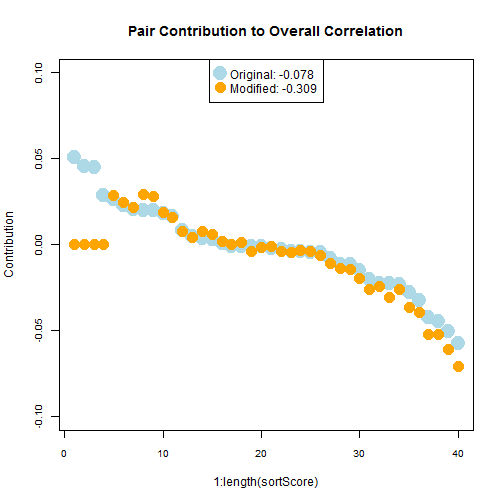

Moving just 10% of the points to the mean drives the correlation significantly more negative.  
  
####_7.09 Post-hoc group comparisons (ANOVA)_  
ANOVA is often run to determine if one or more group means are different.  This is frequently followed by individual comparisons of group means, with some risk of Type I error if many groups are compared.  One school holds that for three-group ANOVA, there is no need for alpha-correction in the post-hoc tests.  Let's see what happens in a few key cases:  
  

```r
## All three groups drawn from the same population
## Run 2000 trials for 100 randoms for each of 3 groups
nTrials <- 2000
nPer <- 100
aovP <- rep(-9, nTrials)
aovCI <- matrix(data=rep(-9, nTrials*3), nrow=nTrials)
ttPoolNoneP <- matrix(data=rep(-9, nTrials*3), nrow=nTrials)
ttPoolBonfP <- matrix(data=rep(-9, nTrials*3), nrow=nTrials)

for (intCtr in 1:nTrials) {
    vecA <- rnorm(nPer, mean=0, sd=1)
    vecB <- rnorm(nPer, mean=0, sd=1)
    vecC <- rnorm(nPer, mean=0, sd=1)
    
    testFrame <- data.frame(value=c(vecA, vecB, vecC), 
                            group=rep(c("A","B","C"), c(nPer, nPer, nPer) )
                            )
    
    aovRes <- aov(value ~ group, data=testFrame)
    aovP[intCtr] <- summary(aovRes)[[1]][1,5]  ## Better way to get p-value?
    
    critT <- qt(0.975, df=aovRes$df.residual)
    keyRSS <- sqrt(sum(aovRes$residual^2) / aovRes$df.residual)
    keyCI <- critT * keyRSS * sqrt(1/nPer + 1/nPer) ## Fisher LSD
    
    aovCI[intCtr, 1] <- abs(mean(vecA) - mean(vecB)) / keyCI
    aovCI[intCtr, 2] <- abs(mean(vecA) - mean(vecC)) / keyCI
    aovCI[intCtr, 3] <- abs(mean(vecB) - mean(vecC)) / keyCI
    
    ttPoolNoneP[intCtr, ] <- pairwise.t.test(testFrame$value, testFrame$group, 
                                             pool.sd = TRUE, paired=FALSE, 
                                             p.adjust.method="none")$p.value[c(1,2,4)]
    
    ttPoolBonfP[intCtr, ] <- pairwise.t.test(testFrame$value, testFrame$group, 
                                             pool.sd = TRUE, paired=FALSE, 
                                             p.adjust.method="bonf")$p.value[c(1,2,4)]
    
}

hist(aovP, col="light blue", xlab="ANOVA p-value", 
     main="ANOVA P-Values - 3-Group Random (Same Mean)"
     )
```

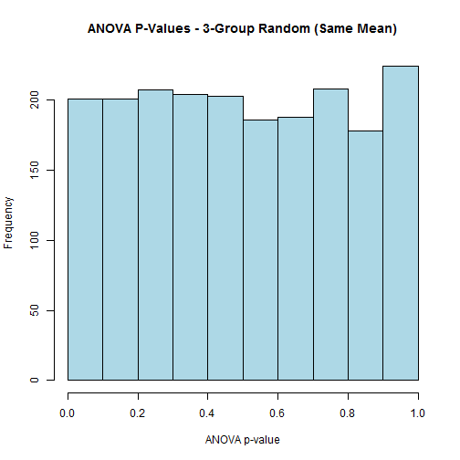

```r
print(paste0("During ",nTrials," ANOVA trials, ",sum(aovP<0.05)," have p < 0.05"))
```

```
## [1] "During 2000 ANOVA trials, 118 have p < 0.05"
```

```r
print(paste("Significant post-hoc ANOVA pairwise comparisons:", sum(aovCI[,1]>1 & aovP<0.05), 
            sum(aovCI[,2]>1 & aovP<0.05), sum(aovCI[,3]>1 & aovP<0.05)
           )
      )
```

```
## [1] "Significant post-hoc ANOVA pairwise comparisons: 62 59 59"
```

```r
print(paste("Significant pairwise t-tests (no ANOVA, no p-adj): ", sum(ttPoolNoneP[,1]<0.05),
            sum(ttPoolNoneP[,2]<0.05), sum(ttPoolNoneP[,3]<0.05)
            )
      )
```

```
## [1] "Significant pairwise t-tests (no ANOVA, no p-adj):  106 104 108"
```

```r
print(paste("Significant pairwise t-tests (sig. ANOVA, no p-adj): ", sum(ttPoolNoneP[,1]<0.05 & aovP<0.05),
            sum(ttPoolNoneP[,2]<0.05 & aovP<0.05), sum(ttPoolNoneP[,3]<0.05 & aovP<0.05)
            )
      )
```

```
## [1] "Significant pairwise t-tests (sig. ANOVA, no p-adj):  62 59 59"
```

```r
print(paste("Significant pairwise t-tests (no ANOVA, Bonferroni): ", sum(ttPoolBonfP[,1]<0.05),
            sum(ttPoolBonfP[,2]<0.05), sum(ttPoolBonfP[,3]<0.05)
            )
      )
```

```
## [1] "Significant pairwise t-tests (no ANOVA, Bonferroni):  40 43 40"
```

```r
## One group drawn from different population
## Run 2000 trials for 100 randoms for each of 3 groups
aovP <- rep(-9, nTrials)
aovCI <- matrix(data=rep(-9, nTrials*3), nrow=nTrials)
ttPoolNoneP <- matrix(data=rep(-9, nTrials*3), nrow=nTrials)
ttPoolBonfP <- matrix(data=rep(-9, nTrials*3), nrow=nTrials)

for (intCtr in 1:nTrials) {
    vecA <- rnorm(nPer, mean=0, sd=1)
    vecB <- rnorm(nPer, mean=0, sd=1)
    vecC <- rnorm(nPer, mean=0.3, sd=1) ## Rough edge of detection range 2*1*sqrt(2/100)
    
    testFrame <- data.frame(value=c(vecA, vecB, vecC), 
                            group=rep(c("A","B","C"), c(nPer, nPer, nPer) )
                            )
    
    aovRes <- aov(value ~ group, data=testFrame)
    aovP[intCtr] <- summary(aovRes)[[1]][1,5]  ## Better way to get p-value?
    
    critT <- qt(0.975, df=aovRes$df.residual)
    keyRSS <- sqrt(sum(aovRes$residual^2) / aovRes$df.residual)
    keyCI <- critT * keyRSS * sqrt(1/nPer + 1/nPer) ## Fisher LSD
    
    aovCI[intCtr, 1] <- abs(mean(vecA) - mean(vecB)) / keyCI
    aovCI[intCtr, 2] <- abs(mean(vecA) - mean(vecC)) / keyCI
    aovCI[intCtr, 3] <- abs(mean(vecB) - mean(vecC)) / keyCI
    
    ttPoolNoneP[intCtr, ] <- pairwise.t.test(testFrame$value, testFrame$group, 
                                             pool.sd = TRUE, paired=FALSE, 
                                             p.adjust.method="none")$p.value[c(1,2,4)]
    
    ttPoolBonfP[intCtr, ] <- pairwise.t.test(testFrame$value, testFrame$group, 
                                             pool.sd = TRUE, paired=FALSE, 
                                             p.adjust.method="bonf")$p.value[c(1,2,4)]
    
}

hist(aovP, col="light blue", xlab="ANOVA p-value", 
     main="ANOVA P-Values - 3-Group Random (One Mean Different)"
     )
```

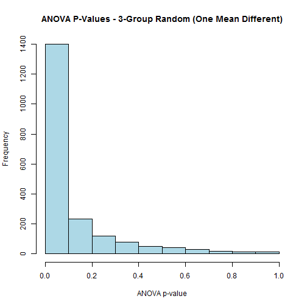

```r
print(paste0("During ",nTrials," trials, ",sum(aovP<0.05)," have p < 0.05"))
```

```
## [1] "During 2000 trials, 1167 have p < 0.05"
```

```r
print(paste("Significant pairwise comparisons:", sum(aovCI[,1]>1 & aovP<0.05), 
            sum(aovCI[,2]>1 & aovP<0.05), sum(aovCI[,3]>1 & aovP<0.05)
           )
      )
```

```
## [1] "Significant pairwise comparisons: 82 988 958"
```

```r
print(paste("Significant pairwise t-tests (no ANOVA, no p-adj): ", sum(ttPoolNoneP[,1]<0.05),
            sum(ttPoolNoneP[,2]<0.05), sum(ttPoolNoneP[,3]<0.05)
            )
      )
```

```
## [1] "Significant pairwise t-tests (no ANOVA, no p-adj):  89 1117 1124"
```

```r
print(paste("Significant pairwise t-tests (sig. ANOVA, no p-adj): ", sum(ttPoolNoneP[,1]<0.05 & aovP<0.05),
            sum(ttPoolNoneP[,2]<0.05 & aovP<0.05), sum(ttPoolNoneP[,3]<0.05 & aovP<0.05)
            )
      )
```

```
## [1] "Significant pairwise t-tests (sig. ANOVA, no p-adj):  82 988 958"
```

```r
print(paste("Significant pairwise t-tests (no ANOVA, Bonferroni): ", sum(ttPoolBonfP[,1]<0.05),
            sum(ttPoolBonfP[,2]<0.05), sum(ttPoolBonfP[,3]<0.05)
            )
      )
```

```
## [1] "Significant pairwise t-tests (no ANOVA, Bonferroni):  36 796 764"
```

When the true population means are the same, the ANOVA comes back significant ~5% of the time with each of the pairwise comparisons being significant about 3% of the time (note that the pairwise comparisons are only counted as significant if the ANOVA came back significant).  
  
Additionally, pairwise t-tests assuming pooled standard deviation and no p-adjustment, counted as significant only when ANOVA is significant, return the same results as the post-hoc ANOVA approach.  The pairwise t-tests in the absence of any ANOVA come back 15% significant (5% each), an obvious problem.  The stand-alone Bonferroni paired t-tests have roughly the same false positive rate as the overall ANOVA.  
  
When the true population means have one different element (but near the edge of the 95% CI detection range), the ANOVA comes back significant ~60% of the time, with the pairwise comparison of the items from the identical population showing significant difference only ~5% of the time.  
  
In this case, Bonferroni comes back overly conservative, detecting ~10% fewer of the AC and BC differences in return for reporting ~2% fewer of the false AB differences.  While there are obviously trade-offs, there is no evidence suggesting wild bias in false positives for Fisher LSD (post-hoc ANOVA comparisons) with 3 groups.  
  
