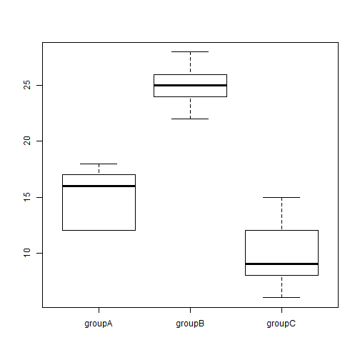

### Overview and Synopsis  
This example takes a look at one-way ANOVA.  The goal is to better understand the results of ANOVA and their relationship to results from multivariate regression with dummy variables on the same data.  

* The R function aov() produces the same results as ANOVA calculations by hand  
* Multivariate regression with dummy variables produces the same F-value and confidence interval as aov()  
* Various comparisons of means (Fisher, Tukey, Bonferroni, Holm) produce varying p-value on the differences  
* R does not always have a great function for creating the CI for these differences in mean, and the packages that do so require downloading compiled code (agricolae, multcomp)  

### Background  
One-way ANOVA compares variance between groups to variance within groups and draws conclusions about whether the groups are sampled from the same population.  There is a loose requirement that the groups have similar standard deviations (no worse than 2:1 ratio).  If this criteria and several others are met, "sampled from the same population" becomes a surrogate for "have the same mean".  

### _One-way ANOVA_  
To run one-way ANOVA, you need at least two groups and sufficient information such that you can determine the MSWithin (Mean Squares Within) and MSBetween (Mean Squares Between).

#### _Determining MSWithin_  
MSWithin is an estimate of overall variance, treating all groups as if there are from the same population.  The primary components are Sum of Squares Within (SSWithin) and associated degrees of freedom.  

Sum of Squares Within: Within each group, calculate its variance and multiply by (number in group - 1).  If you have been provided standard deviation by group, this is sd^2*(n-1).  If you have the group members, this is the equivalent of sum-over-group-of (y-member - mean-y-group)^2.  Sum the SSWithin for each group to get an overall SSWithin.  

dfWithin:  There are (number in group - 1) degrees of freedom for each group.  When all the groups are summed, this comes back to (overall N - overall number of groups), often denoted as dfWithin = (n-g).  

MSWithin:  Not surprisingly, this is SSWithin / dfWithin  

#### _Determining MSBetween_  
SSBetween is an estimate of overall variance, treating each group as an independent draw from the same population.  The primary components are Sum of Squares Between (SSBetween) and associated degrees of freedom.  

Overall weighted mean aka "grand mean": Calculate the overall mean based on all of your group data.  If you have the individual elements, it is mean(n-sub-i).  If you just have individual group means, it is (sum-over-groups-of (n-group) * (mean-group)) / (sum-over-groups-of (n-group)).  

Sum of Squares Between: This is simply the sum over all groups of (n-group) * (groupmean - grandmean)^2.

dfBetween:  There are (number of groups - 1) degrees of freedom, often denoted as dfBetween = (g-1).  

MSBetween:  Not surprisingly, this is SSBetween / dfBetween  

#### _One-way ANOVA Calculation_  
The one-way ANOVA is based on an F-test of MSBetween against MSWithin.

Test-statistic:  F = MSBetween / MSWithin, df1 = (g-1), df2 = (n-g)

Hypotheses:  The null hypothesis Ho is that F=1 while the alternate hypothesis Ha is that F > 1.  Take a grain of salt on the null hypothesis, but the p-value will come from "how extreme is this F".

P-value: The R-calculation is pf(MSBetween/MSWithin, df1=(g-1), df2=(n-g), lower.tail=FALSE).  In theory you set a p-value hurdle before running this calculation.  

#### _Post Hoc Calculation_  
A significant p-value for ANOVA is a signal of some difference in the group means.  Post-hoc analysis can be run to look at differences in pairs of group means.  Caution is required since with many individual comparisons, many spurious null rejections could occur.  This is the common FWER (family wise error rate) issue.

Some common approaches for mitigating FWER in these paired difference comparisons include:

Bonferroni: Alpha is adjusted to keep the overall likelihood of any spurious null rejection to alpha.  Broadly, this means that if c comparisons will be run, 1 - (1 - newalpha)^c = overallalpha

Tukey HSD: The Bonferroni approach is very conservative.  Tukey HSD tries to keep the overall FWER near the desired alpha, and will often show significance where Bonferroni does not.

Fisher LSD: For comparison between groups j and k, treat SE = sqrt(MSWithin) * sqrt(1/nj + 1/nk).  In other words, use the overall MSWithin and not any variance that is purely about groups j and k.  For the associated critical t, assume df = (n - g).  CI is then (mean-j minus mean-k) +/- Tc (df=n-g) * SE

#### _Multivariate Regression_  
ANOVA is a special implementation of multivariate regression with dummy variables.  If there are g groups, the multivariate regression would be based on g-1 dummy variables plus an intercept.  The F statistic from the regression will be the same as from ANOVA.  Mean Regression Sum of Squares is MSBetween and Mean Residual Sum of Squares is MSWithin.  However, the t-statistics (or p-values) for differences in means from regression and post-hoc ANOVA computations can differ.  

### Analysis  
First, we create a simple and small dummy database.  This has 3 groups each with 5 observations.  A boxplot shows significant differences between the groups, as desired so the sample analysis has relevant findings.  


```r
dummyData <- data.frame(groupA=c(12,12,16,17,18), groupB=c(22,24,25,26,28), groupC=c(6,8,9,12,15))
boxplot(dummyData)
```



Further, we can calculate a few summary statistics about the dummy data.  

```r
sampleStats <- data.frame(means=rep(0,ncol(dummyData)),stdevs=rep(0,ncol(dummyData)))

for (intCtr in 1:ncol(dummyData)) {
    sampleStats$means[intCtr] <- mean(dummyData[,intCtr])
    sampleStats$stdevs[intCtr] <- sd(dummyData[,intCtr])
}

rownames(sampleStats) <- names(dummyData)

print("Means and Standard Deviations")
```

```
## [1] "Means and Standard Deviations"
```

```r
sampleStats
```

```
##        means   stdevs
## groupA    15 2.828427
## groupB    25 2.236068
## groupC    10 3.535534
```

```r
summary(dummyData)
```

```
##      groupA       groupB       groupC  
##  Min.   :12   Min.   :22   Min.   : 6  
##  1st Qu.:12   1st Qu.:24   1st Qu.: 8  
##  Median :16   Median :25   Median : 9  
##  Mean   :15   Mean   :25   Mean   :10  
##  3rd Qu.:17   3rd Qu.:26   3rd Qu.:12  
##  Max.   :18   Max.   :28   Max.   :15
```

#### _One-way ANOVA and Fisher LSD by hand_
Next, we run ANOVA by hand on this data.  This is merely to show how it works.  

```r
## Calculate MSWithin
ssWithinGroups <- rep(0,ncol(dummyData))

for (intCtr in 1:ncol(dummyData)) {
    for (intCtr2 in 1:nrow(dummyData)) {
        ssWithinGroups[intCtr] <- ssWithinGroups[intCtr] + 
                                  (dummyData[intCtr2,intCtr] - mean(dummyData[,intCtr]))^2
    }
}

ssWithinGroups
```

```
## [1] 32 20 50
```

```r
dfWithin <- ncol(dummyData) * nrow(dummyData) - ncol(dummyData)
msWithin <- sum(ssWithinGroups) / dfWithin
print(paste0("MS Within: ",msWithin," with df=",dfWithin))
```

```
## [1] "MS Within: 8.5 with df=12"
```

```r
## Calculate MSBetween
ssBetweenGroups <- rep(0,ncol(dummyData))
grandMean <- mean(as.matrix(dummyData))

for (intCtr in 1:ncol(dummyData)) {
    ssBetweenGroups[intCtr] <- length(dummyData[,intCtr]) * (mean(dummyData[,intCtr]) - grandMean)^2
}

ssBetweenGroups
```

```
## [1]  13.88889 347.22222 222.22222
```

```r
dfBetween <- ncol(dummyData) - 1
msBetween <- sum(ssBetweenGroups) / dfBetween
print(paste0("MS Between: ",round(msBetween,2)," with df=",dfBetween))
```

```
## [1] "MS Between: 291.67 with df=2"
```

Then, calculate the relevant F-statistic, p-value, and Fisher LSD.

```r
myFStat <- msBetween / msWithin
myPValue <- pf(myFStat,df1=msBetween,df2=msWithin,lower.tail=FALSE)

print(paste0("F-statistic: ",round(myFStat,2)," with df1=",dfBetween," and df2=",dfWithin))
```

```
## [1] "F-statistic: 34.31 with df1=2 and df2=12"
```

```r
print(paste0("Relevant p-value is: ",round(myPValue,4)))
```

```
## [1] "Relevant p-value is: 0"
```

```r
nCompare <- 0.5 * (ncol(dummyData) * (ncol(dummyData)-1))

myFisherLSD <- data.frame(compType=rep("",nCompare),diffLow=rep(0,nCompare),diffHigh=rep(0,nCompare),
                          stringsAsFactors = FALSE)

## Run for alpha=0.05 two-sided and df=dfWithin
tCritical <- qt(0.025,df=dfWithin,lower.tail=FALSE)

nCompare <- 1 ## Recycling the variable

for (intCtr in 1:(ncol(dummyData)-1)) {
    for (intCtr2 in (intCtr+1):ncol(dummyData)) {
        myFisherLSD$compType[nCompare] <- paste0(names(dummyData)[intCtr]," vs. ",names(dummyData)[intCtr2])
        
        diffMean <- mean(dummyData[,intCtr]) - mean(dummyData[,intCtr2])
        mySE <- sqrt(msWithin) * sqrt(1/length(dummyData[,intCtr]) + 1/length(dummyData[,intCtr2]))
        
        myFisherLSD$diffLow[nCompare] <- diffMean - tCritical*mySE
        myFisherLSD$diffHigh[nCompare] <- diffMean + tCritical*mySE
        
        nCompare <- nCompare + 1
    }
}

print("Below are the 95% hand-calculated CI for differences in mean using Fisher LSD")
```

```
## [1] "Below are the 95% hand-calculated CI for differences in mean using Fisher LSD"
```

```r
myFisherLSD
```

```
##            compType     diffLow  diffHigh
## 1 groupA vs. groupB -14.0175323 -5.982468
## 2 groupA vs. groupC   0.9824677  9.017532
## 3 groupB vs. groupC  10.9824677 19.017532
```

#### _One-way ANOVA and CI by R Function_
Next, the data frame is converted to long, skinny form with a factor for the group.

```r
myFactorFrame <- data.frame(keyGroup=rep("",nrow(dummyData)*ncol(dummyData)),
                            indValue=rep(0,nrow(dummyData)*ncol(dummyData)),
                            stringsAsFactors = FALSE
                            )

nCompare <- 1 ## Reccylcing the variable

for (intCtr in 1:ncol(dummyData)) {
    for (intCtr2 in 1:nrow(dummyData)) {
        myFactorFrame$keyGroup[nCompare] <- names(dummyData)[intCtr]
        myFactorFrame$indValue[nCompare] <- dummyData[intCtr2,intCtr]
        nCompare <- nCompare + 1
    }
}

myFactorFrame
```

```
##    keyGroup indValue
## 1    groupA       12
## 2    groupA       12
## 3    groupA       16
## 4    groupA       17
## 5    groupA       18
## 6    groupB       22
## 7    groupB       24
## 8    groupB       25
## 9    groupB       26
## 10   groupB       28
## 11   groupC        6
## 12   groupC        8
## 13   groupC        9
## 14   groupC       12
## 15   groupC       15
```

The one-way ANOVA is run using the R function aov().  Group C is set as the baseline (intercept).

```r
myFactorFrame$aovFactor <- factor(myFactorFrame$keyGroup,levels=c("groupC","groupA","groupB"))
aovFromR <- aov(indValue ~ aovFactor , data=myFactorFrame)
summary(aovFromR)
```

```
##             Df Sum Sq Mean Sq F value   Pr(>F)    
## aovFactor    2  583.3   291.7   34.31 1.09e-05 ***
## Residuals   12  102.0     8.5                     
## ---
## Signif. codes:  0 '***' 0.001 '**' 0.01 '*' 0.05 '.' 0.1 ' ' 1
```

```r
confint(aovFromR)
```

```
##                      2.5 %    97.5 %
## (Intercept)      7.1591756 12.840824
## aovFactorgroupA  0.9824677  9.017532
## aovFactorgroupB 10.9824677 19.017532
```

As expected, MSBetween, MSWithin, dfBetween, dfWithin, F, and p from aov() in R match the hand-calculations.  Further, the confidence intervals for C vs. B and C vs. A are identical (provided care is taken on the direction of the comparison).

Additionally, we can look at the p-values as they would be assessed in any of multiple ways:  

```r
## Run the Tukey HSD
TukeyHSD(aovFromR)
```

```
##   Tukey multiple comparisons of means
##     95% family-wise confidence level
## 
## Fit: aov(formula = indValue ~ aovFactor, data = myFactorFrame)
## 
## $aovFactor
##               diff         lwr       upr     p adj
## groupA-groupC    5  0.08070249  9.919298 0.0462914
## groupB-groupC   15 10.08070249 19.919298 0.0000088
## groupB-groupA   10  5.08070249 14.919298 0.0004187
```

```r
## Run standard pairwise t-tests
pairwise.t.test(x=myFactorFrame$indValue , g=myFactorFrame$keyGroup , p.adjust.method = "none")
```

```
## 
## 	Pairwise comparisons using t tests with pooled SD 
## 
## data:  myFactorFrame$indValue and myFactorFrame$keyGroup 
## 
##        groupA  groupB 
## groupB 0.00015 -      
## groupC 0.01890 3.2e-06
## 
## P value adjustment method: none
```

```r
## Run Bonferroni pairwise t-tests
pairwise.t.test(x=myFactorFrame$indValue , g=myFactorFrame$keyGroup , p.adjust.method = "bonferroni")
```

```
## 
## 	Pairwise comparisons using t tests with pooled SD 
## 
## data:  myFactorFrame$indValue and myFactorFrame$keyGroup 
## 
##        groupA  groupB 
## groupB 0.00046 -      
## groupC 0.05669 9.5e-06
## 
## P value adjustment method: bonferroni
```

```r
## Run Holm pairwise t-tests
pairwise.t.test(x=myFactorFrame$indValue , g=myFactorFrame$keyGroup , p.adjust.method = "holm")
```

```
## 
## 	Pairwise comparisons using t tests with pooled SD 
## 
## data:  myFactorFrame$indValue and myFactorFrame$keyGroup 
## 
##        groupA  groupB 
## groupB 0.00031 -      
## groupC 0.01890 9.5e-06
## 
## P value adjustment method: holm
```

#### _Multivariate regression with dummy variables in R_  
The same results can be generated by creating dummy variables and running linear regression.  For consistency with the above aov(), we will treat groupC as the baseline (intercept).  


```r
myFactorFrame$dummyA <- ifelse(myFactorFrame$keyGroup=="groupA",1,0)
myFactorFrame$dummyB <- ifelse(myFactorFrame$keyGroup=="groupB",1,0)

myLMDummy <- lm(indValue ~ dummyA + dummyB, data=myFactorFrame)
summary(myLMDummy)
```

```
## 
## Call:
## lm(formula = indValue ~ dummyA + dummyB, data = myFactorFrame)
## 
## Residuals:
##    Min     1Q Median     3Q    Max 
##   -4.0   -2.5    0.0    2.0    5.0 
## 
## Coefficients:
##             Estimate Std. Error t value Pr(>|t|)    
## (Intercept)   10.000      1.304   7.670 5.77e-06 ***
## dummyA         5.000      1.844   2.712   0.0189 *  
## dummyB        15.000      1.844   8.135 3.17e-06 ***
## ---
## Signif. codes:  0 '***' 0.001 '**' 0.01 '*' 0.05 '.' 0.1 ' ' 1
## 
## Residual standard error: 2.915 on 12 degrees of freedom
## Multiple R-squared:  0.8512,	Adjusted R-squared:  0.8264 
## F-statistic: 34.31 on 2 and 12 DF,  p-value: 1.087e-05
```

```r
confint(myLMDummy)
```

```
##                  2.5 %    97.5 %
## (Intercept)  7.1591756 12.840824
## dummyA       0.9824677  9.017532
## dummyB      10.9824677 19.017532
```
  
As expected, the F-statistic is identical in the multivariate dummy regression.  Further, the confidence intervals match those provided by aov().
